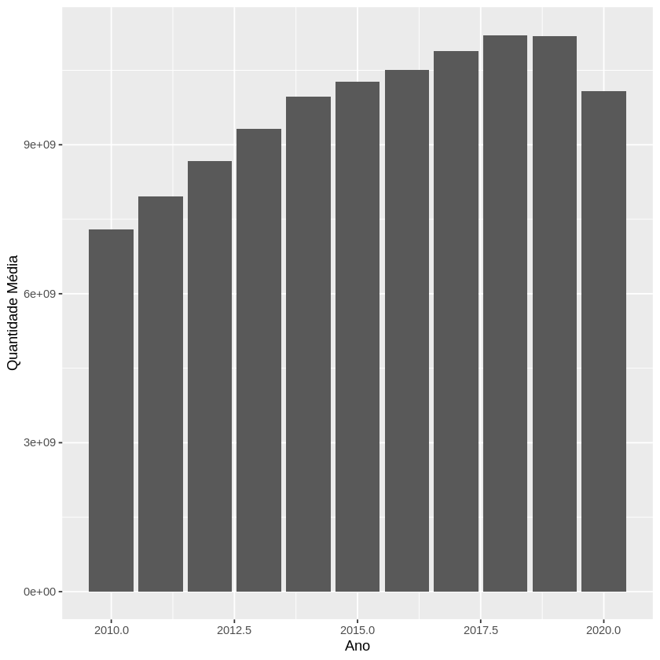
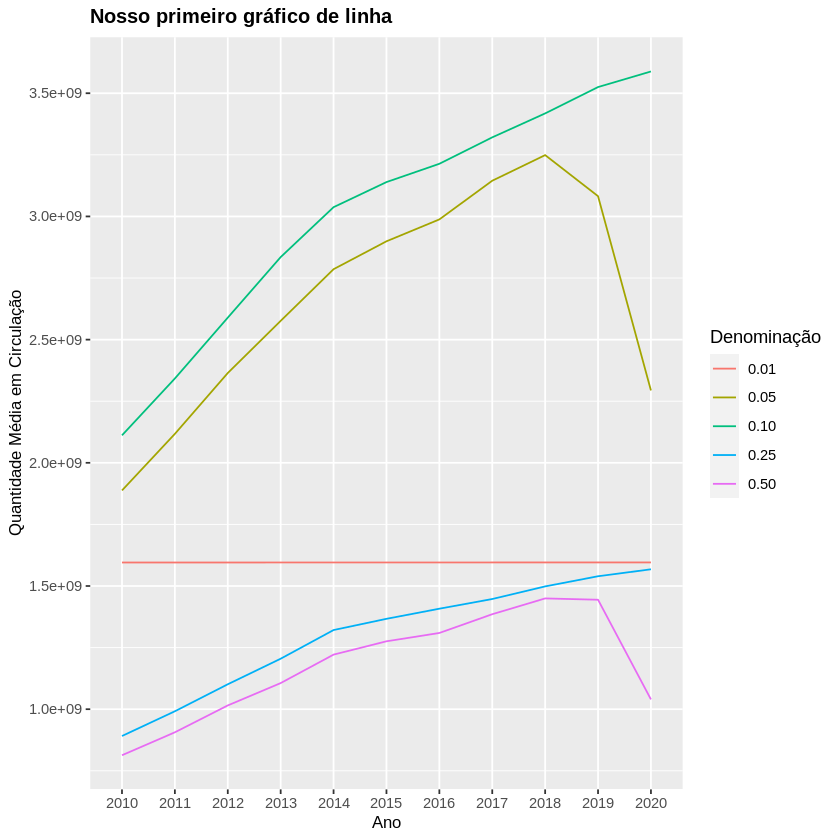
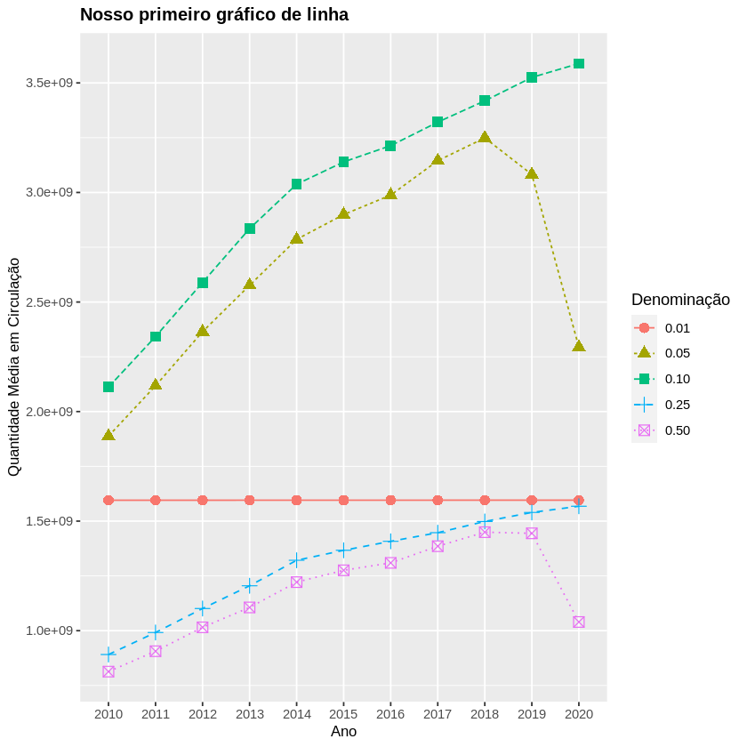

# Introdução a visualização de dados
Iremos nos aventurar no mundo da visualização gráfica de dados usando o ggplot2 (já dentro do tidyverse). Este material temcomo objetivo introduzir alguns conceitos principais deste pacote e uma visão inicial de como gerar os principais tipos de gráficos,usando o nosso tibble chamado circulacao_dinheiro_detalhado que é formado a seguir


```R
# library(tidyverse)

circulacao_dinheiro <- read_csv2("./MeioCirculante_DadosAbertos.csv", col_names = c("Data", "Família", "Denominação", "Quantidade"))

circulacao_dinheiro_detalhado <- mutate(circulacao_dinheiro, Dia = as.numeric(format(Data, "%d")), Mes = as.numeric(format(Data, "%m")), Ano = as.numeric(format(Data, "%Y")))
```

    [36mℹ[39m Using [34m[34m','[34m[39m as decimal and [34m[34m'.'[34m[39m as grouping mark. Use [30m[47m[30m[47m`read_delim()`[47m[30m[49m[39m for more control.
    
    
    [36m──[39m [1m[1mColumn specification[1m[22m [36m────────────────────────────────────────────────────────[39m
    cols(
      Data = [34mcol_date(format = "")[39m,
      Família = [31mcol_character()[39m,
      Denominação = [31mcol_character()[39m,
      Quantidade = [32mcol_number()[39m
    )
    
    


## Conceitos gerais
Com ggplot2, começamos a criar um gráfico com a função ggplot(). 

Intuitivamente, ela cria um sistema de coordenadas ondecolocamos camadas (por exemplo, um gráfico de barra). 

O primeiro argumento dessa função é o conjunto de dados que é utilizado parafazer os gráficos.

Completamos a criação do gráfico ao adicionar (literalmente adicionar, usando o símbolo +) uma ou mais camadas ao ggplot(). 

Em geral, a função para criar uma nova camada, a qual cria de fato um gráfico, tem o prefixo geom_ e abaixo vemos alguns tipos de gráficosimportantes do ggplot2:

 - geom_area() - desenha um gráfico de área (area plot), onde as linhas são preenchidas

 - geom_bar() - desenha um gráfico de barras (bar chart). Em geral, definimos um argumento stat = "identity" para desenhar um gráfico unidimensional (baseado no valor de um atributo/coluna).

 - geom_line() - desenha um gráfico de linhas (line plot). Adicionalmente, precisamos definir a coluna que contém os dados que serão conectados (argumento group) da esquerda para direita.

 - geom_path() - também desenha um gráfico de linhas, mas diferentemente, a ordem de conexão dos pontos serão conforme dispostos no conjunto de dados.

 - geom_point() - desenha um gráfico de pontos (scatterplot).
 - geom_polygon() - desenha polígonos, os quais essencialmente são “caminhos preenchidos”

geom_rect(), geom_tile() e geom_raster() desenham retângulos, eles somente diferem em seus argumentos.

Cada função que desenha gráfico no ggplot2 recebe um argumento chamado mapping. Esse argumento define como o conjunto dedados (ou seja, seus dados tabulares - tibble ou data.frame) são mapeados para as propriedades visuais dos gráficos.Essencialmente, o argumento mapping recebe um objeto retornado pela função aes() (de aesthetics) que significa a estética visualdo gráfico.

As funções que desenham gráficos exigem quais são os valores/colunas para os eixos x e y. 

Tal informação é passada pela funçãoaes(). Outras características visuais podem ser informadas também, mas somente nos próximos materiais iremos abordar emdetalhes.

Podemos definir que um formato geral para produção de um gráfico usando ggplot2 é:

````r
ggplot(data = <DATA>) +  
    <GEOM_FUNCTION>(mapping = aes(<MAPPINGS>))
````

Onde:

 - em <DATA> nós informamos o nosso data.frame ou tibble
    
 - em <GEOM_FUNCTION> nós de fato desenhamos uma nova camada no gráfico através de uma função
    
 - em <MAPPINGS> informamos as características visuais do gráfico, principalmente especificando qual é a coluna dos eixos x e y
    
Além disso, temos algumas funções para formatar de forma geral um gráfico:
    
 - ggtitle() - define o título do gráfico final
    
 - theme() - especifica, por exemplo, o estilo e tamanho da fonte usado em elementos como legenda e título do gráfico
    
 - labs() - para alterar nomes dos títulos dos eixos

## Gerando os primeiros gráficos

Tudo ficará mais claro ao aplicar os conceitos vistos ao nosso conjunto de dados usado até então. A seguir, vários tipos diferentes degráficos são usados visando responder a seguinte questão:

Qual é quantidade média de circulação de moedas menores de 1 real (ou seja, 0.01, 0.05, 0.10, 0.25 e0.50) nos últimos 10 anos no Brasil?

Ao responder essa pergunta, podemos analisar se existe alguma tendência de circulação de alguma moeda em particular - afinal, ondeestão as moedas de 0.01 centavos, por exemplo, elas existem mesmo em circulação? Alguma moeda em particular teve sua circulaçãoreduzida?O segredo para gerar gráficos precisos é gerar o conjunto de dados que responde a questão!

Por que?Vamos tentar gerar um gráfico de maneira “direta”:


```R
grafico_moedas <- ggplot(data = circulacao_dinheiro_detalhado) +   
    geom_bar(stat = "identity", mapping = aes(x = Ano, y = Quantidade))

grafico_moedas
```


    

    


Este gráfico possui uma série de problemas. O mais sério deles é que: **ele não responde a nossa questão!** As barras não significamnada! Cadê as legendas? Grupos?

Bom. Calma! Retomando:O segredo para se montar gráficos precisos é construir os dados tabulares que respondem a questãodefinida. Ou seja, definem-se quais são as colunas/atributos que esse conjunto de dados terá equestiona-se: as linhas desse conjunto de dados respondem à questão de fato? Se sim, estamos prontos para gerar gráficos precisos e ricos!

A seguir, preparamos os nossos dados para responder a questão anterior:


```R
#primeiro, vamos montar nossa tabela com os dados de interesse (ou seja, somente com as moedas inferiores a 1 real)
#vamos converter Denominação para numeric aqui!

moedas_menores_1real <- filter(circulacao_dinheiro_detalhado, as.numeric(Denominação) < 1.00 & between(Ano, 2010, 2020))

#agora, vamos montar a agregação, pois queremos somente a quantidade média de moedas por ano! do jeito que está, nosso conjunto de dados possui todos os dias e meses.
#dessa forma, vamos manter somente um subconjunto de colunas no resultado final -> Ano, Denominaçãoe Quantidade Média

moedas_menores_1real_agrupado <- group_by(moedas_menores_1real, Ano, Denominação)

#vamos chamar nosso conjunto de dados final de análise como "conjunto_de_analise"

conjunto_de_analise <- summarise(moedas_menores_1real_agrupado, "Quantidade Média" = mean(Quantidade)) 

#queremos a quantidade média, ou seja, a média de todos os valores do atributo Quantidade em um determinado Ano para cada Denominação

conjunto_de_analise
```

    `summarise()` has grouped output by 'Ano'. You can override using the `.groups` argument.
    


<table class="dataframe">
<caption>A grouped_df: 55 × 3</caption>
<thead>
	<tr><th scope=col>Ano</th><th scope=col>Denominação</th><th scope=col>Quantidade Média</th></tr>
	<tr><th scope=col>&lt;dbl&gt;</th><th scope=col>&lt;chr&gt;</th><th scope=col>&lt;dbl&gt;</th></tr>
</thead>
<tbody>
	<tr><td>2010</td><td>0.01</td><td>1595390824</td></tr>
	<tr><td>2010</td><td>0.05</td><td>1887855253</td></tr>
	<tr><td>2010</td><td>0.10</td><td>2111540556</td></tr>
	<tr><td>2010</td><td>0.25</td><td> 891228249</td></tr>
	<tr><td>2010</td><td>0.50</td><td> 813160073</td></tr>
	<tr><td>2011</td><td>0.01</td><td>1595410460</td></tr>
	<tr><td>2011</td><td>0.05</td><td>2117552941</td></tr>
	<tr><td>2011</td><td>0.10</td><td>2342271310</td></tr>
	<tr><td>2011</td><td>0.25</td><td> 991671246</td></tr>
	<tr><td>2011</td><td>0.50</td><td> 906274753</td></tr>
	<tr><td>2012</td><td>0.01</td><td>1595439029</td></tr>
	<tr><td>2012</td><td>0.05</td><td>2364452421</td></tr>
	<tr><td>2012</td><td>0.10</td><td>2589195308</td></tr>
	<tr><td>2012</td><td>0.25</td><td>1101182422</td></tr>
	<tr><td>2012</td><td>0.50</td><td>1015294240</td></tr>
	<tr><td>2013</td><td>0.01</td><td>1595485285</td></tr>
	<tr><td>2013</td><td>0.05</td><td>2576165754</td></tr>
	<tr><td>2013</td><td>0.10</td><td>2834982296</td></tr>
	<tr><td>2013</td><td>0.25</td><td>1204942795</td></tr>
	<tr><td>2013</td><td>0.50</td><td>1106022360</td></tr>
	<tr><td>2014</td><td>0.01</td><td>1595490688</td></tr>
	<tr><td>2014</td><td>0.05</td><td>2785852520</td></tr>
	<tr><td>2014</td><td>0.10</td><td>3037555996</td></tr>
	<tr><td>2014</td><td>0.25</td><td>1321290512</td></tr>
	<tr><td>2014</td><td>0.50</td><td>1221525442</td></tr>
	<tr><td>2015</td><td>0.01</td><td>1595502732</td></tr>
	<tr><td>2015</td><td>0.05</td><td>2899055039</td></tr>
	<tr><td>2015</td><td>0.10</td><td>3139405502</td></tr>
	<tr><td>2015</td><td>0.25</td><td>1366785504</td></tr>
	<tr><td>2015</td><td>0.50</td><td>1275599289</td></tr>
	<tr><td>2016</td><td>0.01</td><td>1595518853</td></tr>
	<tr><td>2016</td><td>0.05</td><td>2987903510</td></tr>
	<tr><td>2016</td><td>0.10</td><td>3213660349</td></tr>
	<tr><td>2016</td><td>0.25</td><td>1407888945</td></tr>
	<tr><td>2016</td><td>0.50</td><td>1309411665</td></tr>
	<tr><td>2017</td><td>0.01</td><td>1595551798</td></tr>
	<tr><td>2017</td><td>0.05</td><td>3144932175</td></tr>
	<tr><td>2017</td><td>0.10</td><td>3320943698</td></tr>
	<tr><td>2017</td><td>0.25</td><td>1447217084</td></tr>
	<tr><td>2017</td><td>0.50</td><td>1385520232</td></tr>
	<tr><td>2018</td><td>0.01</td><td>1595592013</td></tr>
	<tr><td>2018</td><td>0.05</td><td>3248885238</td></tr>
	<tr><td>2018</td><td>0.10</td><td>3418146113</td></tr>
	<tr><td>2018</td><td>0.25</td><td>1498396197</td></tr>
	<tr><td>2018</td><td>0.50</td><td>1449591710</td></tr>
	<tr><td>2019</td><td>0.01</td><td>1595591135</td></tr>
	<tr><td>2019</td><td>0.05</td><td>3082089073</td></tr>
	<tr><td>2019</td><td>0.10</td><td>3525064128</td></tr>
	<tr><td>2019</td><td>0.25</td><td>1539618749</td></tr>
	<tr><td>2019</td><td>0.50</td><td>1444233186</td></tr>
	<tr><td>2020</td><td>0.01</td><td>1595590296</td></tr>
	<tr><td>2020</td><td>0.05</td><td>2293675491</td></tr>
	<tr><td>2020</td><td>0.10</td><td>3588364878</td></tr>
	<tr><td>2020</td><td>0.25</td><td>1567869608</td></tr>
	<tr><td>2020</td><td>0.50</td><td>1039664724</td></tr>
</tbody>
</table>


Agora vamos tentar utilizar o mesmo código anterior para gerar um novo gráfico de barras, mas com o conjunto de dados que realmente responde a questão feita:


```R
grafico_moedas <- ggplot(data = conjunto_de_analise) + #note aqui que mudamos a base de dados  
    geom_bar(stat = "identity", mapping = aes(x = Ano, y = `Quantidade Média`)) #quando o nome da coluna tiver espaço, use `` para atributo a coluna à uma característica estética (nesse caso o eixo y)

grafico_moedas
```


    

    


Melhorou, certo? Estamos quase lá!

O gráfico acima possui ainda alguns problemas, tais como:A legenda do eixo x tem valores “quebrados”, como 2017.5. Faz sentido?

As barras simbolizam apenas valores totais das médias. Mas queremos comparar tendências de valor de moeda (ou seja,Denominação). Temos que ajustar, certo?

Vamos tentar melhorar visualmente o gráfico (para introduzir algumas funções de estilo - que serão melhores discutidas mais afrente)

Então, faremos mais uma tentativa:


```R
grafico_moedas_barra <- ggplot(data = conjunto_de_analise) +   
    geom_bar(stat = "identity", position = position_dodge(), mapping = aes(x = as.factor(Ano), y = `Quantidade Média`, fill = Denominação)) +  
    scale_y_continuous(n.breaks = 8) +  labs(x = "Ano", y = "Quantidade Média em Circulação") +  
    theme(axis.title = element_text(size=10), plot.title = element_text(size=12, face="bold")) +  
    ggtitle("Nosso primeiro gráfico de barras")

grafico_moedas_barra
```


    

    


Conseguimos melhorar bastante, certo? Vamos analisar as mudanças!

a. definimos um outro atributo estético do gráfico de barras (no aes()): o fill. Ele nos ajudou a definir qual é coluna do nossoconjunto de dados cujos valores serão comparados (ou seja, por meio do fill = Denominação definimos que os valores dacoluna Denominação sejam usados para construção das barras no gráfico)

b. ainda na função geom_bar(), definimos o seguinte argumento: position = position_dodge(). Isso significa que as barrassão dispostas em grupos, uma do lado da outra. Caso esse argumento não fosse definido, as barras estariam uma sobre a outra,de forma empilhada (faça o teste!)

c. ainda na função geom_bar(), definimos que o atributo do tibble no eixo x é um as.factor(Ano). Ou seja,transformamos o atributo Ano em um Factor! Geralmente, isso será uma prática comum quando quisermos manipular osvalores de um eixo, principalmente para atender alguma ordenação dos níveis (levels).

d. definimos a quantidade de “paradas” (ou seja, de elementos) no eixo y por meio da função scale_y_continuous() (iremosver essas funções de manipulação de eixo mais adiante, e, aproveitando, também existe a manipulação da escala no eixo x)

e. definimos novos nomes para as legendas dos eixos x e y por meio da função labs()

f. definimos uma nova formatação de alguns elementos do gráfico por meio da função theme(). Mais precisamente, o tamanhodo texto dos títulos dos eixos foi modificado para 10 e o tamanho do título do gráfico para 12 com sua formatação em negrito.g. por fim, definimos o título do gráfico por meio da função ggtitle()

Repare que:

1. definir um gráfico envolve a chamada de várias funções para customizar um gráfico (iremos ver mais funções de customização aolongo da disciplina)

2. precisamos definir com precisão quais são os atributos para cada um dos eixos do gráfico

3. a legenda do gráfico é feita automaticamente, incluindo a escolha das cores. Veremos mais adiante como realizar modificaçõesnesse sentido.

4. novas caracterizações do gráfico são simplesmente “adicionadas” usando o operador +

Vamos representar esse mesmo conjunto de dados, que responde a questão original, dessa vez usando um gráfico de linha, conforme segue:


```R
grafico_moedas_linha <- ggplot(data = conjunto_de_analise) +   
    geom_line(mapping = aes(x = as.factor(Ano), y = `Quantidade Média`, group = Denominação, colour =Denominação)) +  
    scale_y_continuous(n.breaks = 8) +  
    labs(x = "Ano", y = "Quantidade Média em Circulação") +  
    theme(axis.title = element_text(size=10), plot.title = element_text(size=12, face="bold")) +  
    ggtitle("Nosso primeiro gráfico de linha")

grafico_moedas_linha
```


    

    


Legal, certo? Parar criar o gráfico acima, 2 argumentos foram específicados na função aes() que são importantes para gráficos delinhas:

a. o group, que define qual a origem dos dados para fazer cada linha do gráfico (ou seja, cada grupo é uma linha e no nosso caso,cada linha representa uma Denominação diferente)

b. o colour, que define uma cor diferente para cada elemento distinto de Denominação

Opcionalmente, poderíamos mudar o tipo da linha, usando o atributo linetype da função aes():


```R
grafico_moedas_linha <- ggplot(data = conjunto_de_analise) +   
    geom_line(mapping = aes(x = as.factor(Ano), y = `Quantidade Média`, group = Denominação, colour =Denominação, linetype=Denominação)) +  
    scale_y_continuous(n.breaks = 8) +  labs(x = "Ano", y = "Quantidade Média em Circulação") +  
    theme(axis.title = element_text(size=10), plot.title = element_text(size=12, face="bold")) +  
    ggtitle("Nosso primeiro gráfico de linha")

grafico_moedas_linha
```


    

    


Podemos melhorar ainda mais o gráfico, colocando os pontos sobre as linhas. Isso é feito “adicionando” um gráfico de pontos(geom_point()):


```R
grafico_moedas_linha_ponto <- ggplot(data = conjunto_de_analise) +   
    geom_line(mapping = aes(x = as.factor(Ano), y = `Quantidade Média`, group = Denominação, colour =Denominação, linetype=Denominação)) +  
    geom_point(mapping = aes(x = as.factor(Ano), y = `Quantidade Média`, group = Denominação, colour= Denominação, shape=Denominação), size = 3) +  
    scale_y_continuous(n.breaks = 8) +  labs(x = "Ano", y = "Quantidade Média em Circulação") +  
    theme(axis.title = element_text(size=10), plot.title = element_text(size=12, face="bold")) +  
    ggtitle("Nosso primeiro gráfico de linha")

grafico_moedas_linha_ponto
```


    

    


2 comentários sobre o código acima:

1. Existe uma repetição de definição dos mappings, certo?

2. No geom_point() foi especificado dois outros parâmetros, um no mapping para variar o formato dos pontos(shape=Denominação) e o outro com relação ao tamanho dos pontos (size = 3).

Vamos melhorar a primeira observação da seguinte maneira:


```R
grafico_moedas_linha_ponto <- ggplot(data = conjunto_de_analise, mapping = aes(x = as.factor(Ano),y = `Quantidade Média`, group = Denominação, colour = Denominação)) +   
    geom_line(mapping = aes(linetype=Denominação)) +  
    geom_point(mapping = aes(shape=Denominação), size = 3) +  
    scale_y_continuous(n.breaks = 8) +  
    labs(x = "Ano", y = "Quantidade Média em Circulação") +  
    theme(axis.title = element_text(size=10), plot.title = element_text(size=12, face="bold")) +  
    ggtitle("Nosso primeiro gráfico de linha")

grafico_moedas_linha_ponto
```


    

    


Repare que os mappings foram para a função ggplot(). Isso significa que todos os gráficos definidos **herdaram** essa estética epoderão definir outros, inclusive. Como ocorreu em geom_line().
