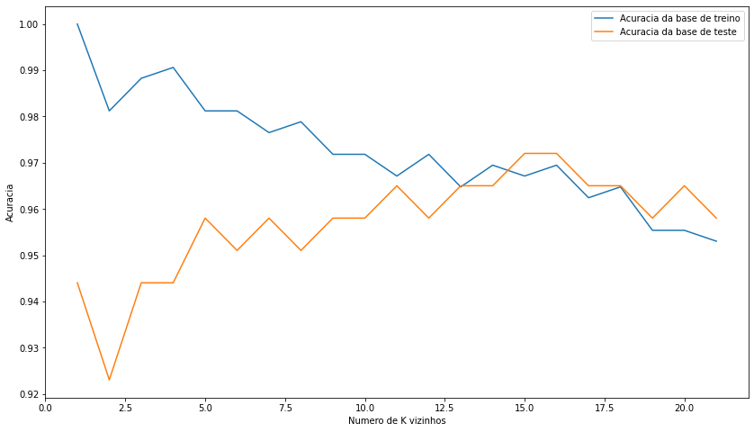

# 0 - Carregando bibliotecas

Nessa etapa, costuma-se dedicar a importação das bibliotecas que serão utilizadas no desenvolvimento do algoritmo de predição


```python
from sklearn.datasets import load_breast_cancer
from sklearn.neighbors import KNeighborsClassifier
from sklearn.model_selection import train_test_split
from sklearn.preprocessing import StandardScaler
import matplotlib.pylab as plt
```

# 1 - Abertura do dados

Aqui, é feito o carregamento dos dados que serão utlizados para treino e teste do algoritmo


```python
cancer = load_breast_cancer()
cancer.DESCR
```


    '.. _breast_cancer_dataset:\n\nBreast cancer wisconsin (diagnostic) dataset\n--------------------------------------------\n\n**Data Set Characteristics:**\n\n    :Number of Instances: 569\n\n    :Number of Attributes: 30 numeric, predictive attributes and the class\n\n    :Attribute Information:\n        - radius (mean of distances from center to points on the perimeter)\n        - texture (standard deviation of gray-scale values)\n        - perimeter\n        - area\n        - smoothness (local variation in radius lengths)\n        - compactness (perimeter^2 / area - 1.0)\n        - concavity (severity of concave portions of the contour)\n        - concave points (number of concave portions of the contour)\n        - symmetry\n        - fractal dimension ("coastline approximation" - 1)\n\n        The mean, standard error, and "worst" or largest (mean of the three\n        worst/largest values) of these features were computed for each image,\n        resulting in 30 features.  For instance, field 0 is Mean Radius, field\n        10 is Radius SE, field 20 is Worst Radius.\n\n        - class:\n                - WDBC-Malignant\n                - WDBC-Benign\n\n    :Summary Statistics:\n\n    ===================================== ====== ======\n                                           Min    Max\n    ===================================== ====== ======\n    radius (mean):                        6.981  28.11\n    texture (mean):                       9.71   39.28\n    perimeter (mean):                     43.79  188.5\n    area (mean):                          143.5  2501.0\n    smoothness (mean):                    0.053  0.163\n    compactness (mean):                   0.019  0.345\n    concavity (mean):                     0.0    0.427\n    concave points (mean):                0.0    0.201\n    symmetry (mean):                      0.106  0.304\n    fractal dimension (mean):             0.05   0.097\n    radius (standard error):              0.112  2.873\n    texture (standard error):             0.36   4.885\n    perimeter (standard error):           0.757  21.98\n    area (standard error):                6.802  542.2\n    smoothness (standard error):          0.002  0.031\n    compactness (standard error):         0.002  0.135\n    concavity (standard error):           0.0    0.396\n    concave points (standard error):      0.0    0.053\n    symmetry (standard error):            0.008  0.079\n    fractal dimension (standard error):   0.001  0.03\n    radius (worst):                       7.93   36.04\n    texture (worst):                      12.02  49.54\n    perimeter (worst):                    50.41  251.2\n    area (worst):                         185.2  4254.0\n    smoothness (worst):                   0.071  0.223\n    compactness (worst):                  0.027  1.058\n    concavity (worst):                    0.0    1.252\n    concave points (worst):               0.0    0.291\n    symmetry (worst):                     0.156  0.664\n    fractal dimension (worst):            0.055  0.208\n    ===================================== ====== ======\n\n    :Missing Attribute Values: None\n\n    :Class Distribution: 212 - Malignant, 357 - Benign\n\n    :Creator:  Dr. William H. Wolberg, W. Nick Street, Olvi L. Mangasarian\n\n    :Donor: Nick Street\n\n    :Date: November, 1995\n\nThis is a copy of UCI ML Breast Cancer Wisconsin (Diagnostic) datasets.\nhttps://goo.gl/U2Uwz2\n\nFeatures are computed from a digitized image of a fine needle\naspirate (FNA) of a breast mass.  They describe\ncharacteristics of the cell nuclei present in the image.\n\nSeparating plane described above was obtained using\nMultisurface Method-Tree (MSM-T) [K. P. Bennett, "Decision Tree\nConstruction Via Linear Programming." Proceedings of the 4th\nMidwest Artificial Intelligence and Cognitive Science Society,\npp. 97-101, 1992], a classification method which uses linear\nprogramming to construct a decision tree.  Relevant features\nwere selected using an exhaustive search in the space of 1-4\nfeatures and 1-3 separating planes.\n\nThe actual linear program used to obtain the separating plane\nin the 3-dimensional space is that described in:\n[K. P. Bennett and O. L. Mangasarian: "Robust Linear\nProgramming Discrimination of Two Linearly Inseparable Sets",\nOptimization Methods and Software 1, 1992, 23-34].\n\nThis database is also available through the UW CS ftp server:\n\nftp ftp.cs.wisc.edu\ncd math-prog/cpo-dataset/machine-learn/WDBC/\n\n.. topic:: References\n\n   - W.N. Street, W.H. Wolberg and O.L. Mangasarian. Nuclear feature extraction \n     for breast tumor diagnosis. IS&T/SPIE 1993 International Symposium on \n     Electronic Imaging: Science and Technology, volume 1905, pages 861-870,\n     San Jose, CA, 1993.\n   - O.L. Mangasarian, W.N. Street and W.H. Wolberg. Breast cancer diagnosis and \n     prognosis via linear programming. Operations Research, 43(4), pages 570-577, \n     July-August 1995.\n   - W.H. Wolberg, W.N. Street, and O.L. Mangasarian. Machine learning techniques\n     to diagnose breast cancer from fine-needle aspirates. Cancer Letters 77 (1994) \n     163-171.'


# 2 - Divisão em treinamento e teste

Uma alternativa para separar os dados de treino e teste, é a utilização da função train_test_split presente na biblioteca sklearn.model_selection


```python
X_train, X_test, y_train, y_test = train_test_split(cancer.data, cancer.target, stratify=cancer.target, random_state=66)
```

# 3 - Padronização dos dados

Utilizando a classe StandardScaler da biblioteca sklearn.preprocessing, realizaremos a padronização dos dados.

Padronização é a técnica para transformar os atributos com distribuição Gaussiana (normal) e diferentes médias e desvios padrão em uma distribuição.

Gausiana com média igual a 0 e desvio padrão igual a 1.

Para mais informações acesse meu blog: [Q.G do Tux](https://nic1611.github.io/blog/post/normalizacao_e_padronizacao/)


```python
scaler = StandardScaler()
scaler.fit(X_train)
X_train_std = scaler.transform(X_train)
X_test_std = scaler.transform(X_test)
```

# 4 -  Classificação com knn

Aqui é onde a mágica acontece :)

A função KNeighborsClassifier da biblioteca sklearn.neighbors facilita o o calculo dos vizinhos mais próximos.

Utilizamos um laço de repetição for para calcular a distância de até K vizinhos = 22.


```python

training_accuracy = []
test_accuracy = []

neighbors_setting = range(1,22)

for n_neighbors in neighbors_setting:
    knn = KNeighborsClassifier(n_neighbors=n_neighbors)
    knn.fit(X_train_std,y_train)
    training_accuracy.append(knn.score(X_train_std, y_train))
    test_accuracy.append(knn.score(X_test_std, y_test))
 

```

# 5 - Avaliação de acurácia

Por último, criamos um gráfico para vizualizar a acurácia das predições feitas com os diferentes K selecionados.


```python
plt.figure(figsize=(14,8)) 
plt.plot(neighbors_setting,training_accuracy, label='Acuracia da base de treino')
plt.plot(neighbors_setting,test_accuracy, label='Acuracia da base de teste')
plt.ylabel('Acuracia')
plt.xlabel('Numero de K vizinhos')
plt.legend()
```


    <matplotlib.legend.Legend at 0x222e98b7c10>


    

    

