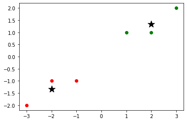

# Implementando um classificador NearestCentroid

## Importação das Bibliotecas


```python
import numpy as np
import matplotlib.pyplot as plt
from math import sqrt
```

## Esses são os dados de treino que vamos utilizar

Usando a biblioteca matplotlib, construimos um gráfico para melhor visualizar os dados


```python

X_train = np.array([[-1, -1], [-2, -1], [-3, -2], [1, 1], [2, 1], [3, 2]])
y_train = np.array([1, 1, 1, 2, 2, 2])

plt.scatter(X_train[y_train==1, 0], X_train[y_train==1, 1], c='r')
plt.scatter(X_train[y_train==2, 0], X_train[y_train==2, 1], c='g')
```


    

    


## Metodo utilizado para encontrar os centroids


```python
classes = np.unique(y_train)
centroids = np.empty((0, X_train.shape[1]))

for i in classes:
  c = np.mean(X_train[y_train == i], axis=0)
  centroids = np.vstack((centroids, c))
  
centroids
```


    array([[-2.        , -1.33333333],
           [ 2.        ,  1.33333333]])


## Com os centroid encontrados, usamos o matplotlib para apresentar os dados


```python
plt.scatter(X_train[y_train==1, 0], X_train[y_train==1, 1], c='r')
plt.scatter(X_train[y_train==2, 0], X_train[y_train==2, 1], c='g')
plt.scatter(centroids_[:,0], centroids_[:,1], s=200, marker='*', c='k')
```


    <matplotlib.collections.PathCollection at 0x2b7adcc79d0>


    

    


## Aqui nós criamos nossa implementação do NearestCentroid, com os métodos fit e predict


```python
class NearestCentroidScratch():
  def __init__(self, metric='eucledian'):
    self.metric = metric
    self.centroids_ = np.array([])
    self.classes_ = np.array([])
  
  def fit(self, X, y):
    self.classes_ = np.unique(y)
    self.centroids_ = np.empty((0, X.shape[1]))

    for i in self.classes_:
      c = np.mean(X[y == i], axis=0)
      self.centroids_ = np.vstack((self.centroids_, c))
    
    print(self.centroids_)

  def predict(self, X):
    res = []

    for t in X:
      label = np.sqrt(np.sum((t - self.centroids_)**2, axis=1))
      pred = self.classes_[np.where(label == np.min(label))[0][0]]
      res = np.append(res, pred)

    res = np.array(res)

    return res

  def score(self, y, pred):
    return np.sum(y == pred) / len(y)
```

## Utilizando a classe criada anteriomente, faremos o treinamento do modelo. Basicamente vai armazenar os centroids de cada categoria. O método predict vai prever a categoria de cada vetor da lista, buscando por seu vizinho mais próximo baseado na menor distância euclidiâna.


```python
model = NearestCentroidScratch()

model.fit(X_train, y_train)

X_test = np.array([[-1, -2], [0, -1], [-3, -3], [2, 2],  [1, 2]])
y_test = np.array([1, 1, 1, 2, 2])

res = model.predict(X_test)

model.score(y_test, res)
```

[[-2.         -1.33333333]
 [ 2.          1.33333333]]

1.0


