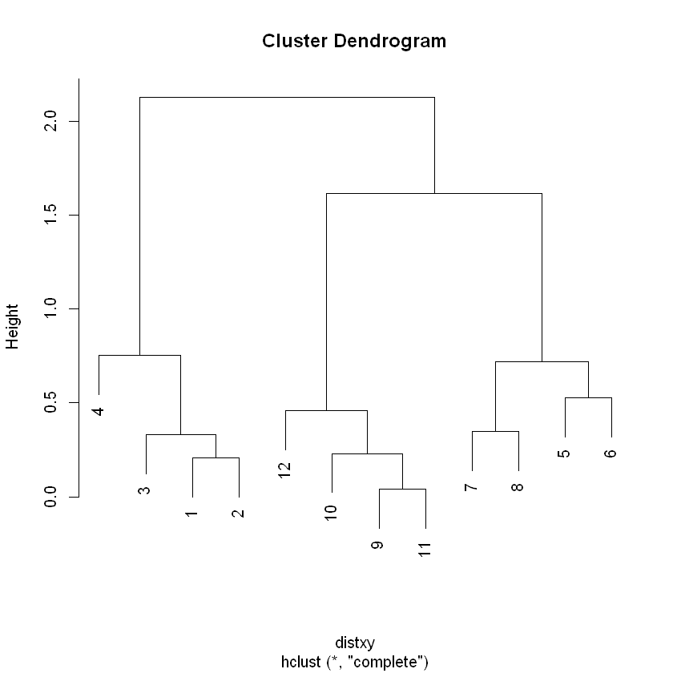
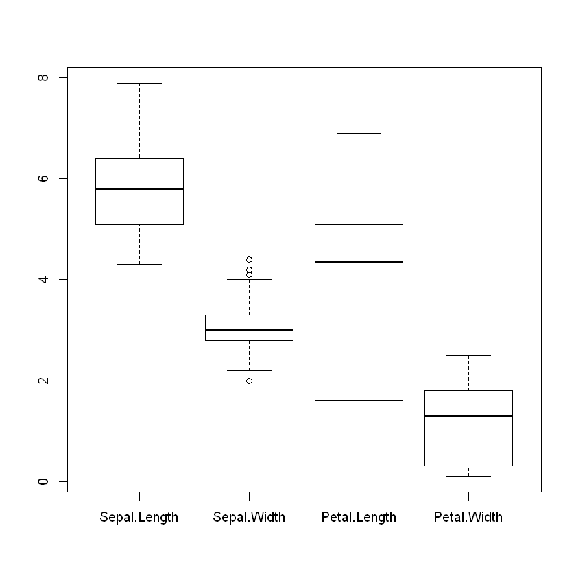
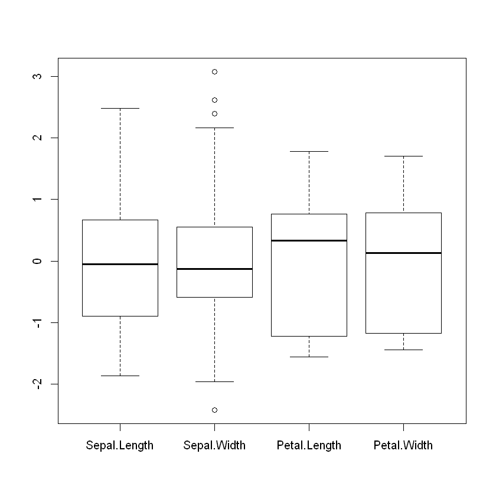
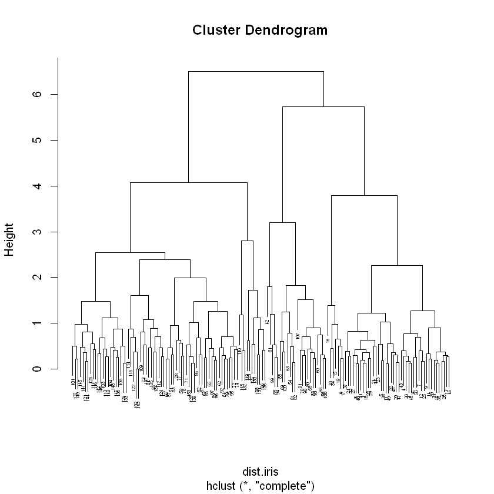
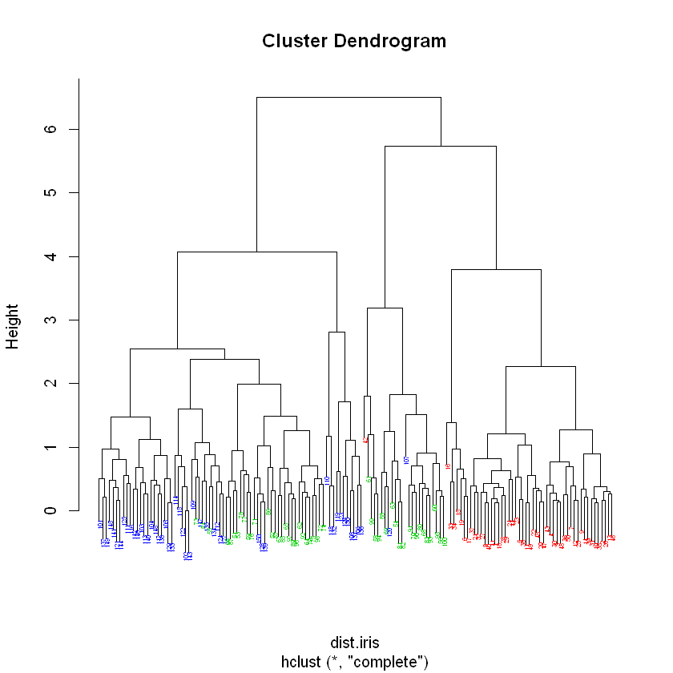
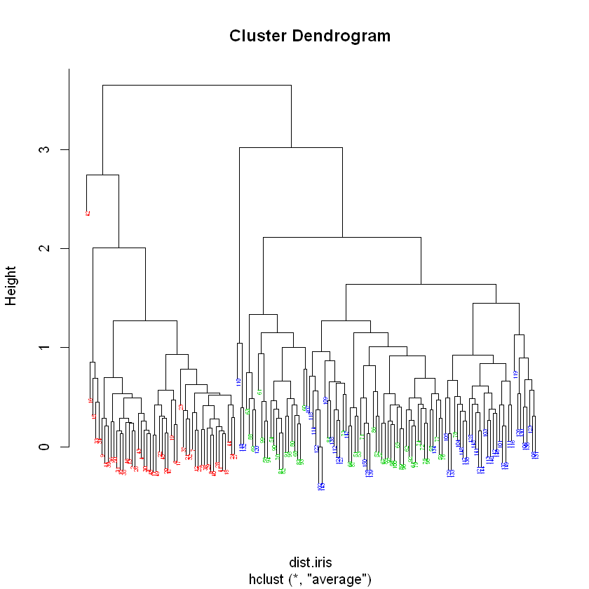
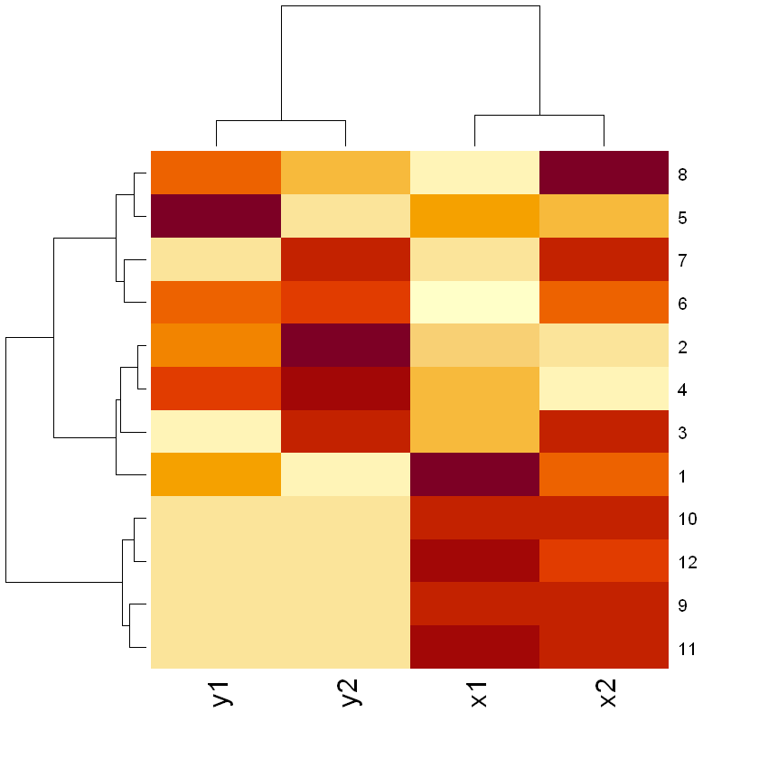
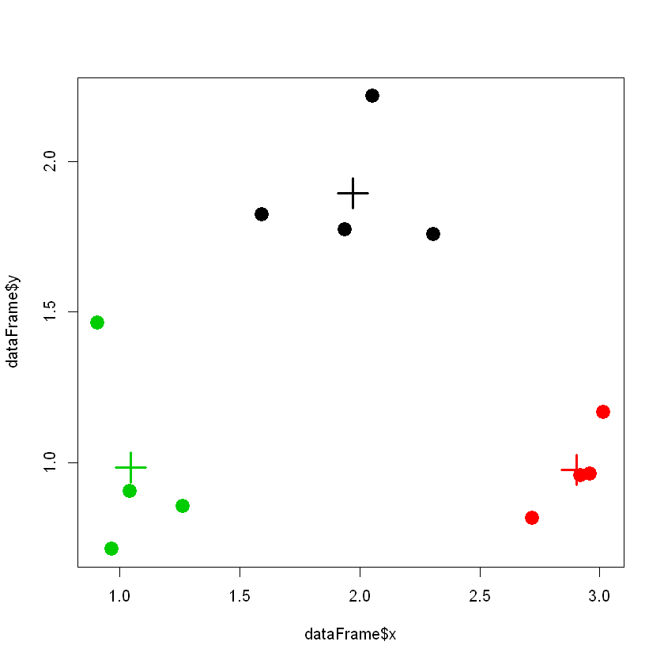

# Clustering 
 
 
## Introdução 
 
O objetivo do clustering é o de realizar o agrupamento de entidades / exemplos de um conjunto de dados (as linhas de uma matriz ou dataframe) com base na similaridade entre estes. Uma tarefa similar passa pelo agrupamento das colunas (variáveis). 
Embora não se pretenda neste texto abordar em detalhe as variantes, as formulações e os algoritmos para realizar esta tarefa note-se que as abordagens para este problemas variam sobretudo nas métricas usadas com vista à definição de similaridade, nos algoritmos usados para realizar o agrupamento, na forma que assume a saída destes mesmos algoritmos e, finalmente, na forma de visualizar e interpretar os resultados. 
Neste texto, abordaremos duas abordagens distintas, o clustering hierárquico e o clustering k-means, focando na forma como estas se podem implementar com a linguagem R. 
 
## Clustering hierárquico 
 
O clustering hierárquico tem como principal característica o tipo de resultados 
que gera que está intimamente ligado com o processo usado na sua construção. Neste caso, o resultado final do processo é uma árvore binária que representa possíveis divisões dos dados em clusters. Assim, na raiz todos os dados estão agrupados num único cluster, e ao descer na árvore os clusters vão-se dividindo de forma binária, ou seja, em cada nó da árvore são criados dois clusters pela divisão de um único. 
	O método mais usado para construir estas árvores é designado por 
aglomerativo, pois inicia-se com um cluster para cada exemplo, ou seja parte das folhas da árvore em direção à raiz, no processo de construção. Em cada iteração, vão-se juntando dois clusters e criando um único (criando nós na árvore) até se atingir o ponto em que todos os clusters estão unidos num único (raiz da árvore). 
O processo é baseado numa matriz de distâncias onde estão guardadas as distâncias entre todos os pares de objetos; esta matriz é construída aplicando uma métrica de similaridade sobre as linhas da matriz inicial de dados. Esta pode ser, por exemplo, baseada em métricas clássicas de distância como a distância euclidiana ou a distância de Manhattan ou, em alternativa, métricas baseadas na correlação (e.g. Spearman ou Pearson. 
Para obter uma matriz de distâncias em R, pode usar-se a função dist. Esta 
recebe como argumento uma matriz ou um data frame com valores numéricos, retornando a matriz de distâncias. Por omissão, o método usado para o cálculo das distâncias é a distância euclidiana, mas podem ser escolhidas outras opções como a distância de Manhattan ou a distãncia de Minkowski, através da definição do argumento method. 
O exemplo seguinte mostra como se pode calcular a matriz de distâncias para 
um exemplo com pontos gerados de forma aleatória formando três clusters naturais. Note que o resultado é uma matriz triangular dado que as matrizes de distâncias são simétricas. 


```R
x = rnorm(12,mean=rep(1:3,each=4),sd=0.2) 
y = rnorm(12,mean=rep(c(1,2,1),each=4),sd=0.2) 
dataFrame <- data.frame(x=x,y=y) 
dist(dataFrame)
```


                1          2          3          4          5          6          7
    2  0.20642068                                                                  
    3  0.33061879 0.22807374                                                       
    4  0.75146312 0.57341611 0.70477161                                            
    5  1.69987967 1.52512599 1.37926316 1.42841505                                 
    6  1.85433604 1.65480425 1.57319004 1.36853928 0.52512738                      
    7  1.27469223 1.07041532 1.02321407 0.77194462 0.71838837 0.60479049           
    8  1.43718223 1.24621901 1.13810773 1.07359908 0.36994125 0.45862069 0.34949609
    9  2.00937781 1.91775057 1.69807147 2.10964406 1.02696006 1.54643980 1.61521290
    10 2.10039289 1.99127326 1.77936524 2.12754673 0.92259869 1.42499933 1.56849129
    11 1.96897529 1.87760174 1.65778939 2.07220004 1.00661024 1.52805954 1.58463720
    12 1.75644918 1.67883553 1.45467613 1.92125873 1.02643369 1.55000062 1.51113162
                8          9         10         11
    2                                             
    3                                             
    4                                             
    5                                             
    6                                             
    7                                             
    8                                             
    9  1.30271310                                 
    10 1.23685031 0.21110702                      
    11 1.27525702 0.04040931 0.23045445           
    12 1.23396283 0.28163120 0.45936467 0.24501607


Para executar o processo de clustering hierárquico usa-se a função hclust. Esta 
recebe como argumento a matriz com as distâncias. Como argumento opcional (method), a função permite escolher a forma como se calculam distâncias entre clusters com mais do que um ponto nos passos intermédios do algoritmo. Os valores possíveis para esta opção incluem “complete” (valor por omissão, indica que a distância entre 2 clusters é a maior distância entre qualquer par de elementos dos 2 clusters), “single” (indica que a distância entre 2 clusters é a menor distância entre qualquer par de elementos dos 2 clusters) e “average” (indica que a distância entre 2 clusters é a média das distância entre todos os pares de elementos dos 2 clusters). 
Veja-se um exemplo de aplicação da função hclust com os dados do exemplo 
anterior: 


```R
distxy = dist(dataFrame, method = "euclidean") 
hc = hclust(distxy) 
plot(hc)
```


    

    


Para ilustrar estes métodos com um exemplo usando um conjunto de dados de 
maior dimensão, tome-se como ponto de partida os dados do conjunto de dados iris ja usados em capítulos anteriores. No exemplo seguinte, os dados são inicialmente standardizados para que a métrica de distância pese de forma uniforme as várias variáveis, podendo visualizar-se o efeito com um gráfico do tipo boxplot. Note-se que o atributo Species (posição 5) não é utilizado neste processo, sendo usados apenas os atributos numéricos. 


```R
iris.sc = scale(iris[,1:4])
boxplot(iris[,1:4]) 
boxplot(iris.sc)
```


    

    


    

    


Em seguida, procede-se ao cálculo da matriz de distâncias usando distâncias 
euclideanas e realiza-se o processo de clustering hierárquico usando a funçãoo hclust.


```R
dist.iris = dist(iris.sc, method = "euclidean") 
hc.complete = hclust(dist.iris, method = "complete") 
plot(hc.complete, cex = 0.4)
```


    

    


No gráfico gerado pelo código anterior, note-se que o número de pontos torna o 
resultado difícil de interpretar. Em muitos casos, faz sentido comparar a divisão dos dados em clusters com conhecimento próprio do problema. Neste caso, iremos usar o campo iris$Species como divisão natural dos dados (note-se que este campo não foi usado para realizar o clustering). O exemplo seguinte usa este campo para colocar as folhas da árvore e, assim, verificar os clusters gerados com os clusters naturais, usando dois valores distintos para o argumento method na função hclust.


```R
my.plot.hc = function(hclust, lab = 1:length(hclust$order),  
                      lab.col=rep(1, length(hclust$order)), hang = 0.1, ...) 
{ 
  y = rep(hclust$height, 2) 
  x = as.numeric(hclust$merge) 
  y = y[which(x<0)] 
  x = x[which(x<0)] 
  x = abs(x) 
  y = y[order(x)] 
  x = x[order(x)] 
  plot(hclust, labels = F, hang = hang, ...) 
  text(x = x, y = y[hclust$order]- (max(hclust$height) * hang),  
       labels = lab[hclust$order], col = lab.col[hclust$order], srt = 90,  
       adj = c(1,0.5), xpd = NA, ...) 
}

dist.iris = dist(iris.sc, method = "euclidean") 
hc.complete = hclust(dist.iris, method = "complete") 
my.plot.hc(hc.complete,lab.col=as.integer(iris$Species)+1, cex=0.4)
hc.average = hclust(dist.iris, method = "average") 
my.plot.hc(hc.average,lab.col=as.integer(iris$Species)+1,cex=0.4)
```


    

    


    

    


Uma representação gráfica dos dados relacionada com o clustering hierárquico 
são os heatmaps, que podem ser construídos em R com a função heatmap. Esta permite representar os dados como uma imagem onde cada valor da matriz de dados é representado com uma célula cuja cor varia consoante o valor respetivo, num gradiente de cores que pode ser configurado. Os heatmaps tipicamente incluem as árvores criadas por clustering hierárquico quer ao nível das linhas, quer ao nível das colunas de dados. Note o exemplo seguinte: 


```R
x1 <- rnorm(12,mean=rep(1:3,each=4),sd=0.2) 
x2 <- rnorm(12,mean=rep(1:3,each=4),sd=0.2) 
y1 <- rnorm(12,mean=rep(c(1,2,1),each=4),sd=0.2) 
y2 <- rnorm(12,mean=rep(c(1,2,1),each=4),sd=0.2) 
df2 = data.frame(x1, x2, y1, y2) 
heatmap(as.matrix(df2))
```


    

    


## Clustering k-means 
  
O problema de clustering k-means constitui uma das possíveis formulações do clustering, onde o objetivo é o de minimizar a média do quadrado das distâncias de cada ponto ao centro do cluster a que pertence. Nesta formulação, o número de clusters é dado como parâmetro de entrada (designado por k). Dado que este problema apresenta uma significativa complexidade (dentro da classe dos problemas NP-completos), métodos heurísticos são tipicamente usados na resolução do problema. 
A função kmeans permite resolver um problema de clustering k-means dado um 
conjunto de dados e o valor de k (parâmetro centers).  
Veja um exemplo de seguida, usando os dados criados na secção anterior: 


```R
resKmeans <- kmeans(dataFrame, centers=3) 
resKmeans$cluster 
plot(dataFrame$x,dataFrame$y, col=resKmeans$cluster, pch=19, cex=2) 
points(resKmeans$centers, col=1:3, pch=3, cex=3, lwd=3) 
```


<ol class=list-inline>
	<li>3</li>
	<li>3</li>
	<li>3</li>
	<li>3</li>
	<li>1</li>
	<li>1</li>
	<li>1</li>
	<li>1</li>
	<li>2</li>
	<li>2</li>
	<li>2</li>
	<li>2</li>
</ol>


    

    


Note-se que, em casos reais, dado que o método de otimização usado é heurístico 
há a necessidade de se correr o algoritmo por diversas vezes, de forma a aumentar a qualidade da solução final encontrada. Este número de repetições pode ser controlado pelo parâmetro nstart. 
De forma idêntica ao método anterior, ir-se-á demonstrar este método usando o 
conjunto de dados iris.


```R
kmeans.iris = kmeans(iris[,1:4], centers = 3, nstart = 10000) 
table(kmeans.iris$cluster, iris$Species)
```


       
        setosa versicolor virginica
      1     50          0         0
      2      0         48        14
      3      0          2        36


Note-se que o segundo comando executado permite comparar o resultado da função kmeans com o agrupamento natural dos dados pelo campo Species. Esta comparação permite aferir da conformidade dos clusters gerados e dos clusters naturais. 
