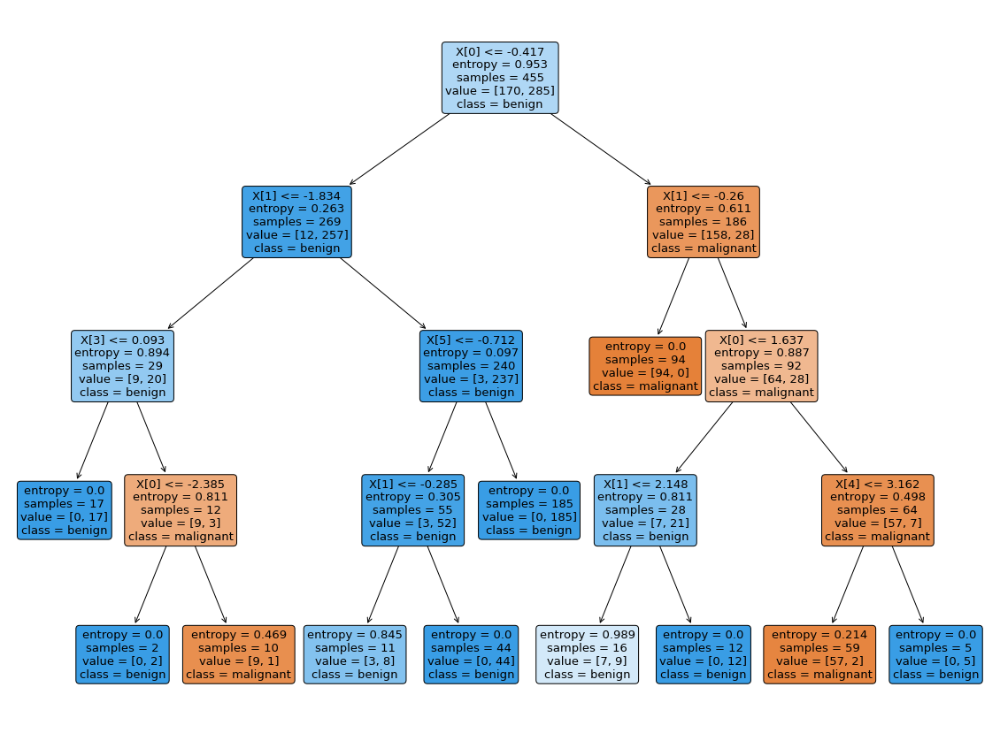

# Criando um pipeline de um modelo Decision Tree Classifier para prever tipos de cancer de mama


```python
from sklearn.datasets import load_breast_cancer
from sklearn.model_selection import train_test_split
from sklearn.preprocessing import StandardScaler
from sklearn.decomposition import PCA
from sklearn.model_selection import GridSearchCV
from sklearn.pipeline import Pipeline
import matplotlib.pyplot as plt
from sklearn.tree import DecisionTreeClassifier
from sklearn.metrics import accuracy_score
import numpy as np
```


```python
cancer = load_breast_cancer()
X = cancer.data
Y = cancer.target
```


```python
X_train, X_test, y_train, y_test = train_test_split(X, Y, test_size=0.2, shuffle=True, stratify=Y)
```


```python
pipeline = Pipeline([
        ('z-score', StandardScaler()),
        ('reduce_dim', PCA(n_components=3)),
        ('classify', DecisionTreeClassifier(criterion='entropy', max_depth=2))])
```


```python
param_grid = {
    'reduce_dim__n_components': [1, 2, 3, 4, 5, 6, 7, 8, 9, 10, 11, 12, 13, 14, 15],
    'classify__max_depth': [2, 3, 4, 5, 6, 7]
}

grid = GridSearchCV(pipeline, cv=2, n_jobs=1, param_grid=param_grid, scoring='accuracy')
```


```python
grid.fit(X_train, y_train)
```


    GridSearchCV(cv=2,
                 estimator=Pipeline(steps=[('z-score', StandardScaler()),
                                           ('reduce_dim', PCA(n_components=3)),
                                           ('classify',
                                            DecisionTreeClassifier(criterion='entropy',
                                                                   max_depth=2))]),
                 n_jobs=1,
                 param_grid={'classify__max_depth': [2, 3, 4, 5, 6, 7],
                             'reduce_dim__n_components': [1, 2, 3, 4, 5, 6, 7, 8, 9,
                                                          10, 11, 12, 13, 14, 15]},
                 scoring='accuracy')


```python
print(grid.best_score_)
print(grid.best_params_)
```

    0.9384612412087487
    {'classify__max_depth': 4, 'reduce_dim__n_components': 9}
    


```python
clf = grid.best_estimator_

y_test_pred = clf.predict(X_test)
accuracy_score(y_test, y_test_pred)
```


    0.9210526315789473


```python
from sklearn.tree import plot_tree

plt.figure(figsize=(20, 15))

plot_tree(clf['classify'], filled=True, rounded=True, class_names=cancer.target_names) 

plt.show()
```


    

    


### Escolha de uma amostra para realização da inferência


```python
amostra_x = X_test[77,:]
amostra_x = np.reshape(amostra_x,(1, -1))

amostra_padronizada = clf['z-score'].transform(amostra_x)
amostra_x = clf['reduce_dim'].transform(amostra_padronizada)
amostra_y = y_test[77]
amostra_y = np.reshape(amostra_y, (1))

print("X da amostra", amostra_x)

```

    X da amostra [[-3.19882789 -0.95927264 -1.46330018  0.57726281  0.71290105  0.24765855
       0.10316019  0.27941066  0.25004988]]
    


```python
y_amostra_pred = clf['classify'].predict(amostra_x)
print("Categoria da amostra", amostra_y)
print("Categoria prevista pelo modelo", y_amostra_pred)


```

    Categoria da amostra [1]
    Categoria prevista pelo modelo [1]
    

### Explicação da previsão do modelo para a amostra selecionada:

- Se a primeira posição do array for menor ou igual a -0.417:
  - Se a segunda posição do array for menor ou igual a -1.835:
    
      ..
  - Senão:
    - Se a sexta posição do array for menor ou igual a -0.712:

      ..
    - Senão:
      
      resultado = 1/benign
