## Distribuições

As distribuições são modelos matemáticos que tem por objetivo resolver
certos problemas probabilísticos.

Pense da seguinte maneira:

Situações são diferentes: mas não tão diferentes assim...

Dessa forma: se eu elaboro um método que resolve um certo tipo de
situação, eu posso reproduzí-lo para resolver situações parecidas com a
que eu resolvi previamente.

## Distribuição Binomial

A Distribuição Binomial é uma distribuição que chamamos de DISCRETA.
Isso ocorre, pois a variável envolvida “n” são número inteiros.

Essa distribuição tem algumas “regras”, ou seja, ela funciona somente para
algumas situações específicas:

1. O experimento deve ser repetido, sob as mesmas condições, um
número finito “n” de vezes
2. Cada experimento deve ser independente do anterior.
3. Em cada prova, deve aparecer somente dois casos: sucesso e
insucesso
4. A chance de sucesso (p) e de insucesso devem ser eventos
complementares

P( X = K ) é a probabilidade de que o experimento tenha sucesso “k”
vezes em “n” tentativas

“p” é a probabilidade de sucesso do experimento. “q” é a probabilidade
de insucesso. Como sucesso e insucesso são complementares, a
probabilidade de q = 1 - p

### Fórmula:

## Distribuição de Poisson

### O que é a distribuição de Poisson?

Bom, a distribuição de Poisson segue uma ideia bastante intuitiva até. A ideia de que às vezes é muito fácil saber o número de sucessos de um experimento, mas é algo totalmente sem sentido determinar o número de insucessos ou então o número total de provas. Exemplo: é fácil determinar quantos carros passaram numa esquina durante um dia, mas é algo totalmente sem sentido tentar calcular quantos carros deixaram de passar.

Uma outra ideia que se aplica a distribuição de Poisson são
aqueles experimentos que são repetidos MUITAS vezes, muitas
vezes mesmos!

Mas que cada iteração tem uma chance mínima de ocorrer.

Não é difícil de pensar em um exemplo:
A todo momento o planeta Terra é alvo de um cometa gigante
que poderia exterminar toda a vida contida nele, a todo
momento mesmo! Mas a chance disso acontecer é MUITO
pequena.

Em linguagem Matemática, dizemos da seguinte maneira isso:

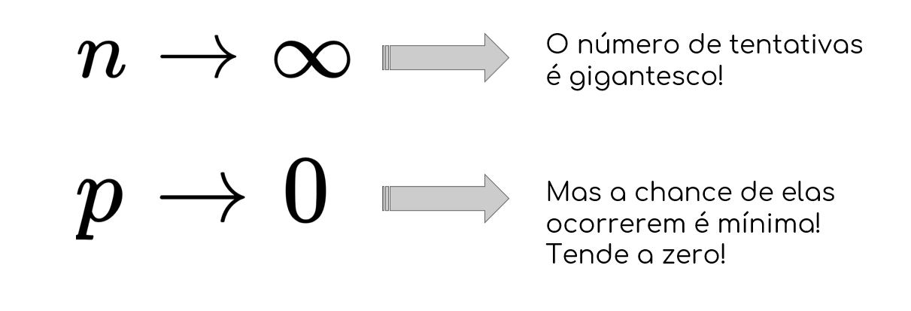

Geralmente situações que envolvem TEMPO associamos a
distribuição de Poisson. As outros “regras” são similares a
distribuição Binomial. Vamos aos parâmetros:

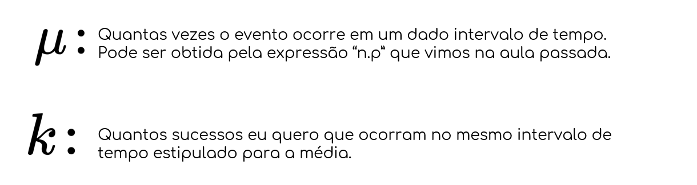

### FÓRMULA

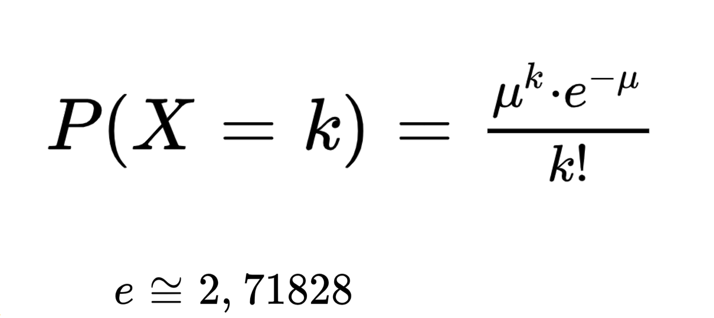

## Distribuição Normal

### O que é uma variável contínua?

Para entender, precisamos voltar um pouco lá nas variáveis discretas... vamos montar o gráfico da distribuição de probabilidade da variável discreta “X = soma do resultado do lançamento de dois dados”

### Tabela da variável discreta “X”

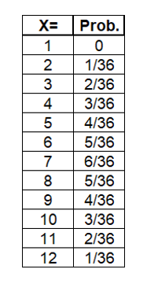

O que faz com que chamemos
essa variável de discreta?

### O que é então uma variável contínua?

É uma variável que pode assumir infinitos valores em um intervalo finito. Por isso que para uma variável dessas, não faz sentido calcular P(X = y)... as probabilidades que desejamos obter sempre serão dadas em formas de intervalos. A área do intervalo é a probabilidade!

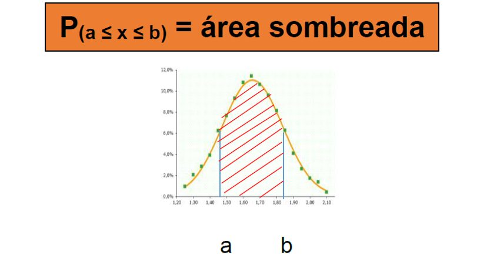

#### Exemplo

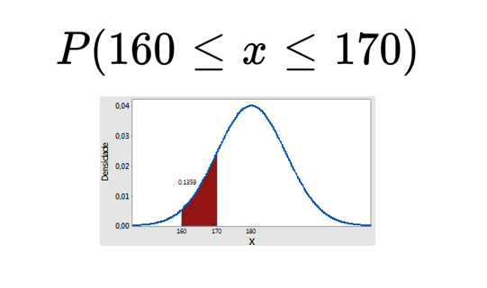

#### Exemplo

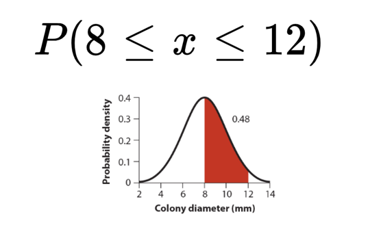

### O que é a distribuição Normal?

Entre as distribuições de variável aleatória contínua, a mais empregada é sem dúvida a distribuição Normal. O aspecto gráfico de uma distribuição normal é sempre o formato de um “sino”. Já vimos isso antes na disciplina. São as distribuições que possuem média, moda e mediana com valores iguais!

### Aspecto gráficos

Essa distribuição também recebe o nome de distribuição de Gauss ou
de Laplace.

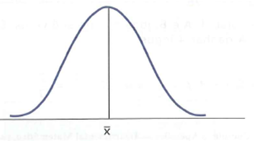

### Fórmula

Sua fórmula é muito complicada! Porque além de ela ser complicada,
para calcular as probabilidades precisaríamos integrar um intervalo.

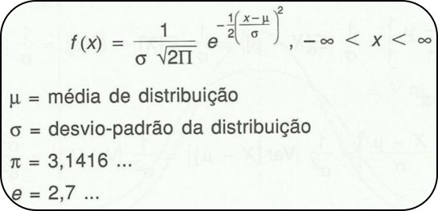

### Felizmente...

Existem formas de “dibrar” o problema da fórmula e a integração.
Começamos fazendo uma mudança de variável:

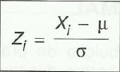

Mudamos os intervalos que queremos calcular as probabilidades. Percebam que é necessário saber de antemão a MÉDIA (o valor esperado) e o DESVIO PADRÃO da variável aleatória que se está estudando

### O tal do “Z”

Essa variável nova chamada de “Z” é excelente para trabalhar, pois ela tem duas propriedades que permite que seja fácil de colocar seus valores em uma tabela:

Sua média é 0

Sua variância e desvio padrão são iguais a 1

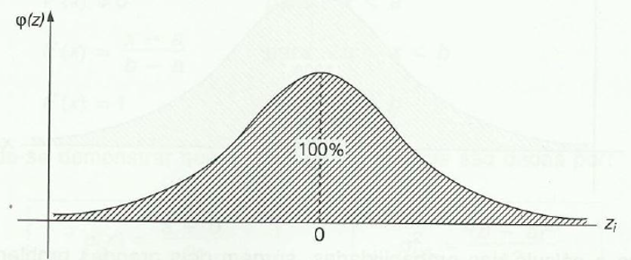

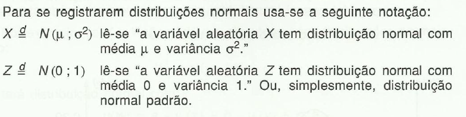

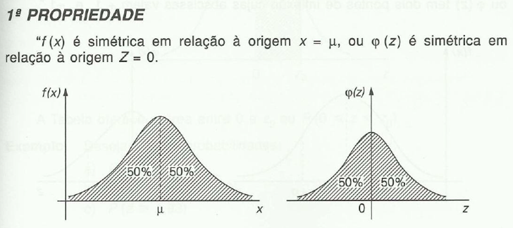

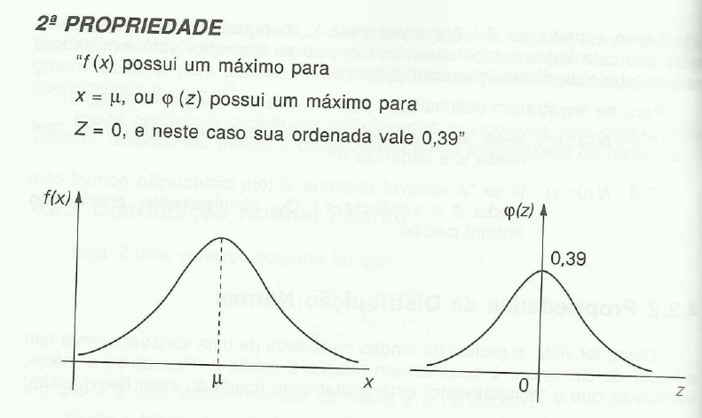

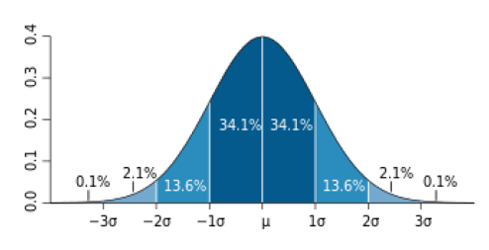

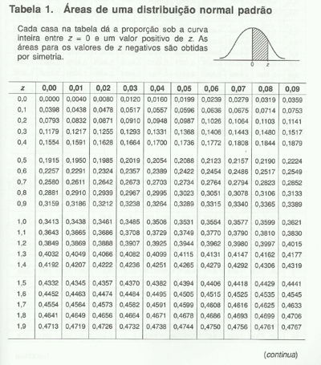

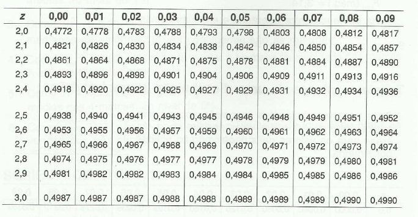

### Como usar a tabela?

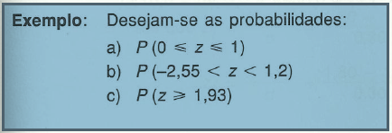

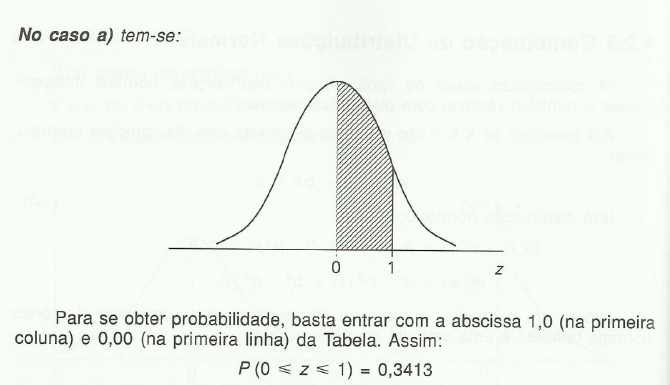

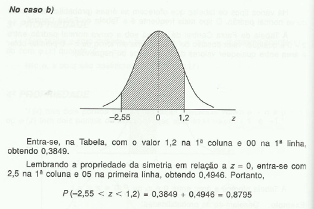

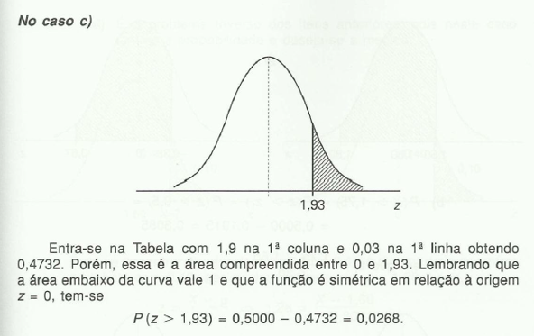

