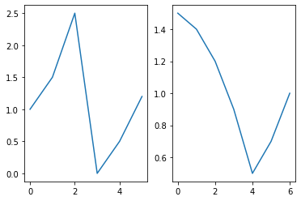
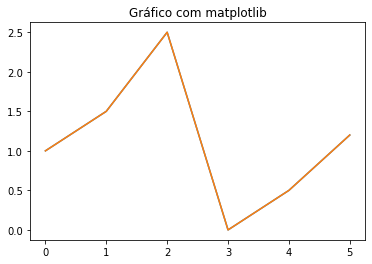
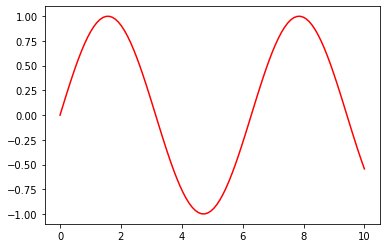
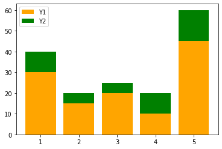
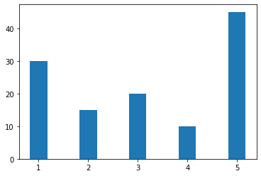
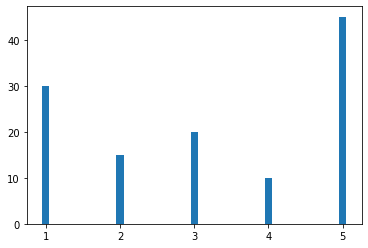
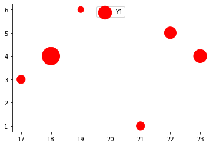
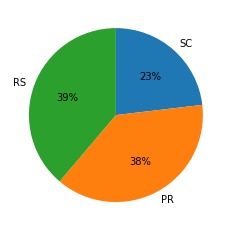
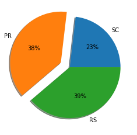
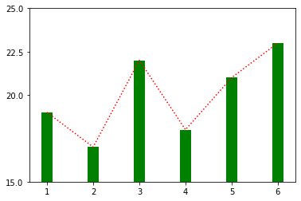

# Introdução

O matplotlib é uma biblioteca para gerar gráficos ( plots ) em Python, inclusive em 3 dimensões.
Abaixo um exemplo de como plotar um gráfico com matplotlib.
Primeiramente importamos a interface baseada em estados ( pyplot ) do matplotlib. O padrão da
comunidade é usar o alias plt :


```python
from matplotlib import pyplot as plt
import math
import numpy as np
```

Então, definimos uma sequencia de valores (em uma lista) a serem impressos. Por padrão


```python
plt.plot([1.0, 1.5, 2.5, 0.0, 0.5, 1.2])
```

    

    


No comando acima, passamos uma lista com os valores no eixo y. Os valores do eixo x são inferi-
dos pelo índice dos valores na lista.
Note que no Jupyter, para cada célula de código que gera uma figura, a figura é exibida automati-
camente abaixo da célula. No Spyder há a aba plots (no mesmo local do explorador de variáveis).
Para um script executado normalmente (sem um ambiente como o Jupyter ou Spyder) é necessário
chamar o comando plt.show.


```python
plt.plot([1.0, 1.5, 2.5, 0.0, 0.5, 1.2])
plt.show()
```


    

    


Fora do Jupyter, plt.show() executará uma janela com ferramentas para a manipulação da posição
ezoomdo gráfico. Também haverá uma opção para salvar em disco o gráfico como figura.

## Padrões de uso

Há dois principais padrões de uso: API pyplot e a API orientada a objetos.

### API pyplot

matplotlib.pyplot (lembre-se que geralmente usamos o alias plt ) é uma coleção de funções em es-
tilo comandos inspirado no MATLAB. Cada função faz alguma alteração em uma figura (e.g. criar
a figura, adicionar área de plotagem, gerar plots, adicionar rótulos).
Esta API é recomendada para gráficos interativos e casos simples. O exemplo acima usa a API
pyplot.

### API orientada a objetos

Se você necessita mais controle sobre seus plots a API orientada a objetos é mais indi-
cada. Na maioria dos casos é criada uma figura e um ou mais eixos ( Axes ) usando mat-
plotlib.pyplot.subplots (ou plt.subplots com o uso do alias).
Observe o exemplo abaixo:


```python
fig, ax = plt.subplots(1, 1)
ax.plot([1.0, 1.5, 2.5, 0.0, 0.5, 1.2])
```


   

    


O exemplo acima usa a API orientada a objetos para plotar o mesmo plot anterior. O comando
plt.subplots retorna uma figura e um eixo, ax , (ou uma lista de eixos) criado(s). É uma maneira
conveniente de criar umlayoutde vários plots, incluindo a figura que os agrega, em um único
comando.
Os principais argumentos de plt.subplots são dados conforme a descrição abaixo:
matplotlib.pyplot.subplots(nrows=1, ncols=1, sharex=False, sharey=False, squeeze=True, subplot_kw=None, gridspec_kw=None, **fig_kw)

- **nrows** , **ncols** : Número de linhas e colunas
- **sharex** , **sharey** : Controla o compartilhamento dos eixos x e y, respectivamente. 

Aceita os valores:

- True ou ‘all’: eixos **x** e/ou **y** são compartilhados em todos os subplots.
- False ou ‘none’: Os eixos são independentes em todos os subplots.
- ‘row’: todos os subplots na mesma linha tem e/os eixos **x** ou **y** compartilhados
- ‘col’: todos os subplots na mesma coluna tem os eixos **x** e/ou **y** compartilhados.
       
Observe abaixo a criação de uma figura com dois subplots:


```python
fig, axes = plt.subplots(1, 2)
axes[0].plot([1.0, 1.5, 2.5, 0.0, 0.5, 1.2])
axes[1].plot([1.5, 1.4, 1.2, 0.9, 0.5, 0.7, 1.0])
```


    

    


O mesmo exemplo, mas com o eixo y compartilhado:


```python
fig, axes = plt.subplots(1, 2, sharey=True)
axes[0].plot([1.0, 1.5, 2.5, 0.0, 0.5, 1.2])
axes[1].plot([1.5, 1.4, 1.2, 0.9, 0.5, 0.7, 1.0])
```


    

    


## Controlando ambos os eixos (x e y)

O comando plot aceita que definimos tanto os valores do eixo x como do y. Podemos passar
as duas listas para plot , devemos tomar cuidado que as listas devem ter o mesmo número de
elementos. Observe o exemplo abaixo:


```python
fig, ax = plt.subplots(1, 1)
X = [1.0, 3.0, 4.0, 7.0, 9.0]
Y = [5.0, 6.0, 7.0, 6.5, 2.0]

ax.plot(X, Y)
```


    

    


## Várias linhas em um mesmo subplot

Podemos adicionar quantas linhas forem necessárias a um mesmo subplot.


```python
fig, ax = plt.subplots(1, 1)
X = np.linspace(0, 3.1415, 100)
Y1 = list(map(lambda x: math.sin(x), X))
Y2 = list(map(lambda x: math.cos(x), X))


ax.plot(X, Y1)
ax.plot(X, Y2)
```


    

    


## Componentes do gráfico

### Legendas

Abaixo adicionamos legendas ao exemplo acima, facilitando a leitura do gráfico. Para isso pas-
samos o argumento label para cada plot , especificando o rótulo da legenda daquela linha. Us-
amos o método legend para adicionar a legenda e definir sua localização no subplot. loc define a
posição da legenda e aceita os seguintes valores:

- ‘best’
- ‘upper right’
- ‘upper left’
- ‘lower left’
- ‘lower right’
- ‘right’
- ‘center left’
- ‘center right’
- ‘lower center’
- ‘upper center’
- ‘center’


```python
fig, ax = plt.subplots(1, 1)
X = np.linspace(0, 3.1415, 100)
Y1 = list(map(lambda x: math.sin(x), X))
Y2 = list(map(lambda x: math.cos(x), X))

ax.plot(X, Y1, label='Seno')
ax.plot(X, Y2, label='Cosseno')
ax.legend(loc='upper right')
```


    

    


### Título do subplot

O título é adicionado com o método set_title na API orientada a objetos e com plt.title na API
pyplot.


```python
fig, ax = plt.subplots(1, 1)
ax.plot([1.0, 1.5, 2.5, 0.0, 0.5, 1.2])
ax.set_title("Gráfico com matplotlib")
```


    

    


```python
plt.plot([1.0, 1.5, 2.5, 0.0, 0.5, 1.2])
plt.title("Gráfico com matplotlib")
```


    

    


### Rótulo (ou título) dos eixos

Na API orientada a objetos , adicionamos rótulos do eixo x e y com set_xlabel e set_ylabel , re-
spectivamente


```python
fig, ax = plt.subplots(1, 1)
ax.plot([1.0, 1.5, 2.5, 0.0, 0.5, 1.2])
ax.set_xlabel("Eixo x")
ax.set_ylabel("Eixo y")
```


    

    


Na API pyplot , adicionamos rótulos do eixo x e y com xlabel e ylabel , respectivamente


```python
plt.plot([1.0, 1.5, 2.5, 0.0, 0.5, 1.2])
plt.xlabel("Eixo x")
plt.ylabel("Eixo y")
```


    

    


### Título da figura

Usamos o método suptitle do objeto Figure (primeiro retorno da função plt.subplots , o qual
chamamos fig ) para adicionar um título para a figura. Observe o exemplo abaixo:


```python
fig, (ax1, ax2) = plt.subplots(2, 1, sharex=True)
X = np.linspace(0, 10, 100)
Y1 = list(map(lambda x: math.sin(x), X))
Y2 = list(map(lambda x: math.cos(x), X))

ax1.plot(X, Y1)
ax1.set_title("Seno")

ax2.plot(X, Y2)
ax2.set_title("Cosseno")

fig.suptitle("Seno e Cosseno")
```


    

    


No exemplo acima também estamos compartilhando o eixo **x**.

## Gráficos y vs x (linhas)

Já vimos que utilizamos **plot** para adicionar um gráfico de linha a um eixo. Na realidade, **plot** faz
uma gráfico de **y** versus **x** , que por padrão é uma linha.

O terceiro argumento, **fmt** , de **plot** é uma string que controla algumas características deste gráfico.
Ele é formado por até 3 partes:

fmt = '[marcador][linha][cor]'

Os principais **marcadores** são:

- ‘.’ ponto;
- ‘,’ pixel;
- ‘o’ círculo;
- ‘v’, ‘ˆ’, ‘<’, ‘>’ triângulo para baixo, cima, esquerda e direita, respectivamente;
- ‘s’ quadrados
- ‘p’ pentágonos
- ‘+’ sinal de +
- ‘x’ sinal x
- ‘D’ diamante
- ‘*’ estrela

As **linhas** podem ser:


- ‘-’ linha sólida
- ‘–’ tracejado
- ‘-.’ traço-ponto
- ‘:’ pontilhada
E as **cores** :
- ‘b’ azul (blue)
- ‘g’ verde (green)
- ‘r’ vermelho (red)
- ‘c’ ciano
- ‘m’ magenta
- ‘y’ amaremo (yellow)
- ‘k’ preto
- ‘w’ branco (white)
Nos exemplos abaixo usamos os dados já gerados acima em **X** e **Y**.


```python
fig, ax = plt.subplots(1, 1)
ax.plot(X, Y1, ':m')
```


    

    


```python
fig, ax = plt.subplots(1, 1)
ax.plot(X, Y1, '*g')
```


    

    


```python
fig, ax = plt.subplots(1, 1)
ax.plot(X, Y1, 'r')
```


    

    


```python
fig, ax = plt.subplots(1, 1)
ax.plot(X, Y1, '--b')
```


    

    


## Gráfico de barras

Usamos o método bar para adicionar um gráfico de barras que gera uma barra para cada elemento
da lista Y.
Observe que no eixo ax2 usamos tick_label para alterar o valor dos ticks de cada posição no eixo
x para a sigla dos estados.


```python
fig, (ax1, ax2) = plt.subplots(1, 2)
X = [1, 2, 3, 4, 5]
Y = [30, 15, 20, 10, 45]
ax1.bar(X, Y)

rotulos = ['SC','PR', 'RS','SP','RJ']
ax2.bar(X, Y, tick_label=rotulos)
ax2.set_xlabel("Estado")
```


    

    


Para gráfico de barras horizontais usamos barh :


```python
fig, (ax1, ax2) = plt.subplots(1, 2)
X = [1, 2, 3, 4, 5]
Y = [30, 15, 20, 10, 45]
ax1.barh(X, Y)

rotulos = ['SC','PR', 'RS','SP','RJ']
ax2.barh(X, Y, tick_label=rotulos)
ax2.set_xlabel("Estado")
```


    

    


O argumento color permite definir as cores de cada barra individualmente com uma lista dos
nomes das cores desejadas:


```python
fig, ax = plt.subplots(1, 1)
X = [1, 2, 3, 4, 5]
Y = [30, 15, 20, 10, 45]
ax.bar(X, Y, color=['red','green','blue','cyan','magenta'])
```


    

    


Ou de todas as barras passando apenas uma string com o nome da cor desejada.


```python
fig, ax = plt.subplots(1, 1)
X = [1, 2, 3, 4, 5]
Y = [30, 15, 20, 10, 45]
ax.bar(X, Y, color='red')
```


    

    


Usamo o argumento bottom para empilhar barras. Observe que também usamos o argumento
label para definir o nome de cada barra na legenda.


```python
fig, ax = plt.subplots(1, 1)
X = [1, 2, 3, 4, 5]
Y1 = [30, 15, 20, 10, 45]
Y2 = [10, 5, 5, 10, 15]
ax.bar(X, Y1, label='Y1', color='orange')
ax.bar(X, Y2, label='Y2', color='green', bottom=Y1)
ax.legend(loc='upper left')
```


    

    


### Ajustando a espessura da barra

No exemplo abaixo modificamos a espessura das barras com o terceiro argumento de bar


```python
fig, ax = plt.subplots(1, 1)
X = [1, 2, 3, 4, 5]
Y = [30, 15, 20, 10, 45]
ax.bar(X, Y, 0.35)
```


    

    


```python
fig, ax = plt.subplots(1, 1)
X = [1, 2, 3, 4, 5]
Y = [30, 15, 20, 10, 45]
ax.bar(X, Y, 0.1)
```


    

    


### Gráfico de barras agrupados.

O primeiro argumento de bar controla a posição no eixo x da barra. Assim, com uma lógica bem
simples podemos agrupar vários gráficos de barra.


```python
ESPESSURA = 0.3

X1 = [1, 2, 3, 4, 5]
X2 = [x + ESPESSURA for x in X1]
print(X1)
print(X2)
```

    [1, 2, 3, 4, 5]
    [1.3, 2.3, 3.3, 4.3, 5.3]
    


```python
Y1 = [10, 30, 15, 20, 25]
Y2 = [5, 15, 20, 22, 9]

rotulos = ['SC','PR', 'RS','SP','RJ']

fig, ax = plt.subplots(1, 1)

ax.bar(X1, Y1, ESPESSURA, color='g', label='Y1')
ax.bar(X2, Y2, ESPESSURA, color='b', label='Y2')

ax.legend(loc='upper center')
```


    

    


## Gráfico de dispersão (scatter)

Para gerar um gráfico de dispersão usamos plt.scatter. Passamos uma lista com o componente
x e outra com o componente y da coordenada de cada ponto. Assim como nos gráficos de linha
e barra, podemos ajustar o título da legenda com label e a cor com color. Usamos marker para
definir o marcador de cada ponto (ver os marcadores usados por plot acima).


```python
X1 = [19, 17, 22, 18, 21, 23]
Y1 = [6, 3, 5, 4, 1, 4]

X2 = [18, 17, 22, 19, 21, 17]
Y2 = [7, 8, 10, 8, 9, 9]

X3 = [26, 32, 31, 37, 29, 35]
Y3 = [4, 5, 6, 2, 7, 9]

fig, ax = plt.subplots(1, 1)

ax.scatter(X1, Y1, color='r', marker='o', label='Y1')
ax.scatter(X2, Y2, color='g', marker='*', label='Y2')
ax.scatter(X3, Y3, color='b', marker='^', label='Y3')

ax.legend(loc='upper center')
```


    

    


Ajustamos o tamanho de cada ponto do gráfico de dispersão com o terceiro argumento, s.


```python
fig, ax = plt.subplots(1, 1)

ax.scatter(X1, Y1, 100, color='r', marker='o', label='Y1')
ax.scatter(X2, Y2, 200, color='g', marker='*', label='Y2')
ax.scatter(X3, Y3, s=300, color='b', marker='^', label='Y3')

ax.legend(loc='upper center')
```


    

    


Podemos ajustar o tamanho de cada ponto interindividual. Para isso passando uma lista com o
tamanho desejado de cada ponto para o terceiro argumento, s.


```python
fig, ax = plt.subplots(1, 1)

S = [100, 200, 400, 900, 200, 500]

ax.scatter(X1, Y1, s=S, color='r', marker='o', label='Y1')

ax.legend(loc='upper center')
```


    

    


## Gráfico de pizza (pie)

Usamos o método pie para plotar um gráfico de pizza.


```python
estados = ['SC','PR', 'RS']
pop = [6.73, 11.08, 11.29] # Em milhões

fig, ax = plt.subplots(1, 1, facecolor='w')

ax.pie(pop, labels=estados, autopct='%1.f%%', counterclock=False, startangle=90)
```


    

    


Em plt.subplots , usamos facecolor=‘w’ para configurar o fundo da imagem como branco.
Em pie , usamos autopct para formatar o texto com os valores dentro das fatias da pizza. O trecho
‘%1.f’ configura como número sem casas decimais, ‘%%’ adiciona um símbolo de ‘%’ no final do
número. É necessário utilizar dois símbolos pois o símbolo ‘%’ é um carácter especial e necessita
ser escapado.
startangle define o angulo para iniciar o gráfico, no nosso caso 90 é no topo. O valor padrão, 0, é
a direita:


```python
fig, ax = plt.subplots(1, 1, facecolor='w')

ax.pie(pop, labels=estados, autopct='%1.f%%', counterclock=False)
```


    

    


counterclock determina a direção de preenchimento:


```python
fig, ax = plt.subplots(1, 1, facecolor='w')

ax.pie(pop, labels=estados, autopct='%1.f%%', counterclock=True)
```


    

    


Podemos fazer alguns outros ajuste como ‘explodir’ o gráfico com explode e adicionar sombra
com shadow :
explode deve ser uma lista, cada item determinando um valor de deslocamento de cada fatia da
pizza.


```python
fig, ax = plt.subplots(1, 1, facecolor='w')

explodir = [0, 0.2, 0] # destacar o estado do Paraná

ax.pie(pop, labels=estados, autopct='%1.f%%', counterclock=True,explode=explodir, shadow=True)
```


    

    


## Misturando vários tipos de gráficos

Muitas combinações de gráficos podem ser realizadas. Veja o exemplo abaixo com um gráfico de
barras e de linhas em um único eixo.


```python
fig, ax = plt.subplots(1, 1)

X = [1, 2, 3, 4, 5, 6]
Y = [19, 17, 22, 18, 21, 23]

ax.plot(X, Y, ':r')
ax.bar(X, Y, 0.25, color='g')
```


    

    


## Definindo os ticks dos eixos

No gráfico acima o menor valor é 17 e o maior 23, vamos focar no intervalo 15 à 25. Usamos o
método set_ylim para definir os limites dos ticks do eixo y e set_xlim para o eixo x


```python
fig, ax = plt.subplots(1, 1)

X = [1, 2, 3, 4, 5, 6]
Y = [19, 17, 22, 18, 21, 23]

ax.plot(X, Y, ':r')
ax.bar(X, Y, 0.25, color='g')
ax.set_ylim(15, 25)
```


    

    


Além do intervalo, podemos definir exatamente quais valores de ticks queremos com o método
set_yticks (e set_xticks para o eixo x ):


```python
fig, ax = plt.subplots(1, 1)

X = [1, 2, 3, 4, 5, 6]
Y = [19, 17, 22, 18, 21, 23]

ax.plot(X, Y, ':r')
ax.bar(X, Y, 0.25, color='g')
ax.set_ylim(15, 25)
ax.set_yticks([15, 20, 22.5, 25])
```


    

    


Podemos usar o método set_yticklabels ( set_xticklabels para o eixo x ) para definir exatamente o
texto de cada tick.


```python
fig, ax = plt.subplots(1, 1)

X = [1, 2, 3, 4, 5, 6]
Y = [19, 17, 22, 18, 21, 23]

ax.plot(X, Y, ':r')
ax.bar(X, Y, 0.25, color='g')
ax.set_ylim(15, 25)
ax.set_yticks([15, 20, 22.5, 25])
ax.set_yticklabels(["baixo", "médio", "alto", "crítico"])
```


    

    


## 12 Recursos

O matplotlib é extremamente versátil e completo. Neste material tivemos apenas uma intro-
dução a alguns dos seus principais gráficos. Para mais informações consulte sua documentação:
https://matplotlib.org/3.3.0/contents.html

E também sua galeria de exemplos: https://matplotlib.org/3.1.1/gallery/index.html

## 13 Referências

John Hunt. **Advanced Guide to Python 3 Programming**. Undergraduate Topics in Computer
Science. Springer, 2019.

Comunidade do matplotlib. Documentação. Disponível em
https://matplotlib.org/3.3.0/contents.html
