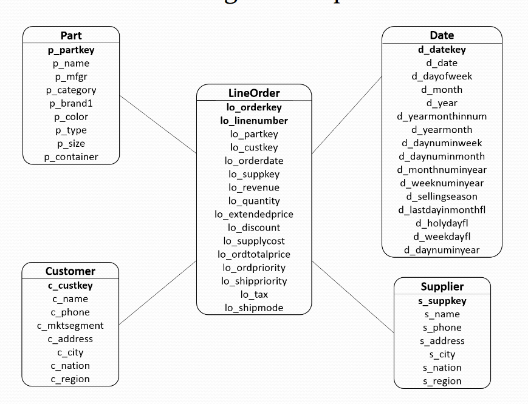
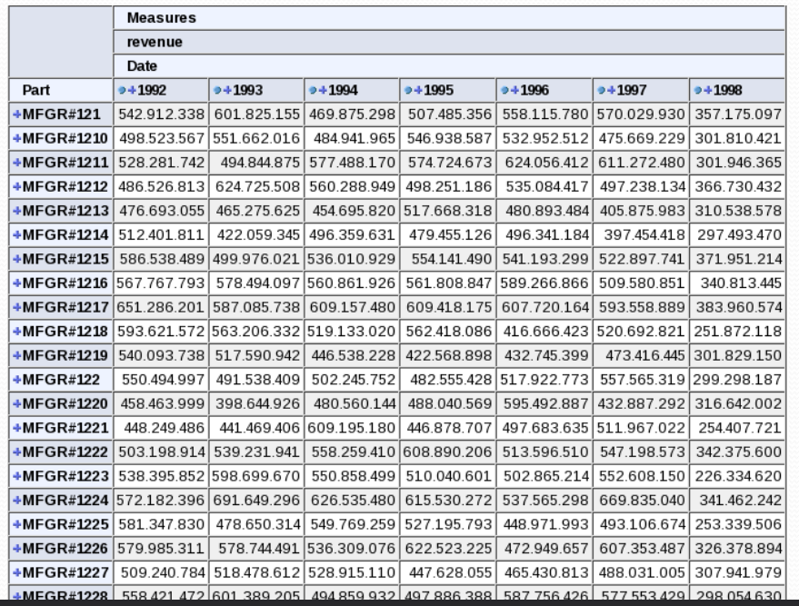

# Introdução

 - Linguagem de consulta à base de dados multidimensionais criada pela Microsoft® em 1998

 - Parte de um padrão industrial, o OLE DB for OLAP

 - Permite a especificação de até 128 eixos de consultas, sendo porém incomum a utilização de mais de 3 eixos

 - Não é igual a linguagem SQL

 - Apesar do nome, a linguagem SQL também possui comandos CREATE, INSERT e ALTER

 - Tem sintaxe parecida com a linguagem SQL na forma SELECT-FROM-WHERE

 - Linguagem extensível, permitindo criação de funções para manipular dados multidimensionais

# MDX – Conceitos da Linguagem

A MDX utiliza três conceitos principais em sua sintaxe de consulta

 - Cells- Células

 - Tuples-Tuplas

 - Sets - Conjuntos

# Cells

Criadas a partir de intersecções de membros, onde se obtém os dados

# Tuples

É um sistemade extraçãode célulasde um cubo, a partirde diferentes dimensões

Sintaxe( [DIMENSAO_1].[MEMBRO], [DIMENSAO_2].[MEMBRO], ...., [DIMENSAO_N].[MEMBRO] )

Exemplo: ( [Supplier].[AMERICA].[BRAZIL], [Data].[1997] ) Ou ([Supplier].[Nation].[BRAZIL], [Date].[Year].[1997] )

# Tuples

( [Supplier].[EUROPE] ) ou (Supplier].[Region].[EUROPE] )

# Sets

É umacoleçãode tuplas, ondeseuconjuntode membrospertencea uma únicadimensão

Representado pelo{ ... }

{[DIMENSAO1].[MEMBRO1], [DIMENSAO1].[MEMBRO2], ... , [DIMENSAO1].[MEMBRO_N] }

Exemplo: { [Supplier].[ASIA].[JAPAN], [Supplier].[AMERICA].[BRAZIL] }

# Sets

{ [Date].[1994], [Date].[1995], [Date].[ 1996 ]}

# Sintaxe Consulta MDX

SELECT 
{... a set ...} ON COLUMNS, 
{... a set ...} ON ROWS
FROM [CUBO]
WHERE [ slicer ]

Na cláusulaWHERE nãopode repetirdimensões presentes anteriormente (em COLUMNS e ROWS)

Referênciacompletaem:

[microsoft](http://msdn.microsoft.com/en-us/library/ms145506.aspx)

[mondrian](http://mondrian.pentaho.org/)

# Expressões MDX

 - Operadores

 - CALCULATED MEMBERS e NAMED SETS

 - Expressões Condicionais

 - Funções

# Operadores

 - Aritméticos
   - +, -, *, /, ^

 - String
   - +

 - Condicionais
   - =, <>, >, <, >=, <=

 - Lógicos
   - OR, AND, XOR, NOT

 - Range
    - Ex: {[Date].[1998] : [Date].[2010]}

# CALCULATED MEMBERS (CM)

São membros calculados a partir de medidas. Eles não são armazenados no cubo de dados, sendo processados durante a consulta

 - Sintaxe:
    - WITH MEMBER parent.name AS ‘expression’

 - Criação do CM Profit:
    - WITH MEMBER Measures.ProfitAS
    ‘Measures.[Revenue] – [Measures].[SupplyCost]’

# NAMED SETS

Definição de uma nova dimensão a partir de uma operação sobre outras dimensões

 - Sintaxe:
   - WITH SET setNameAS ‘expression’

 - Criação de um Named Set para os produtos que não são brancos
   - WITH SET ColorRestriction AS
    ‘EXCEPT({[Part].[Color].Children},{[Part].[Color].[White]})’

# Expressões Condicionais

IIF para avaliar expressões de diferentes dimensões e retorna outras expressões caso seja true ou false

 - Sintaxe
   - IIF(expressão_logica, expressão_true, expressão_false)

 - Criação de um CM para valores de quantidade entre 50 e 100
   - WITH MEMBER [Measures].[QuantityRestriction] as
     IFF([Measures].[Quantity] >= 50 AND [Measures].[Quantity]
     <= 100, [Measures].[Quantity], null)

# Expressões Condicionais

FILTER retorna um conjunto de acordo com um filtro

 - Sintaxe:
   - FILTER(Expressão de conjunto, expressão lógica)

Exemplo:

 - Retornar os anos que tiveram receita maior que 10000
   - FILTER([Date].[All].[Year].Members,
     [Measures].[Revenue] > 10000)

# Funções

CHILDREN
Retorna todos os filhos de um determinado membro
 - Exemplo: 
   - [Date].[1998].Children -> Todos os meses do ano de 1998

DESCENDANTS
Retorna todos os membros a partir de um determinando membro até um determinado nível de uma hierarquia

 - Sintaxe: 
   - DESCENDANTS(member, level [, f lags])

 - Exemplo: 
   - Descendants([Supplier].[AMERICA].[BRAZIL],
     [Supplier].[ADDRESS], BEFORE)

# Funções

 - COALESCEEMPTY garante que uma expressão numérica tenha null formatado comozero

 - ANCESTOR retornao ancestral de um determinado membro. O ancestral podeser informadopelo nome do nível

 - CROSSJOIN combina em um único eixo, 2 sets (pode ser utilizado o operador *)

# Funções

Outros funções utilizadas:

 - FIRSTCHILD, LASTCHILD para retornar o primeiro ou último membro de um nível, respectivamente

 - CURRENTMEMBER para retornar o membro atual durante uma iteração (utilizado principalmente para cálculos que dependem de contexto)

# Funções

WITH
  MEMBER [Measures].[Order Percent by Category] AS
  CoalesceEmpty
(
  ([Part].[Part Categories].CurrentMember,
    [Measures].[Quantity]) /
      (
        Ancestor
        ( [Part].[Part Categories].CurrentMember,
        [Part].[Part Categories].[Category]
        ), [Measures].[Order Quantity]
      ), 0
), FORMAT_STRING='Percent'

# Consultas MDX

Considere o seguinte esquema estrela

# Consultas MDX

Projete uma consulta MDX que retorna a soma da receita por ano e por marca da categoria MFGR#12 produzidos pelos fornecedores da região AMERICA

select Crossjoin({[Measures].[revenue]},
{[Date].[All].Children}) ON COLUMNS,
{[Part].[category].[MFGR#12].Children} ON ROWS
from [CubeSSB]
where {[Supplier].[All].[AMERICA]}

Consultas MDX – Resultado em Pivot/Cross Table

# Consultas MDX

Retorne a soma das receitas por ano e por marca, das marcas MFGR#2221 e MFGR#2228 e dos fornecedores da AMERICA

SELECT Crossjoin({[Measures].[revenue]},
{[Date].[All].Children}) ON COLUMNS,
{[Part].[brand].[MFGR#2221], [Part].[brand].[MFGR#2228]}
ON ROWS
FROM [CubeSSB]
WHERE {[Supplier].[All].[AMERICA]}