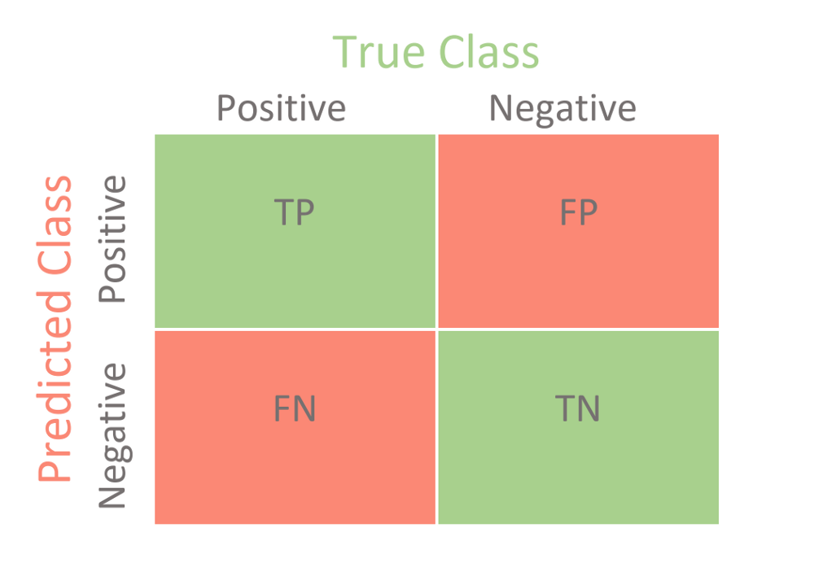

# Métricas de avaliação de maquinas preditivas

## Métricas de avaliação para problemas de **Classificação**

### **Confusion Matrix**

Confusion Matrix é uma tabela que permite a visualização do desempenho de um algoritmo de classificação.

Essa tabela de contingência 2x2 especial. Cada linha da matriz representa instâncias de uma classe prevista enquanto cada coluna representa instâncias da classe atual (ou vice versa).

### **Acurácia**

Esta é métrica mais importante. É basicamente o número de acertos (positivos) dividido pelo número total de exemplos. Ela deve ser usada em datasets com a mesma proporção de exemplos para cada classe, e quando as penalidades de acerto e erro para cada classe forem as mesmas.

Em problemas de classes desproporcionais, ela causa uma false impressão de bom desempenho. Por exemplo, em um datase em que 80% dos exemplos pertençam a uma classe, só de classificar todos os exemplos naquela classe já se atinge uma precisão de 80% mesmo que todos os exemplos de outra classe estejam classificados incorretamene.

### **Precision**

Precision ou precisão, também conhecida como Valor Prediivo Positivo (VPP), é a mérica que traz a informação de quantidade de observações classificadas como positivas (1) que realmente são positivas. Ou seja, entre todas as observações identificadas como positivas (1), quantas foram identificadas correntamente.

Por exemplo: entre os paciente classificadas como doentes, quantos foram identificados corretamente.

### **Recall**
Recall ou sensibilidade é a proporção dos Verdadeiros Positivos entre todas as observações que realmente são positivas no seu conjunto dedados. Ou seja, entre todas as observações que são posiivas quantas o modelo conseguiu identificar como positiva. Representa a capacidade deum modelo em prever a classe positiva.

Por exemplo: dentre todos os pacientes doentes, quantos pacientes o modelo conseguiu identificar corretamente. 

### **F1 - Score**

F1-Score é a média harmônica entre o recall e a precision. Utilizada quando temos classes desbalanceadas.

### **Curva ROC**

Uma curva de característica de operação do receptor (ROC) exibe quão bem um modelo pode classificar os resultados binários. 
Uma curva ROC é gerada traçando a taxa de falsos positivos de um modelo contra sua taxa de verdadeiros positivos, para cada valor de corte possível. 
Freqüentemente, a área sob a curva (AUC) é calculada e usada como uma métrica que mostra quão bem um modelo pode classificar pontos de dados.

O gráfico à esquerda mostra as distribuições de preditores para os dois resultados e o gráfico à direita mostra a curva ROC para essas distribuições. A linha vertical que viaja da esquerda para a direita é o valor de corte. O ponto vermelho que viaja ao longo da curva ROC corresponde à taxa de falso positivo e à taxa de verdadeiro positivo para o valor de corte dado no gráfico à esquerda.

O corte móvel demonstra a compensação entre tentar classificar um resultado corretamente e tentar classificar o outro corretamente. Quando tentamos aumentar a taxa de verdadeiros positivos, também aumentamos a taxa de falsos positivos. Quando diminuir a taxa de falsos positivos, diminuímos a taxa de verdadeiros positivos.

A forma de uma curva ROC muda quando um modelo muda a maneira como classifica os dois resultados.

A animação abaixo começa com um modelo que não consegue diferenciar um resultado do outro, e as duas distribuições se completamente (essencialmente um classificador aleatório). À medida que as duas distribuições se separam, a curva ROC se aproxima do superior esquerdo e o valor AUC da curva aumenta. Quando o modelo consegue separar perfeitamente os dois resultados, a curva ROC forma ângulo reto e a AUC torna-se 1.

## Métricas de avaliação para problemas de **Regressão**

### **Mean Squared Error - MSE**

Talvez seja a mais utiliada, esta função calcula a média dos erros do modelo ao quadrado. Ou seja, diferenças menores têm menos importância, enquanto diferenças maiores recebem mais peso.

### **RMSE**

O Root Mean Squared Error. Ele é simplesmente a raiz quadrada do primeiro. Nesse caso, o erro vola a ter as unidades de medida originais da variável dependene. Quanto menor melhor.

### **Mean Absolute Error - MAE**

Bastante parecido com MSE, em vez de elevar a diferença entre a previsão do modelo, e o valor real, ao quadrado, ele **toma o valor absoluto.**.
Neste caso, em vez de atribuir um peso de acordo com a magnitude da diferença, ele atribui o mesmo peso a todas as diferenças, de maneira linear.

## Métricas de avaliação para problemas de **Clusterização**

### **silhouette_score**

O coeficiente Silhouette é calculado usando a distância média intra-cluster (a) e a distância média do cluster mais próximo (b) para cada amostra.
O melhor valor é 1 e o pior valor é -1. Valores próximos a 0 indicam cluster sobrepostos. Valores negativos geralmente indicam que uma amostra foi atribuida ao cluster diferente é mais semelhante.

### **Métricas personalidas**

Em alguns casos, o ideal é usar uma métrica que tenha um significado específico para a tarefa em questão.
Por exemplo, na segmentação de anúncios, **a taxa de cliques**
Num sistema para comprar e vender ações, verificar o **retorno médio.**

### **Observação importante**

As métricas acima são impotantes e podem ser utilizadas de maneira geral, mas se houver uma alternativa melhor, mais adequada ao contexto, ela deve ser utilizada.
