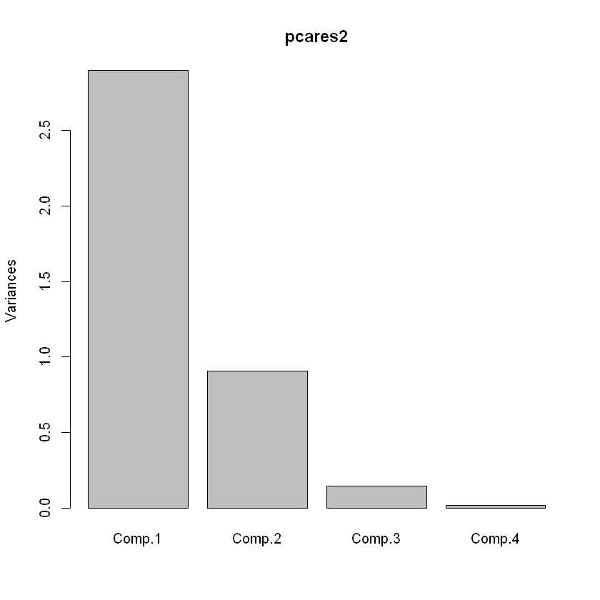
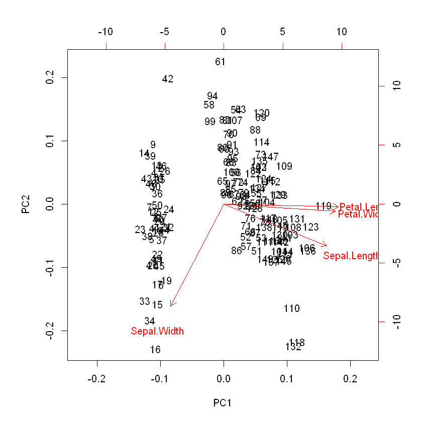
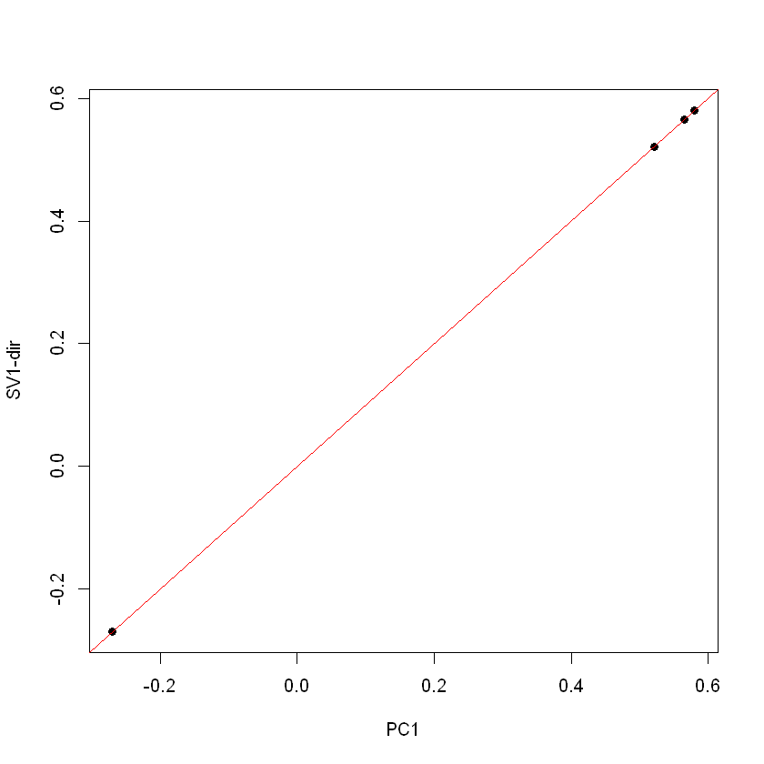
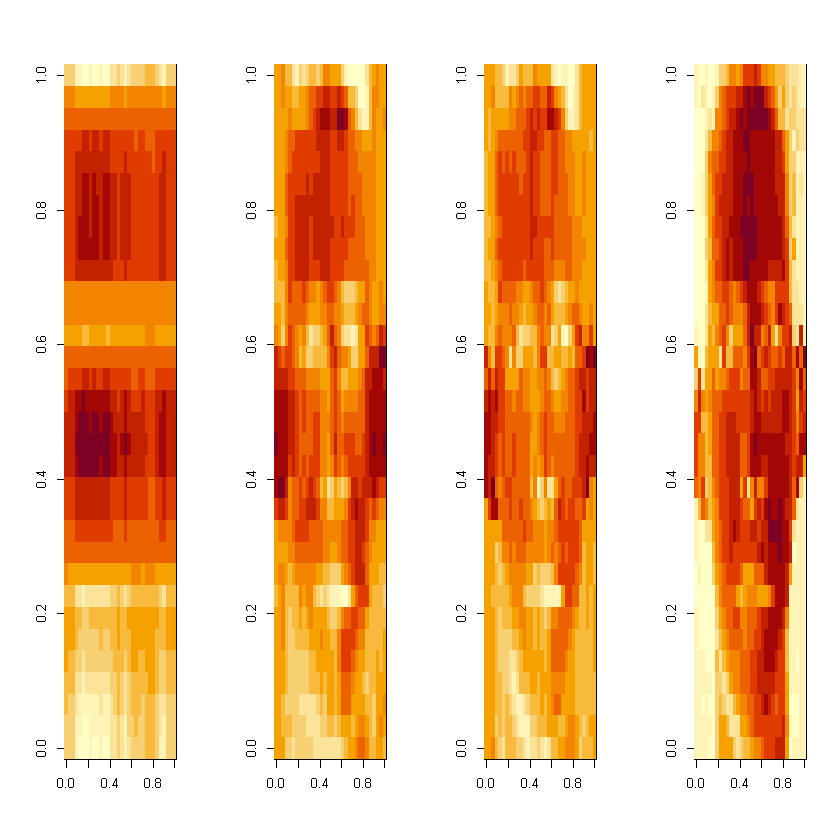

# Redução de dimensionalidade 
 
## Introdução 
 
Em muitos casos, os conjuntos de dados a analisar são de dimensões elevadas e as variáveis possuem dependências entre si. Neste capítulo, apresentam-se métodos para reduzir a dimensionalidade dos dados. Estes métodos funcionam identificando conjuntos de variáveis não correlacionadas entre si que explicam a maior parte da variabilidade dos dados. Em termos algébricos, estamos interessados em matrizes de rank menor que permitam explicar os dados originais e reconstrui-los de forma o mais aproximada possível. 
 
## Análise de componentes principais 
 
A técnica mais popular ao nível da redução de dimensionalidade de dados numéricos é a análise de componentes principais (ou PCA na denominação anglo-­saxónica). A PCA consta de um procedimento algébrico que converte as variáveis originais (que são tipicamente correlacionadas) num conjunto de variáveis não correlacionadas (linearmente) que se designam por componentes principais (PCs) ou variáveis latentes. Assim, a PCA fornece um mapeamento de um espaço com N dimensões (em que N é o número de variáveis originais) para um espaço com M dimensões (onde M é tipicamente muito menor do que N). 
As PCs são ordenadas pela quantidade decrescente de variabilidade (variância) que explicam. Cada PC é gerada de forma a explicar o máximo de variabilidade da parte ainda não explicada, tendo que ser ortogonal às PCs anteriores. É importante notar que a PCA é sensível à escala dos dados, pelo que se recomenda a sua normalização prévia. 
A PCA consiste numa decomposição dos dados originais (uma matriz X) em duas matrizes: T.PT. A matriz T tem o nome de scores, indicando as coordenadas dos exemplos iniciais (linhas de X) no novo sistema de coordenadas dado pelas PCs. As PCs determinadas são combinações lineares das variáveis originais, sendo os coeficientes destas no espaço original são dados pelas colunas da matriz P, sendo designados por loadings. Se considerarmos apenas as primeiras k componentes principais, isto implica considerarmos apenas as primeiras k colunas das matrizes T e P, obtendo-se uma aproximação dos dados originais que será tanto mais precisa quanto maior é o valor de k. 
Há várias formas de realizar a PCA em R, em diversos packages distintos. Uma das funções mais usadas, num dos packages base do R, é a função princomp. Esta tem como argumento obrigatório a matriz de dados ou data frame com os dados originais (necessariamente dados numéricos). Os argumentos opcionais permitem, por exemplo, filtrar linhas ou tratar de formas distintas os valores omissos (argumento na.action). O resultado é uma list, que inclui vários campos com os diversos resultados, incluindo os loadings e os scores. 
Uma função alternativa é a função prcomp que difere da anterior no método de cálculo da PCA, nos argumentos e na estrutura dos resultados. Por exemplo, esta função permite indicar explicitamente a normalização dos dados com o argumento “scale”. Os exemplos seguintes ilustrarão as principais diferenças na estrutura dos resultados das duas funções. 
O exemplo seguinte usa o conjunto de dados iris, já usado anteriormente para demonstrar o uso das funções anteriores. Como o conjunto de dados possui 5 atributos, 4 dos quais numéricos, serão apenas estas colunas a serem consideradas (as 4 primeiras). Serão usadas ambas as funções anteriores: 


```R
pcares = prcomp(iris[,-5], scale = T) 
pcares2 = princomp(scale(iris[,-5])) 
summary(pcares) 
summary(pcares2)
```


    Importance of components:
                              PC1    PC2     PC3     PC4
    Standard deviation     1.7084 0.9560 0.38309 0.14393
    Proportion of Variance 0.7296 0.2285 0.03669 0.00518
    Cumulative Proportion  0.7296 0.9581 0.99482 1.00000


    Importance of components:
                              Comp.1    Comp.2     Comp.3      Comp.4
    Standard deviation     1.7026571 0.9528572 0.38180950 0.143445939
    Proportion of Variance 0.7296245 0.2285076 0.03668922 0.005178709
    Cumulative Proportion  0.7296245 0.9581321 0.99482129 1.000000000


```R
pcares$rotation
pcares2$loadings
```


<table>
<thead><tr><th></th><th scope=col>PC1</th><th scope=col>PC2</th><th scope=col>PC3</th><th scope=col>PC4</th></tr></thead>
<tbody>
	<tr><th scope=row>Sepal.Length</th><td> 0.5210659 </td><td>-0.37741762</td><td> 0.7195664 </td><td> 0.2612863 </td></tr>
	<tr><th scope=row>Sepal.Width</th><td>-0.2693474 </td><td>-0.92329566</td><td>-0.2443818 </td><td>-0.1235096 </td></tr>
	<tr><th scope=row>Petal.Length</th><td> 0.5804131 </td><td>-0.02449161</td><td>-0.1421264 </td><td>-0.8014492 </td></tr>
	<tr><th scope=row>Petal.Width</th><td> 0.5648565 </td><td>-0.06694199</td><td>-0.6342727 </td><td> 0.5235971 </td></tr>
</tbody>
</table>


    
    Loadings:
                 Comp.1 Comp.2 Comp.3 Comp.4
    Sepal.Length  0.521  0.377  0.720  0.261
    Sepal.Width  -0.269  0.923 -0.244 -0.124
    Petal.Length  0.580        -0.142 -0.801
    Petal.Width   0.565        -0.634  0.524
    
                   Comp.1 Comp.2 Comp.3 Comp.4
    SS loadings      1.00   1.00   1.00   1.00
    Proportion Var   0.25   0.25   0.25   0.25
    Cumulative Var   0.25   0.50   0.75   1.00


```R
plot(pcares2)
biplot(pcares)
```


    

    


    

    


Os resultados demonstram que os métodos usadas por ambas as funções obtêm 
resultados similares mas ligeiramente distintos e que a estrutura das lists de resultados são também diferentes (e.g. a diferença de nomes de loadings para rotation). Os resultados dos gráficos (últimas duas linhas) são mostrados em seguida. 
 

## Decomposição em valores singulares 
 
A decomposição em valores singulares (SVD em notação anglo-saxónica) é um 
método algébrico de fatorização de matrizes que pode ser usado em análise de dados para reduzir a dimensionalidade dos dados. De fato, a PCA é um caso particular da SVD, sendo a SVD um dos métodos aconselhados para calcular a PCA (usado pelo R na função prcomp).  
A SVD consta da fatorização de uma matriz M (de dimensões n x m) em M = UDVT 
onde: U é uma matriz n x n, V é uma matriz m x m, A tem dimensões n x m; além disso U.UT e V.VT são iguais à matriz identidade de dimensões n e m, respetivamente. As colunas de U são os vetores singulares esquerdos e as de V os vetores singulares direitos. A matriz D é uma matriz diagonal com os valores singulares de M. 
Em R, a operação de SVD pode ser executada com a função svd. O principal 
argumento para esta função é a matriz (ou data frame) com dados numéricos, tal como acontece com as funções que realizam a PCA. O resultado é uma list, com três campos: d – matriz diagonal D; u – matriz U; v – matriz V. 
Note-se que as colunas de v são equivalentes aos loadings resultantes da PCA (se os dados para esta forem normalizados). No exemplo seguinte ilustra-se esta característica com o conjunto de dados usado na secção anterior: 


```R
svdres= svd(scale(iris[,-5]))
svdres$v

plot(pcares$rotation[,1], svdres$v[,1], pch=19, xlab="PC1", 
ylab="SV1-dir")
abline(0,1, col="red")
```


<table>
<tbody>
	<tr><td> 0.5210659 </td><td>-0.37741762</td><td> 0.7195664 </td><td> 0.2612863 </td></tr>
	<tr><td>-0.2693474 </td><td>-0.92329566</td><td>-0.2443818 </td><td>-0.1235096 </td></tr>
	<tr><td> 0.5804131 </td><td>-0.02449161</td><td>-0.1421264 </td><td>-0.8014492 </td></tr>
	<tr><td> 0.5648565 </td><td>-0.06694199</td><td>-0.6342727 </td><td> 0.5235971 </td></tr>
</tbody>
</table>


    

    


No exemplo seguinte demonstra-se a aproximação de uma matriz de dados 
usando um número diferentes de valores singulares. A primeira linha faz o download do ficheiro (podendo ser substituída por um download direto usando o seu browser) e a segunda linha carrega o ficheiro de dados. A linha seguinte executa o processo de SVD, enquanto a última permite visualizar a componente da variância explicada por cada valor singular. 


```R
download.file("https://spark-public.s3.amazonaws.com/dataanalysis/face.rda", destfile="face.rda") 
load("face.rda") 
svd1 <- svd(scale(faceData)) 
plot(svd1$d^2/sum(svd1$d^2),pch=19,xlab="SV",ylab="Variancia explicada")
```


    

    


Nos comandos seguintes mostra-se como podemos criar aproximações aos 
dados originais usando 1, 5 e 10 valores singulares, respetivamente. Estas aproximações são mostradas em forma de gráfico em seguida, comparando-se com os dados originais (último gráfico).


```R
aprox1 <- svd1$u[,1] %*% t(svd1$v[,1]) * svd1$d[1] 
aprox5 <- svd1$u[,1:5] %*% diag(svd1$d[1:5])%*% t(svd1$v[,1:5]) 
aprox10 <- svd1$u[,1:10] %*% diag(svd1$d[1:10])%*% t(svd1$v[,1:10]) 
par(mfrow=c(1,4)) 
image(t(aprox1)[,nrow(aprox1):1]) 
image(t(aprox5)[,nrow(aprox5):1]) 
image(t(aprox10)[,nrow(aprox10):1]) 
image(t(faceData)[,nrow(faceData):1]) 
```


    

    

