# Visualização de dados

O objetivo aqui é apresentar vários exemplos práticos de construção de gráficos comuns e o ferramental necessáriopara criar boas visualizações.Para isso, a partir dessa seção iremos usar o arquivo .csv sobre a circulação das moedas, considerando a execução do seguinte código abaixo:

```R
library(tidyverse)
```


```R
circulacao_dinheiro <- read_csv2("./MeioCirculante_DadosAbertos.csv", col_names = c("Data", "Família", "Denominação", "Quantidade"))
```


```R
#lembre-se o segredo é sempre preparar os dados de maneira que o subconjunto selecionado responda apergunta disposta
#os grupos que queremos no final é por MÊS e DENOMINAÇÃO junto com a quantidade MÉDIA em circulação#seguindo a especificação, podemos definir o seguinte tibble resultante:

moedas_2019 <- mutate(circulacao_dinheiro,                       
                      Dia = as.numeric(format(Data, "%d")),                      
                      Mês = as.numeric(format(Data, "%m"))) %>% 
    filter(as.numeric(format(Data, "%Y")) == 2019 & Denominação %in% c("0.01", "0.05", "0.10", "0.25", "0.50", "1.00")) %>%   
    select(Dia, Mês, Denominação, Quantidade) %>%  
    arrange(desc(Mês), desc(Dia)) %>% 
    group_by(Mês, Denominação) %>% 
    summarise(Média = mean(Quantidade, na.rm = TRUE))

## `summarise()` regrouping output by 'Mês' (override with `.groups` argument)
##nos exemplos a seguir, iremos fazer uso da variável moedas_2019. Portanto, tenha certeza que vocêtenha executado a instrução anterior

ggplot(data = moedas_2019) +  
    geom_line(aes(x = as.factor(Mês), y = Média, group = Denominação, colour = Denominação))
```

    `summarise()` has grouped output by 'Mês'. You can override using the `.groups` argument.
    


    

    


Com esse gráfico como base, segue algumas funções comuns usadas para melhorar a formatação geral de um gráfico gerado peloggplot2.

Nota importante

Note que cada linha possui uma cor diferente. Cada linha de cor diferente é criada pois foi informado 2 parâmetros estéticos (aes()): ogrupo (group) e a cor (colour). Para valor distinto da coluna Denominação, é criado um grupo (ou seja, uma linha) onde uma corúnica é atribuída (se quiséssemos definir um tipo de linha diferente, usaríamos o linetype).

Assim, podemos observar que para cada tipo de gráfico, existe um conjunto particular de “estética” que podemos aplicar e até mesmousar na redefinição de nomes de legendas.

# Título do gráfico

A função ggtitle() adiciona um título (e opcionalmente um subtítulo) para um gráfico e a sua execução deve ser “somada” ou
“adicionada” a um objeto ggplot.

Podemos adicionar o seguinte título no nosso gráfico, conforme segue:


```R
ggplot(data = moedas_2019) +  
    geom_line(aes(x = as.factor(Mês), y = Média, group = Denominação, colour = Denominação)) +  
    ggtitle("Moedas em Circulação", subtitle = "Brasil - 2019")
```


    
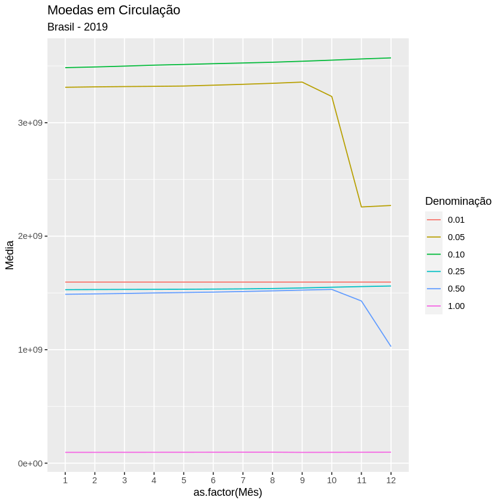
    


O parâmetro subtitle é opcional.

# Ajustanto os títulos de eixos

As funções xlab() e ylab() alteram os títulos dos eixos x e y respectivamente e devem ser “adicionadas” ao objeto ggplot.

Note que se não usarmos essas funções, o ggplot() pega os nomes do x e y na função aes().

Em nosso exemplo, podemos realizar as seguintes alterações:


```R
ggplot(data = moedas_2019) +  
    geom_line(aes(x = as.factor(Mês), y = Média, group = Denominação, colour = Denominação)) +  
    ggtitle("Moedas em Circulação", subtitle = "Brasil - 2019") +  
    xlab("Mês") + 
    ylab("Quantidade Média")
```


    
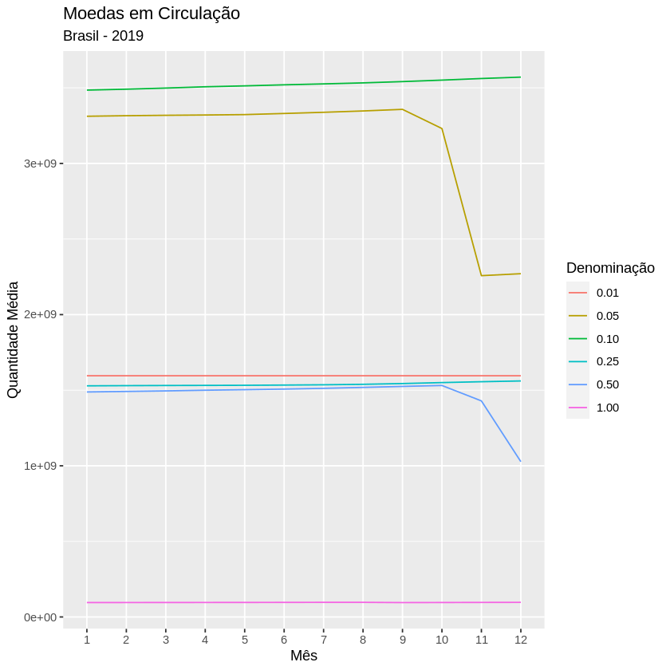
    


# Alterando vários elementos de um gráfico

A função lab() consegue alterar, além dos títulos do gráfico e dos eixos, o título da legenda e adicionar uma nota de rodapé no gráfico.

Um exemplo completo de utilização dessa função é mostrada a seguir, o qual continua a melhoria em nosso gráfico original:


```R
ggplot(data = moedas_2019) +  
    geom_line(aes(x = as.factor(Mês), y = Média, group = Denominação, colour = Denominação)) +  
    labs(x = "Mês", y = "Quantidade Média", title = "Moedas em Circulação", subtitle = "Brasil - 2019", caption = "Portal Brasileiro de Dados Abertos", tag = "Criado por CECDADOS", colour = "Valor daMoeda")
```


    

    


O parâmetro que é importante destacar é o colour. Perceba que este é um parâmetro estético que foi usado para definir as cores daslinhas. Uma vez que essas cores são usadas na legenda do gráfico, ao atribuirmos um valor para o parâmetro colour, nós estamosdefinindo o nome da legenda para as cores! Então, para mudar o título de algum fator estético que foi usado na criação do gráfico, usa-se o nome de seu parâmetro na função labs().

# Alterando o estilo (tema) de um gráfico

A função theme() é bastante abrangente para modificar a aparência de componentes de um gráfico (ela não modifica os dados). Por exemplo, podemos modificar o tamanho da fonte, cor do fundo, as linhas do grid do gráfico, e entre outros elementos de aparência.

Aqui daremos apenas alguns exemplos, conforme segue.

**Manipulando a aparência da legenda:**


```R
ggplot(data = moedas_2019) +  
    geom_line(aes(x = as.factor(Mês), y = Média, group = Denominação, colour = Denominação)) +  
    labs(x = "Mês", y = "Quantidade Média", title = "Moedas em Circulação", subtitle = "Brasil - 2019", caption = "Portal Brasileiro de Dados Abertos", tag = "Criado por CECDADOS", colour = "Valor daMoeda") +  
    theme(legend.title = element_text(face = "bold"),        
          legend.text = element_text(size = 10, colour = "blue"))
```


    
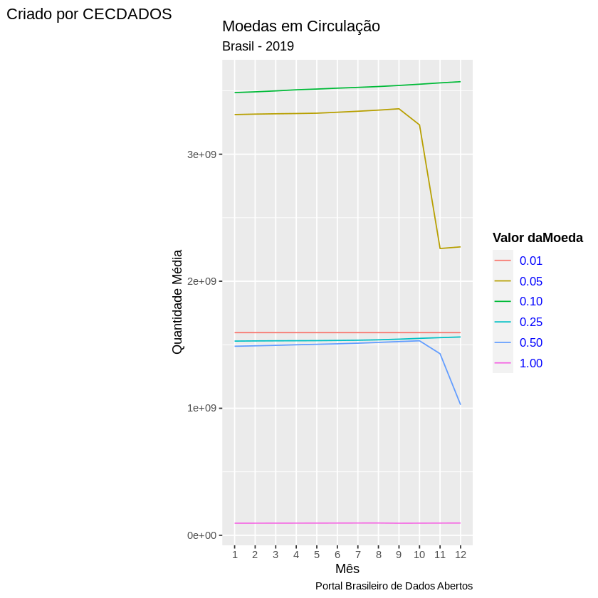
    


Repare no uso da função element_text() a qual define a formatação do texto, elementos como face, size e colour.

Manipulando a aparência do título do gráfico e dos eixos x e y:


```R
ggplot(data = moedas_2019) +  geom_line(aes(x = as.factor(Mês), y = Média, group = Denominação, colour = Denominação)) +  
    labs(x = "Mês", y = "Quantidade Média", title = "Moedas em Circulação", subtitle = "Brasil - 2019", caption = "Portal Brasileiro de Dados Abertos", tag = "Criado por CECDADOS", colour = "Valor daMoeda") +  
    theme(plot.title = element_text(face = "bold"),        
          axis.title = element_text(size = 8, colour = "red"))
```


    
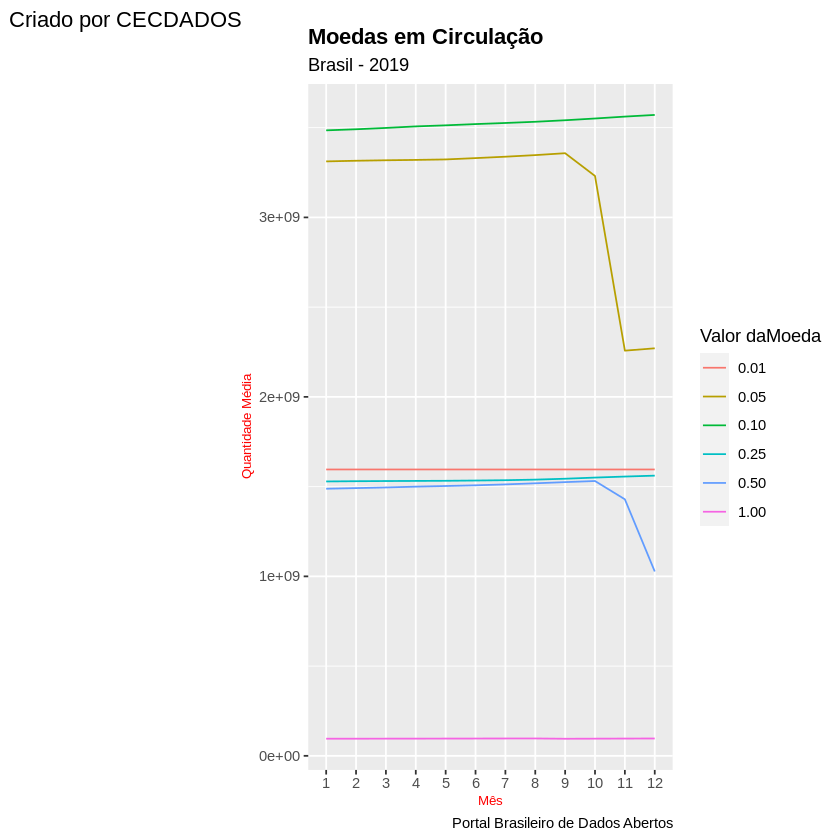
    


**Manipulando o painel de plotagem do gráfico:**


```R
ggplot(data = moedas_2019) +  geom_line(aes(x = as.factor(Mês), y = Média, group = Denominação, colour = Denominação)) +  
    labs(x = "Mês", y = "Quantidade Média", title = "Moedas em Circulação", subtitle = "Brasil - 2019", caption = "Portal Brasileiro de Dados Abertos", tag = "Criado por CECDADOS", colour = "Valor daMoeda") +  
    theme(panel.background = element_rect(fill = "white", colour = "black"))
```


    

    


Existem alguns temas já predefinidos, tais como a seguir.

**O tema preto e branco:**


```R
ggplot(data = moedas_2019) +  
    geom_line(aes(x = as.factor(Mês), y = Média, group = Denominação, colour = Denominação)) + 
    labs(x = "Mês", y = "Quantidade Média", title = "Moedas em Circulação", subtitle = "Brasil - 2019", caption = "Portal Brasileiro de Dados Abertos", tag = "Criado por CECDADOS", colour = "Valor daMoeda") +  
    theme_bw()
```


    
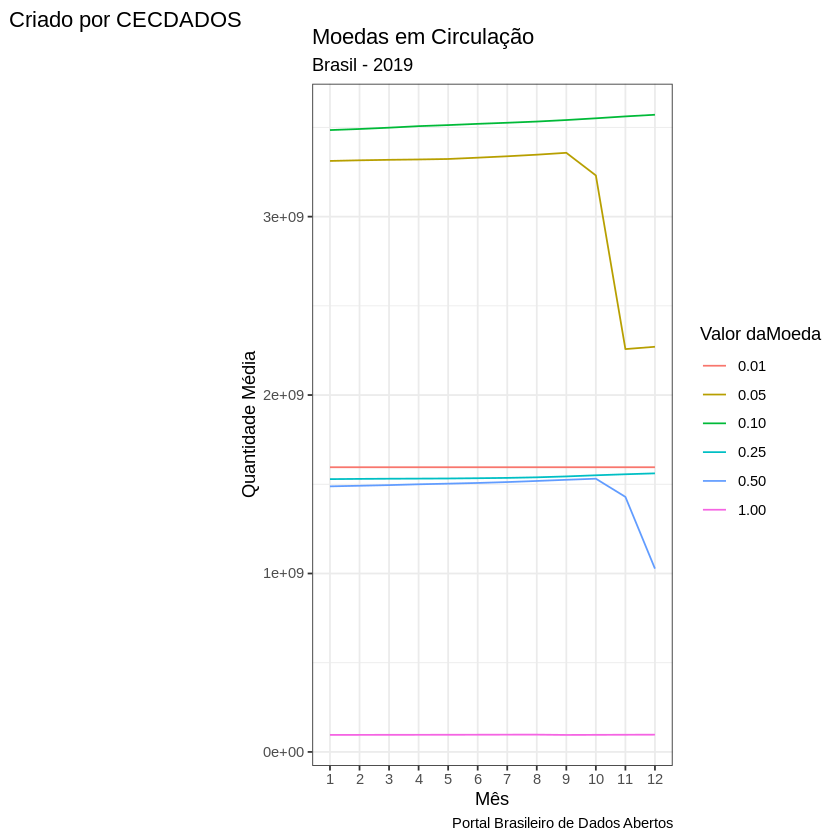
    


**O tema escala de cinza:**


```R
ggplot(data = moedas_2019) +  geom_line(aes(x = as.factor(Mês), y = Média, group = Denominação, colour = Denominação)) +  
    labs(x = "Mês", y = "Quantidade Média", title = "Moedas em Circulação", subtitle = "Brasil - 2019", caption = "Portal Brasileiro de Dados Abertos", tag = "Criado por CECDADOS", colour = "Valor daMoeda") +  
    theme_grey()
```


    
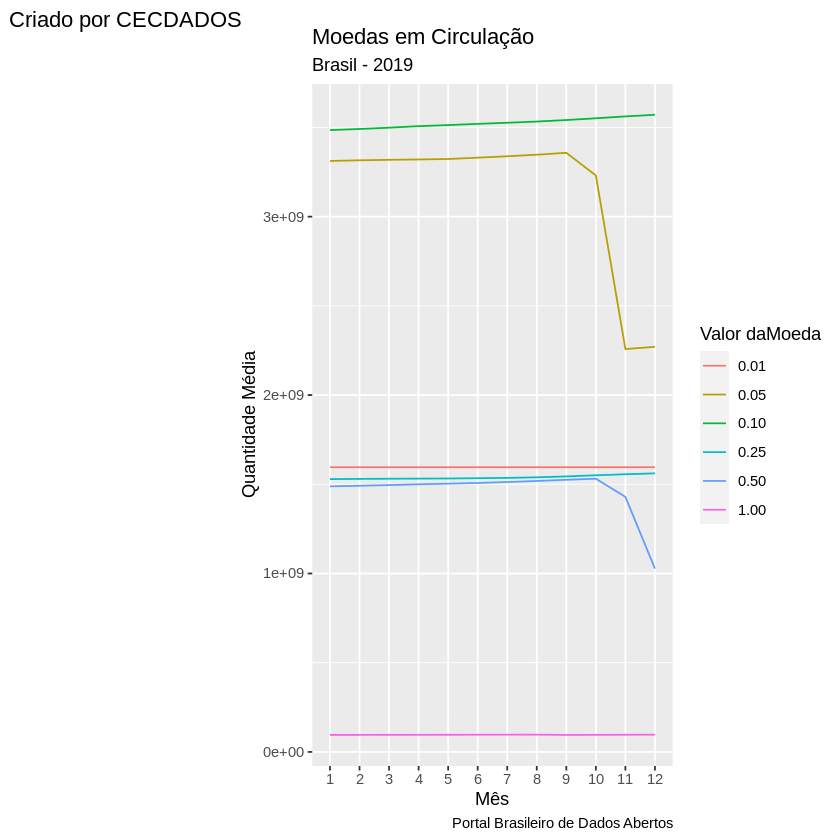
    


**O tema escuro:**


```R
ggplot(data = moedas_2019) +  geom_line(aes(x = as.factor(Mês), y = Média, group = Denominação, colour = Denominação)) +  
    labs(x = "Mês", y = "Quantidade Média", title = "Moedas em Circulação", subtitle = "Brasil - 2019", caption = "Portal Brasileiro de Dados Abertos", tag = "Criado por CECDADOS", colour = "Valor daMoeda") +  
    theme_dark()
```


    
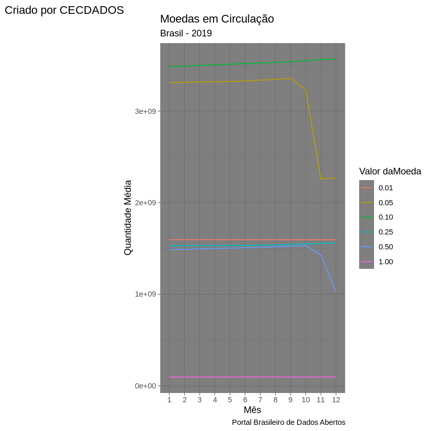
    


O tema escuro:Uma vez que a função theme() é muito abrangente, recomenda-se uma leitura breve de sua documentação
(https://ggplot2.tidyverse.org/reference/theme.html). 

Seja criativo na definição de novos temas!

# Formatação de itens nos eixos x e y

Podemos ainda definir como os ticks de cada eixo podem ser definidos (ou seja, cada elemento usado nos eixos), tais como seuespaçamento ou o número de elementos. Para isso, usamos as funções iniciadas como scale_x e scale_y para formatar os eixos x ey, respectivamente.

Para dados contínuos em algum eixo, usa-se a função scale_*_continuous() (onde * é trocado por x ou y para indicar a algum eixoespecífico). Já para dados discretos em algum eixo, usa-se a função scale_*_discrete().No nosso caso, temos a definição de dados de forma contínua para o eixo y (em geral, eixos com valores numéricos são contínuos - claro,existem excessões!). 

Para o eixo x, são definidos valores discretos (pois, temos 12 meses somente).

Nesse sentido, iremos usar as funções scale_x_discrete() e scale_y_continuous() para realizar as seguintes alterações:
1. Vamos definir que queremos somente que seja mostrado alguns meses específicos e de forma textual.
2. Vamos definir que 8 valores sejam usados no eixo y.
3. Vamos formatar os números do eixo y

Conseguimos fazer essas três formatações da seguinte forma:


```R
ggplot(data = moedas_2019) +  geom_line(aes(x = as.factor(Mês), y = Média, group = Denominação, colour = Denominação)) +  
    labs(x = "Mês", y = "Quantidade Média", title = "Moedas em Circulação", subtitle = "Brasil - 2019", caption = "Portal Brasileiro de Dados Abertos", tag = "Criado por CECDADOS", colour = "Valor daMoeda") +  scale_x_discrete(breaks = c(1, 3, 6, 9, 12), labels = c("Janeiro", "Março", "Junho", "Setembro","Dezembro")) +  
    scale_y_continuous(n.breaks = 8, labels = scales::number_format(big.mark = ".", decimal.mark =','))
```


    
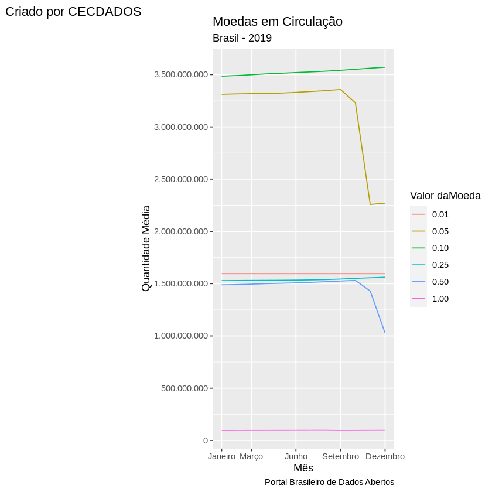
    


Sobre o scale_x_discrete() - primeiro definimos um subconjunto de valores que serão mostrados(breaks = c(1, 3, 6, 9, 12)) e DEPOIS quais são seus textos (seguindo a mesma ordem do vetor em breaks) pela definição doparâmetro labels. Note que somente os ticks são omitidos, os dados não foram modificados (perceba pela curva da moeda 0.01 queos dados permanecem os mesmos).

Sobre o scale_y_continuous() - primeiro foi definido o número de elementos no eixo y com o parâmetro n.breaks. Em seguida,foi definido que os textos usados no eixo y serão formatados. Para isso, foi usado a função scales::number_format() que é dopacote scales (já dentro do tidyverse) - ela é bastante útil para manipular números (se o nosso eixo fosse decimal, poderíamosrestringir o número de casas decimais com o parâmetro accuracy)!

Repare que o uso das funções scale_*_ são poderosas e é bastante recomendado a leitura da documentação para um estudo maisaprofundado, mesmo que esse material já tenha abordado alguns elementos mais comuns de manipulação:

- scale_*_continuous() (https://ggplot2.tidyverse.org/reference/scale_continuous.html)
- scale_*_discrete() (https://ggplot2.tidyverse.org/reference/scale_discrete.html)

Nota sobre formatação de gráficosO pacote ggplot2 disponibiliza outras várias funções que nos auxiliam na formatação de um gráfico. O objetivo desse material éabordar os pontos mais comuns. Assim, um estudo mais aprofundado nesse sentido pode ser realizado ao acessar o materialcomplementar que foi citado ao longo deste material e o livro sobre ggplot

# Gráfico de linha

Um gráfico de linhas foi usado nos exemplos mostrados de formatação do gráfico. Vamos entender melhor a função geom_line()nesta seção, estudando de forma mais detalhada as suas opções estéticas (parâmetros passados na função aes()).

As opções estéticas aceitas pela função geom_line() são as seguintes (em geral, elas recebem uma coluna do nossotibble/data.frame de entrada - indicado na função ggplot()):
- x - aqui é obrigatório qual é o valor do eixo x (um tick é feito para cada valor distinto na coluna mencionada)
- y - aqui é obrigatório qual é o valor do eixo y (um tick é feito para cada valor distinto na coluna mencionada)
- alpha - opcional, para definir um valor de transparência na cor
- colour - opcional, para definir uma cor (um esquema de cor será usado pelo R). O próprio ggplot2 definirá a cor para cada valordistinto da coluna mencionada.
- group - requerido quando queremos fazer várias linhas em um mesmo gráfico pois define que cada valor distinto da coluna mencionada é um grupo (ou seja, linha) e os pontos devem ser ligados da esqueda para direita para cada valor específico (útilcomo série temporal, como estamos usando)
- linetype - opcional, para definir um tipo de linha (um esquema de tipo de linha será usado pelo R). O próprio ggplot2 definirá o tipo de linha para cada valor distinto da coluna mencionada.
- size - opcional, para definir uma espessura de linha (um esquema de tamanho será usado pelo R). O próprio ggplot2 definirá aespessura da linha para cada valor da coluna mencionada.

Vamos entender na prática o significado de cada parâmetro supramencionado! Para ficar “menos” código nos exemplos, somente algunsargumentos da função labs() são definidos.Exemplo de variação na transparência da cor (alpha + colour + group)

Note que temos que usar o parâmetro group pois queremos mostrar uma linha para cada Denominação possível de moeda!


```R
ggplot(data = moedas_2019) +  
    geom_line(aes(x = as.factor(Mês), y = Média, #lembre-se, x e y são obrigatórios!                
                  group = Denominação, #no nosso caso, queremos que cada linha represente cada valor distinto de Denominação. Nesse caso, precisamos definir o group!                
                  colour = Denominação, #vamos manter uma cor distinta para cada linha                
                  alpha = Denominação, #para cada linha, vamos definir um valor alpha                 
                 )) +  
    labs(x = "Mês", y = "Quantidade Média", title = "Moedas em Circulação")
```

    Warning message:
    “Using alpha for a discrete variable is not advised.”


    
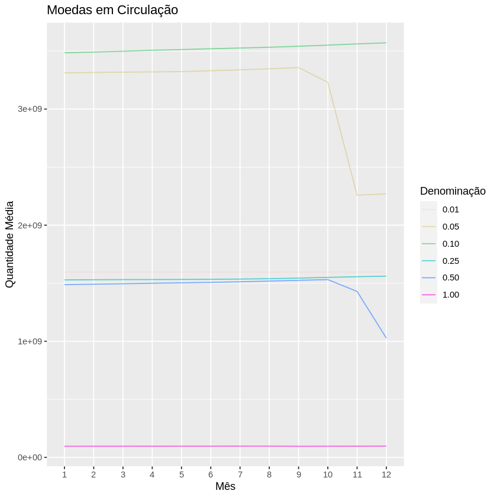
    


No código acima existe um aviso recomendando que o uso do alpha para valores discretos não é recomendável. De fato, no nossoexemplo, não faz muito sentido. Ele somente mudou um pouquinho as cores.

**Exemplo de variação na espessura da linha (group + colour + size)**


```R
ggplot(data = moedas_2019) +  
    geom_line(aes(x = as.factor(Mês), y = Média, #lembre-se, x e y são obrigatórios!                
                  group = Denominação, #no nosso caso, queremos que cada linha represente cada valor distinto de Denominação. Nesse caso, precisamos definir o group!                
                  colour = Denominação, #vamos manter uma cor distinta para cada linha                
                  size = Denominação, #cara linha terá um valor de espessura distinta de acordo com ovalor de Denominação                
                 )) +  
    labs(x = "Mês", y = "Quantidade Média", title = "Moedas em Circulação")
```

    Warning message:
    “Using size for a discrete variable is not advised.”


    
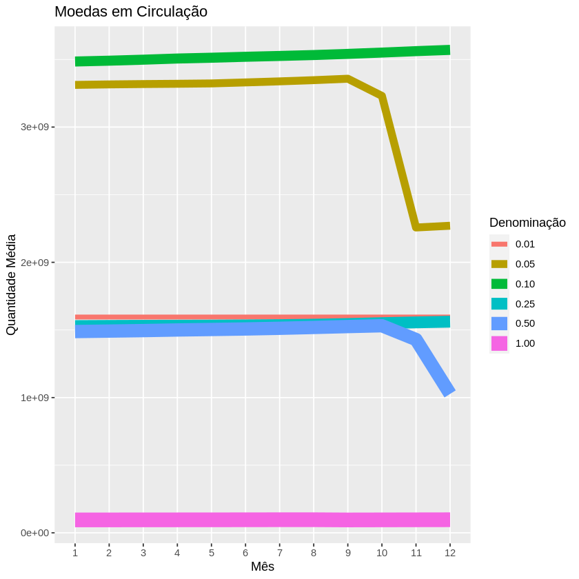
    


Note que conforme o valor da moeda varia, uma espessura diferente é definida. Cuidado com relação ao uso do size, que no nossocaso, fez com que a linha da moeda 0.01 ficasse sobreposta. Assim como para o alpha, o ggplot também nos avisa que definir aespessura dessa forma não é recomendável. Veremos que podemos definir, de forma homogênea, todas as espessuras das linhas.

**Exemplo de variação no tipo da linha (group + linetype + colour)**


```R
ggplot(data = moedas_2019) +  
    geom_line(aes(x = as.factor(Mês), y = Média, #lembre-se, x e y são obrigatórios!                
                                            group = Denominação, #no nosso caso, queremos que cada linha represente cada valor distinto de Denominação. Nesse caso, precisamos definir o group!                
                                            colour = Denominação, #vamos manter uma cor distinta para cada linha                
                                            linetype = Denominação, #cada linha terá um tipo distinto de traço                
                                           )) +  
    labs(x = "Mês", y = "Quantidade Média", title = "Moedas em Circulação")
```


    
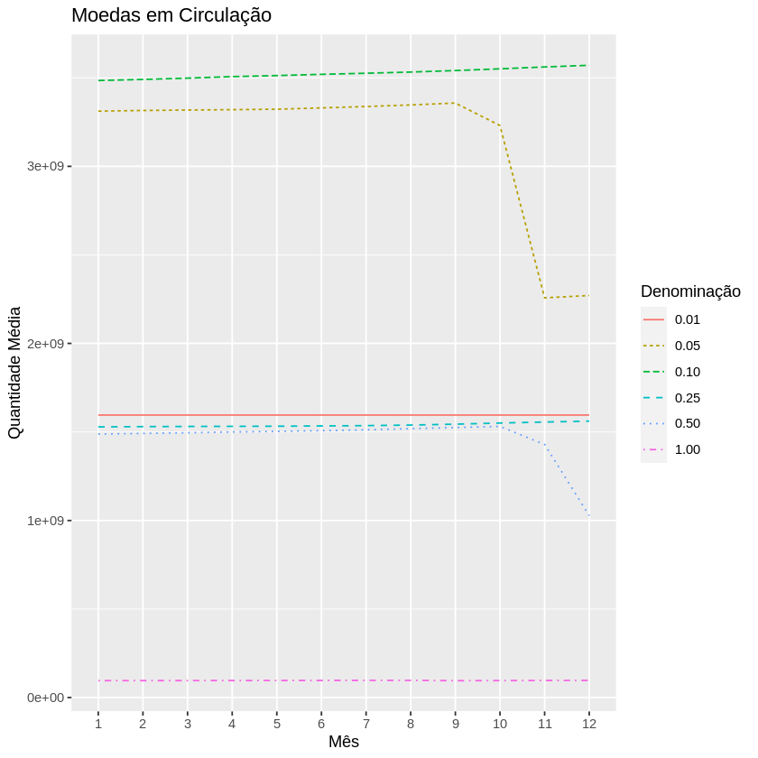
    


**Definindo parâmetros de estética de forma global**

Os parâmetros alpha, colour, linetype e size podem ser definidos diretamente na função geom_line(). Nesse caso, a opçãoserá FIXA em todo o gráfico e não terá o comportamento de atribuir uma característica única para cada valor distinto da coluna que foiatribuída. Tenha cuidado com isso!

Por exemplo, vamos mudar a transparência de todas as linhas de maneira homogênea:


```R
ggplot(data = moedas_2019) +  
    geom_line(aes(x = as.factor(Mês), y = Média, #lembre-se, x e y são obrigatórios!                
                  group = Denominação, #no nosso caso, queremos que cada linha represente cada valor distinto de Denominação. Nesse caso, precisamos definir o group!                
                  colour = Denominação, #vamos manter uma cor distinta para cada linha                
                 ),            
              alpha = 0.2#aqui estamos definindo um valor de transparência de maneira global e FORA do aes()            
             ) +  
    labs(x = "Mês", y = "Quantidade Média", title = "Moedas em Circulação")
```


    
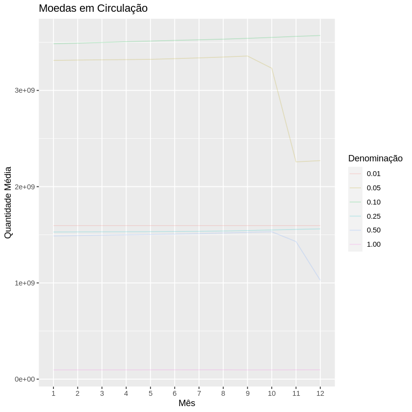
    


Outro exemplo, vamos mudar a espessura da linha de maneira homogênea:


```R
ggplot(data = moedas_2019) +  
    geom_line(aes(x = as.factor(Mês), y = Média, #lembre-se, x e y são obrigatórios!                
                  group = Denominação, #no nosso caso, queremos que cada linha represente cada valor distinto de Denominação. Nesse caso, precisamos definir o group!                
                  colour = Denominação, #vamos manter uma cor distinta para cada linha                
                 ),            
              size = 2            
             ) +  
    labs(x = "Mês", y = "Quantidade Média", title = "Moedas em Circulação")
```


    
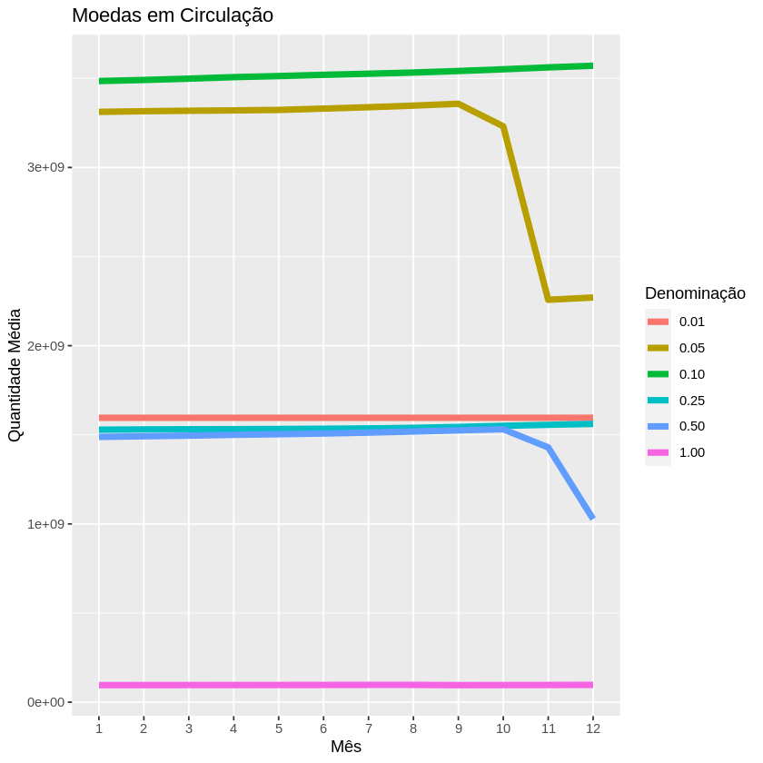
    


Por último, vamos mudar o tipo da linha de maneira homogênea (os tipos existentes são “blank”, “solid”, “dashed”, “dotted”, “dotdash”,“longdash”, “twodash”)


```R
ggplot(data = moedas_2019) +  
    geom_line(aes(x = as.factor(Mês), y = Média, #lembre-se, x e y são obrigatórios!                
                  group = Denominação, #no nosso caso, queremos que cada linha represente cada valor distinto de Denominação. Nesse caso, precisamos definir o group!                
                  colour = Denominação, #vamos manter uma cor distinta para cada linha                
                 ),            
              linetype = "dashed"            
             ) +  
    labs(x = "Mês", y = "Quantidade Média", title = "Moedas em Circulação")
```


    
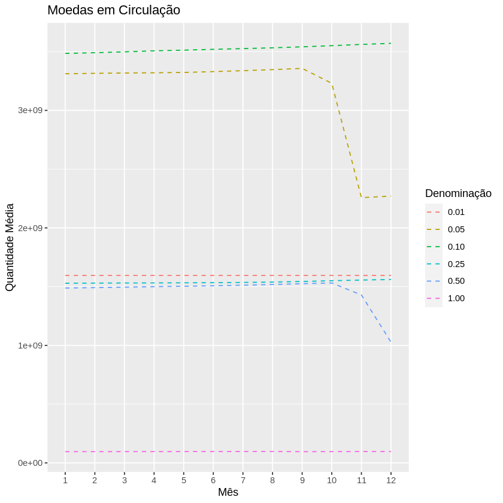
    


**Nota importante**

Existe a função geom_path() que também conecta pontos dispersos no espaço, fazendo gráficos de linhas. Mas estes são mais direcionados para construir de fato caminhos (pois considera a ordenação dos pontos na base de dados) e não para séries temporais(que foi mais o foco do nosso estudo).

# Gráfico de pontos (dispersão de pontos)

A função geom_point() é usada para criar um gráfico de dispersão de pontos (scatterplots). A estética desse tipo de gráfico aceita osseguintes parâmetros (no aes() ou fora dele, de maneira global):
- x - aqui é obrigatório qual é o valor do eixo x (um tick é feito para cada valor distinto na coluna mencionada)
- y - aqui é obrigatório qual é o valor do eixo y (um tick é feito para cada valor distinto na coluna mencionada)
- alpha - opcional, para definir um valor de transparência na cor dos pontos
- colour - opcional, para definir uma cor da linha externa do ponto (um esquema de cor será usado pelo R). O próprio ggplot2 definirá a cor para cada valor distinto da coluna mencionada. Cada valor distinto terá um conjunto de pontos associado a ele.
- group - opcional, para definir que cada valor distinto da coluna mencionada é um grupo de pontos (não é tão necessário como nouso das linhas, por isso aqui não será usado esse parâmetro)
- fill - opcional, para definir a cor interna do ponto (um esquema de cor será usado pelo R). O próprio ggplot2 definirá a cor paracada valor distinto da coluna mencionada.
- size - opcional, para definir o tamanho do ponto (um esquema de tamanho será usado pelo R). O próprio ggplot2 definirá otamanho do ponto para cada valor da coluna mencionada.
- shape - opcional, para definir o tipo do formato do ponto, para valor distinto da coluna mencionada.
- stroke - opcional, para definir a espessura da linha de cotorno do ponto.


```R
ggplot(data = moedas_2019) +  
    geom_point(aes(x = as.factor(Mês), y = Média, #lembre-se, x e y são obrigatórios!                
                   group = Denominação, #no nosso caso, queremos que cada grupo de ponto represente cada valor distinto de Denominação. Nesse caso, precisamos definir o group!                
                   colour = Denominação, #vamos manter uma cor distinta para cada grupo de pontos                
                  )) +  
    labs(x = "Mês", y = "Quantidade Média", title = "Moedas em Circulação")
```


    
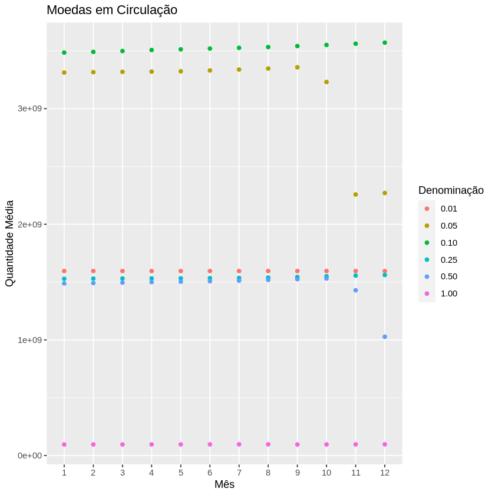
    


No exemplo acima, percebemos que os pontos das linhas que foram traçadas anteriormente foram definidos. Então, parece que essetipo de gráfico pode ser também combinado com um gráfico de linhas (iremos abordar esse tipo de combinação a seguir).

O gráfico de disperção de pontos é interessante para avaliar a correlação entre duas variáveis, podendo ou não ter grupos específicos.Para enriquecer o exemplo de gráfico de ponto, nos próximos exemplos, iremos utilizar uma base de dados gerada artificalmente conforme segue (note que possivelmente você poderá ter diferentes dados para o tibble dados_artificais em sua execuçãodevido às características das funções de geração aleatórias do 
- rnorm()(https://www.rdocumentation.org/packages/compositions/versions/1.40-5/topics/rnorm) 
e 
- sample()(https://www.rdocumentation.org/packages/base/versions/3.6.2/topics/sample)):


```R
dados_artificiais <- tibble("CONSUMO" = abs(rnorm(5000, mean = 15, sd = 2)),"PRODUÇÃO" = abs(rnorm(5000, mean = 55, sd = 12)),"CATEGORIA" = sample(c("A", "B", "C"), 5000, replace = TRUE))
```

Vamos analisar a correlação entre as colunas CONSUMO e PRODUÇÃO utilizando um gráfico de pontos:


```R
ggplot(data = dados_artificiais) +  
    geom_point(aes(x = CONSUMO, y = PRODUÇÃO))
```


    
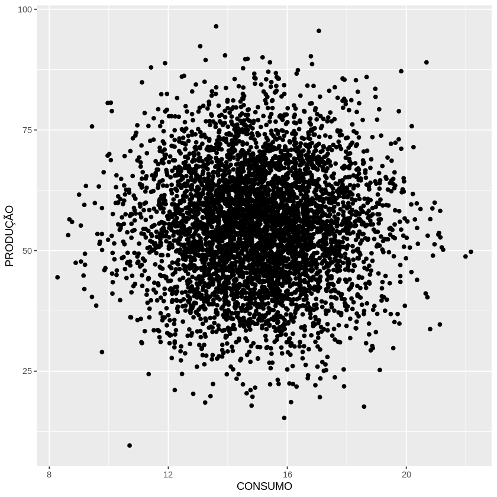
    


Podemos fazer uma seguinte análise: os pontos muito distantes tem uma produção/consumo muito elevada ou muito baixa (talvez demaneira desproporcional). Entretanto, temos uma dificuldade em saber essa relação de produção/consumo para cada categoria deproduto.

Logo, podemos usar algum parâmetro de estética para definirmos a formatação desses grupos. Alguns exemplos seguem abaixo:

**Diferenciando elementos por cor:**


```R
ggplot(data = dados_artificiais) +  
    geom_point(aes(x = CONSUMO, y = PRODUÇÃO, colour = CATEGORIA))
```


    
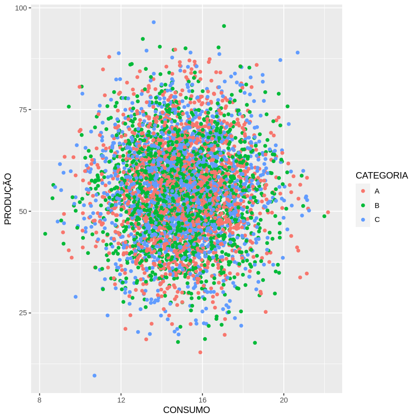
    


**Diferenciando elementos pelo tamanho:**


```R
ggplot(data = dados_artificiais) +  
    geom_point(aes(x = CONSUMO, y = PRODUÇÃO, size = CATEGORIA))
```

    Warning message:
    “Using size for a discrete variable is not advised.”


    
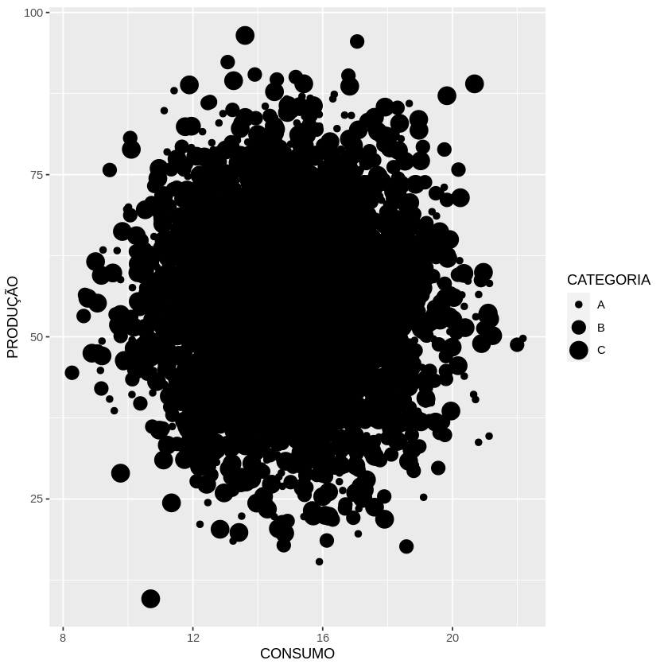
    


Assim como no gráfico de linhas, um mesmo aviso será mostrado. Então a dica é usar o size para diferenciar valores de uma “terceiradimensão” do gráfico, para formar gráficos de bolhas.

**Diferenciando elementos pela forma do ponto:**


```R
ggplot(data = dados_artificiais) +  
    geom_point(aes(x = CONSUMO, y = PRODUÇÃO, shape = CATEGORIA))
```


    
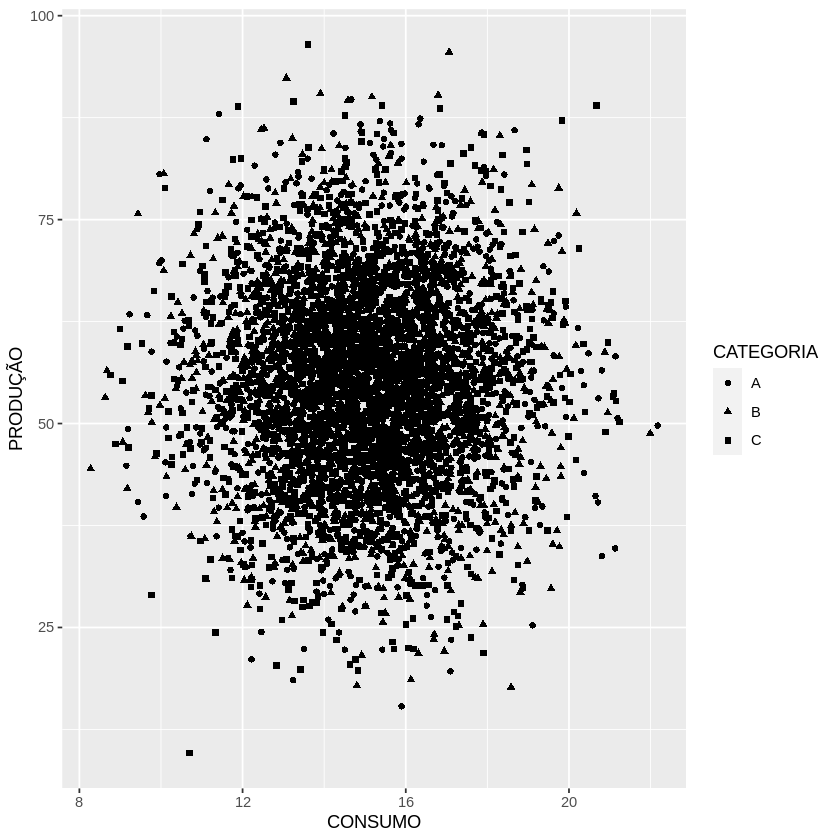
    


Assim como no gráfico de linhas, podemos combinar as características estéticas, por exemplo:

**Diferenciando elementos pela forma do ponto e cor:**


```R
ggplot(data = dados_artificiais) +  
    geom_point(aes(x = CONSUMO, y = PRODUÇÃO, shape = CATEGORIA, colour = CATEGORIA))
```


    
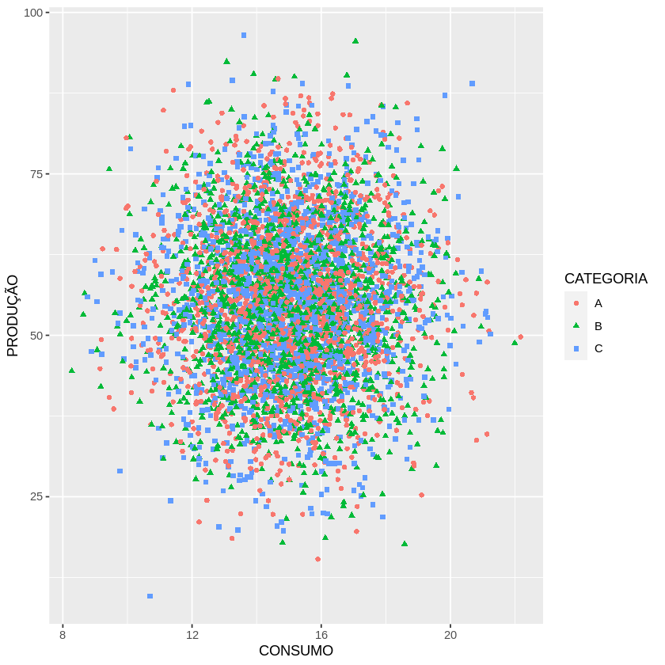
    


Por fim, também podemos definir a estética de maneira homogênea ao aplicar um parãmetro de maneira global (ou seja, fora doaes()). Por exemplo:


```R
ggplot(data = dados_artificiais) +  
    geom_point(aes(x = CONSUMO, y = PRODUÇÃO, colour = CATEGORIA), fill = "white", size = 5, stroke =2, shape = 21)
```


    
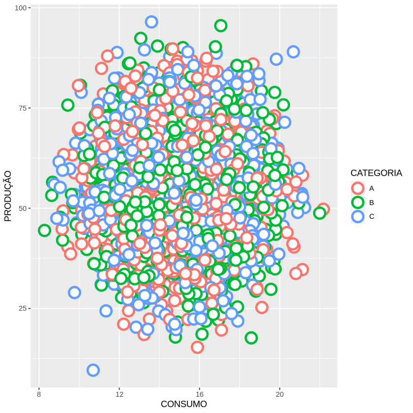
    


Nesse caso combinamos várias características:
- stroke serviu para modificar a largura da borda de cada ponto
- shape serviu para especificarmos um tipo de forma de ponto onde é possível definir cores separadas para a borda e para o seu interior 
- fill serviu para especificamos que a cor de dentro dos pontos seja branca (para todas as categorias)
- colour (dentro do aes()) serviu para definir uma cor de borda diferente para cada categoria

# Gráfico de barras

Em nosso material introdutório sobre ggplot2, vimos o uso da função geom_bar() para geração de gráfico de barras (que possuemvalores discretos no eixo x; para valores contínuos, veja a função geom_histogram() na próxima seção). Esta função, por padrão,utiliza a contagem de observações em uma coluna para realizar o gráfico. Muitas vezes não é bem isso que queremos. Queremos que aaltura da barra seja igual a um valor de alguma coluna do tibble informado no ggplot. Nesse caso, usamos o parâmetrostat = "identify" para expressar justamente esse comportamento.

Para minimizar esforço de escrita de stat = "identify", existe a função geom_col() que já considera que a altura das barras é aidentidade de valores de alguma coluna do tibble de entrada.

Conseguimos manipular os seguintes parâmetros estéticos em um gráfico de barras:
- x - aqui é obrigatório qual é o valor do eixo x (um tick é feito para cada valor distinto na coluna mencionada)
- y - aqui é obrigatório qual é o valor do eixo y (um tick é feito para cada valor distinto na coluna mencionada)
- alpha - opcional, para definir um valor de transparência na cor das barras
- colour - opcional, para definir uma cor da linha externa das barras (um esquema de cor será usado pelo R). O próprio ggplot2 definirá a cor para cada valor distinto da coluna mencionada.
- group - opcional, define que cada valor distinto da coluna mencionada é um grupo de barras (não é tão necessário como no usodas linhas, por isso aqui não será usado esse parâmetro)
- fill - opcional, para definir a cor interna da barra (um esquema de cor será usado pelo R). O próprio ggplot2 definirá a cor paracada valor distinto da coluna mencionada.
- size - opcional, define o tamanho da barra (o maior impacto será na legenda).
- linetype - opcional, para definir o tipo de linha para desenhar as barras.Alguns exemplos de gráfico de barras são mostrados a seguir.

**Criando um gráfico de barras simples e de maneira empilhada, onde cada grupo é diferenciado por meio da cor interna da barra:**


```R
ggplot(data = moedas_2019) +  
    geom_col(aes(x = as.factor(Mês), y = Média, #lembre-se, x e y são obrigatórios!                
                 fill = Denominação) #vamos manter uma cor distinta para cada barra                
            ) +  
    labs(x = "Mês", y = "Quantidade Média", title = "Moedas em Circulação")
```


    
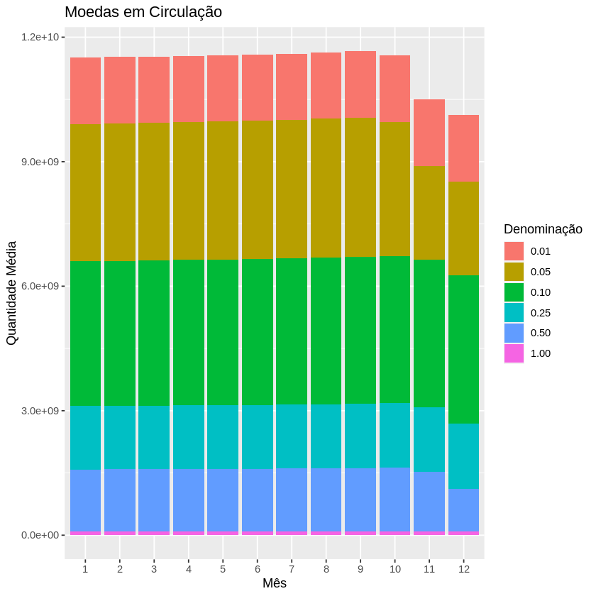
    


A forma empilhada pode ser útil para algumas aplicações.

Para deixar uma barra do lado da outra em cada item do eixo x (ou seja, Mês), devemos incluir o parâmetro

position = position_dodge():


```R
ggplot(data = moedas_2019) +  
    geom_col(aes(x = as.factor(Mês), y = Média, #lembre-se, x e y são obrigatórios!                
                 fill = Denominação), #vamos manter uma cor distinta para cada barra                
             position = position_dodge()) +  
    labs(x = "Mês", y = "Quantidade Média", title = "Moedas em Circulação")
```


    
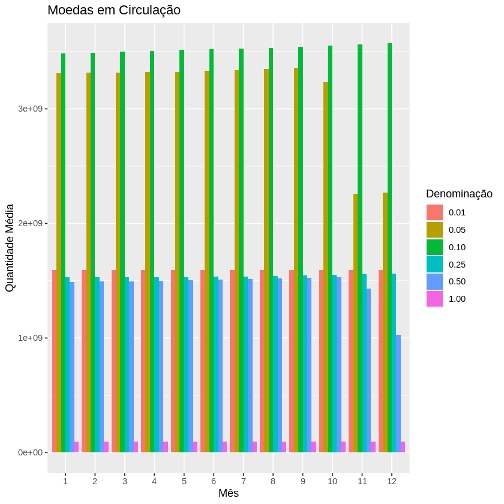
    


Como a variação de outros parâmetros são identificados aos gráficos de linha e barra, vamos mostrar alguns exemplos de manipulaçãode maneira homogênea. Isto é, mudanças de maneira global.

**Modificando o tamanho das barras (principalmente na legenda no caso):**


```R
ggplot(data = moedas_2019) +  
    geom_col(aes(x = as.factor(Mês), y = Média, #lembre-se, x e y são obrigatórios!                
                 fill = Denominação),                 
             position = position_dodge(), size = 10) +  
    labs(x = "Mês", y = "Quantidade Média", title = "Moedas em Circulação")
```


    
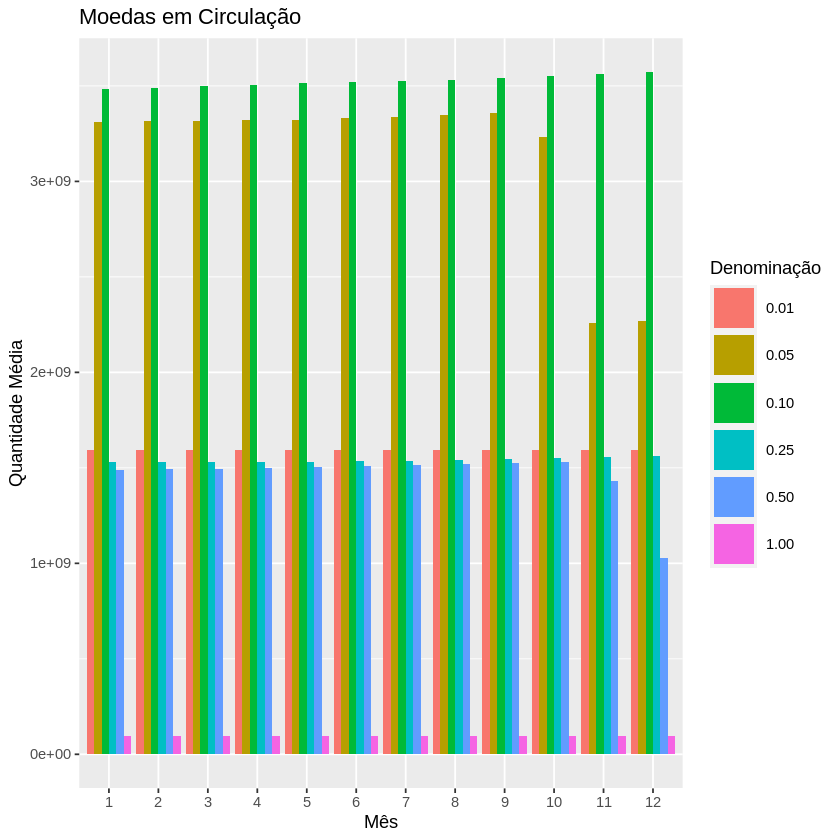
    


**Modificando o estilo de linha de todas as barras - neste caso, precisamos combinar 2 parâmetros: linetype e colour:**


```R
ggplot(data = moedas_2019) +  
    geom_col(aes(x = as.factor(Mês), y = Média, #lembre-se, x e y são obrigatórios!                
                 fill = Denominação),                 
             position = position_dodge(), linetype = "solid", colour = "black") +  
    labs(x = "Mês", y = "Quantidade Média", title = "Moedas em Circulação")
```


    
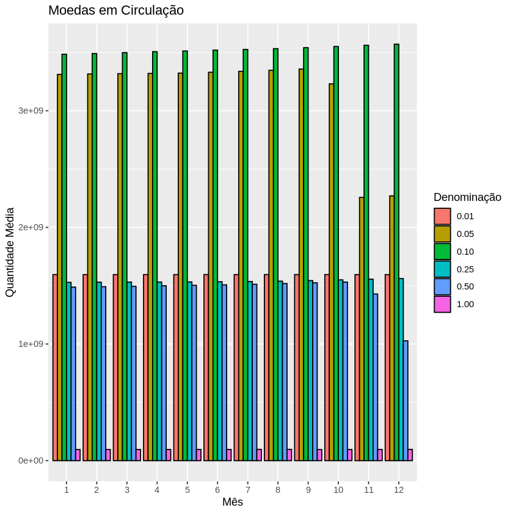
    


Pegando o exemplo anterior como base, o parâmetro size irá impactar no tamanho das linhas usadas para demarcar as barras e nãomais o tamanho das barras na legenda:


```R
ggplot(data = moedas_2019) +  
    geom_col(aes(x = as.factor(Mês), y = Média, #lembre-se, x e y são obrigatórios!                
                 fill = Denominação),                 
             position = position_dodge(), linetype = "solid", colour = "black", size = 2) +  
    labs(x = "Mês", y = "Quantidade Média", title = "Moedas em Circulação")
```


    
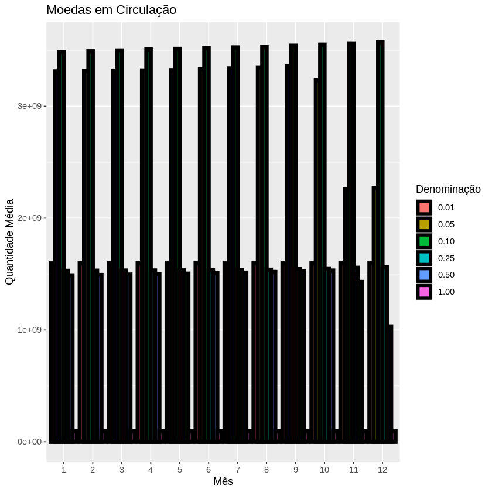
    


# Histogramas

Na seção anterior vimos que um gráfico de colunas é bastante útil quando o eixo x é composto por valores discretos. No nosso exemplo,o eixo x era composto pelos meses de um ano.

O gráfico de histograma gerado pela função geom_histogram() nos ajuda a compreender a distribuição de valores de uma variávelcontínua simples ao dividir o eixo x em “caixas” (bins) e contando o número de observações em cada caixa (bin).

A função geom_histogram() possui os mesmos parâmetros estéticos da função geom_bar() que por sua vez possui os mesmos parâmetros estéticos da função geom_col(). Entretanto, a grande diferença é que somente especificamos o valor para somente um eixo(o mais comum é o eixo x)! Portanto, vamos direto a alguns exemplos!

Na primeira parte da exemplificação, iremos utilizar a base de dados da circulação de dinheiro representado pelotibble moedas_2019_bruto. O principal argumento acerca disso é que o tibble moedas_2019, o qual vínhamos usando atéentão, contém dados agrupados. O tibble moedas_2019_bruto é definido conforme segue:Sobre a base de dados original de moedas_2019, criar 2 novas colunas: Dia e Mês. Então, capturar asobservações que sejam do ano de 2019 e das moedas com denominações iguais a 0.01, 0.05, 0.10, 0.25,0.50 e 1.00. Queremos que o conjunto de dados seja ordenado pelas datas mais recentes.


```R
moedas_2019_bruto <- mutate(circulacao_dinheiro,                       
                            Dia = as.numeric(format(Data, "%d")),                      
                            Mês = as.numeric(format(Data, "%m"))) %>% 
    filter(as.numeric(format(Data, "%Y")) == 2019 & Denominação %in% c("0.01", "0.05", "0.10", "0.25", "0.50", "1.00")) %>%   
    select(Dia, Mês, Denominação, Quantidade)
```

**Histograma da variável Quantidade do tibble moedas_2019_bruto:**


```R
ggplot(data = moedas_2019_bruto) +  
    geom_histogram(aes(x = Quantidade)) + #lembre-se, somente 1 eixo no histograma e ele é um valor contínuo para entendermos a sua distribuição  
    labs(x = "Quantidade em Circulação", y = "Contagem", title = "Histograma - Moedas em Circulação")
```

    `stat_bin()` using `bins = 30`. Pick better value with `binwidth`.
    


    
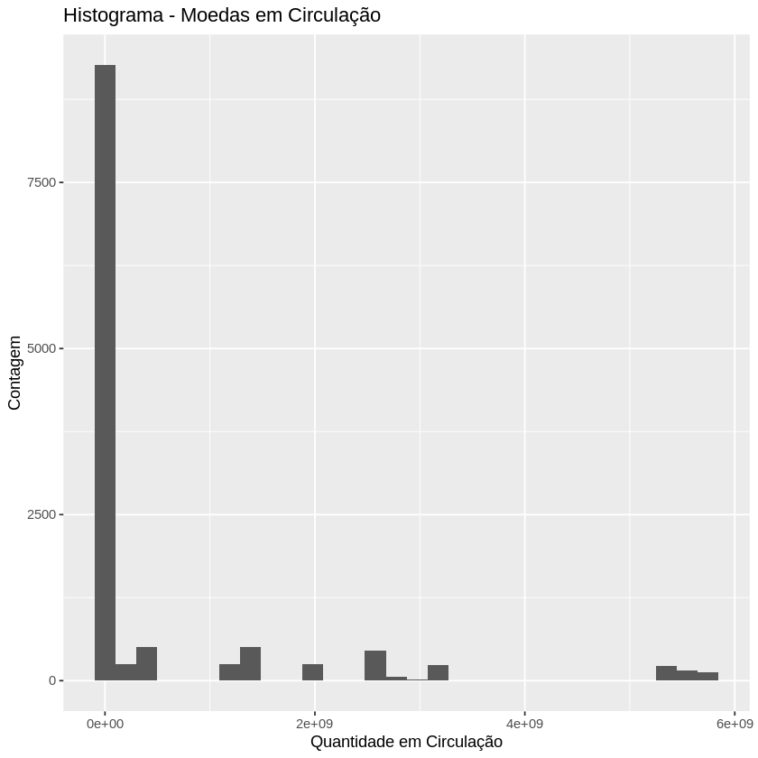
    


Podemos notar nesse histograma uma grande variação de quantidade de moedas em circulação, muitas delas inclusive, que possuemum número bem próximo a zero (o bin no 0). Entretanto, não sabemos exatamente a Denominação dessas moedas. Para isso, podemos definir um parâmetro estético a ser usado para cada tipo de Denominação, como a seguir:


```R
ggplot(data = moedas_2019_bruto) +  
    geom_histogram(aes(x = Quantidade, fill = Denominação)) + #lembre-se, somente 1 eixo no histograma e ele é um valor contínuo para entendermos a sua distribuição  
    labs(x = "Quantidade em Circulação", y = "Contagem", title = "Histograma - Moedas em Circulação")
```

    `stat_bin()` using `bins = 30`. Pick better value with `binwidth`.
    


    
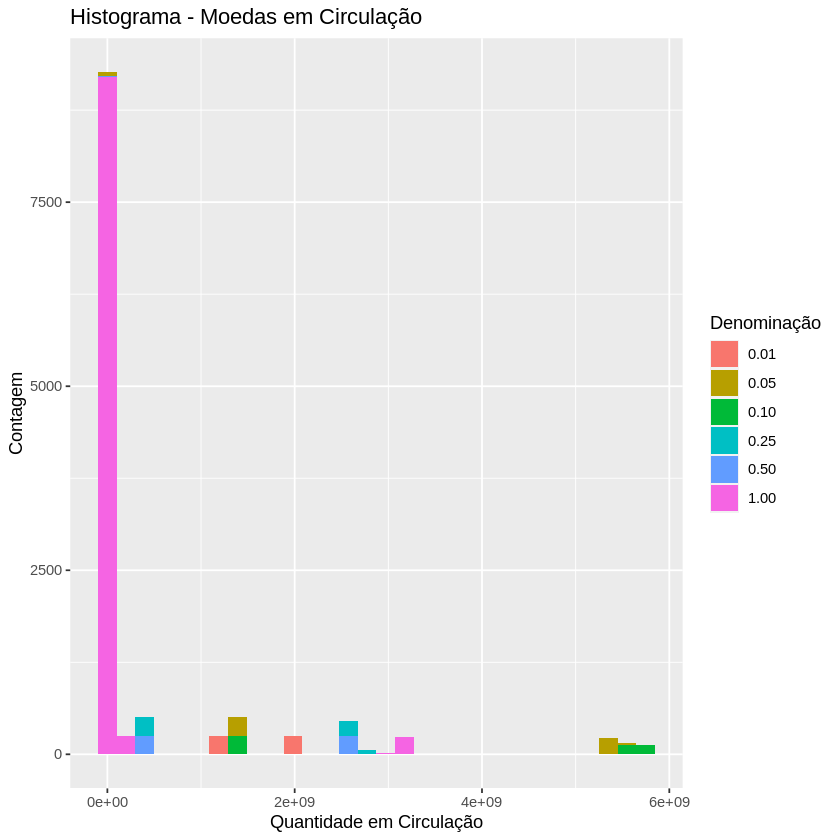
    


Podemos notar que muitas moedas de 1 real tem pouca circulação. Mas será que é algo próximo a 0, realmente? O ggplot nos alertaque podemos melhorar o “comprimento” das barras usadas com o parâmetro binwidth (vamos mostrar mais exemplos sobre isso aseguir). Para este exemplo, vamos modificar o parâmetro bins, especificando exatamente a quantidade de barras que queremos.

Vamos fazer um teste!


```R
ggplot(data = moedas_2019_bruto) +  
    geom_histogram(aes(x = Quantidade, fill = Denominação), bins = 100) + #lembre-se, somente 1 eixo no histograma e ele é um valor contínuo para entendermos a sua distribuição  
    labs(x = "Quantidade em Circulação", y = "Contagem", title = "Histograma - Moedas em Circulação")
```


    
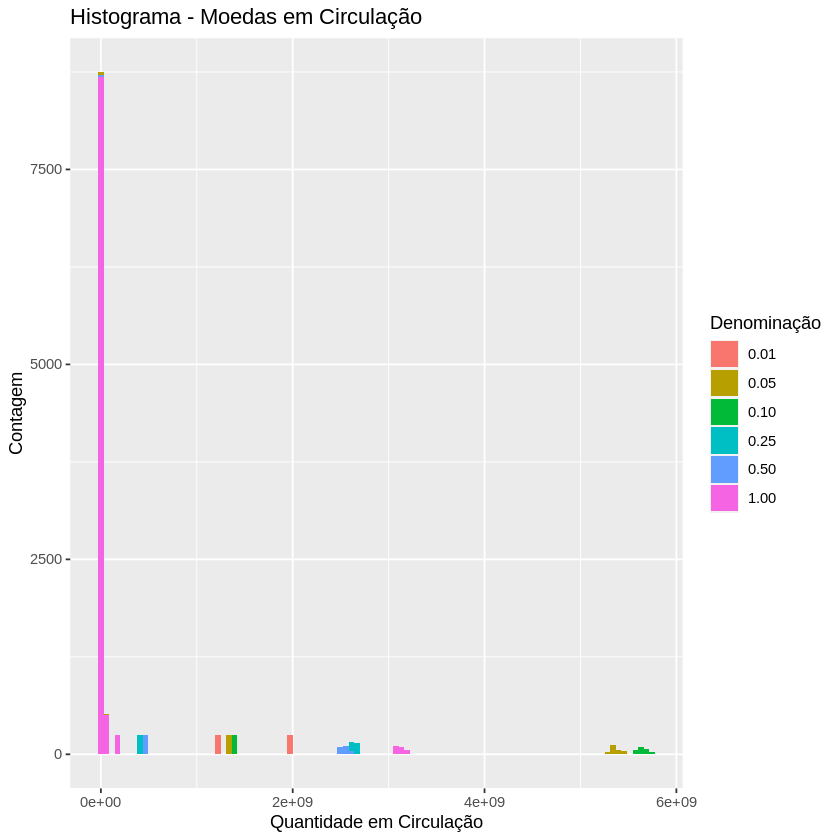
    


Entretanto, ainda não melhorou muito a nossa análise, certo? Isso tem a ver com o tamanho do domínio do eixo x. Ele está entre 0 e 6.000.000.000. Realmente, uma escala bem grande! Vamos dar um “zoom” para analisar o histograma de moedas com baixa quantidadeem circulação. Vamos determinar um valor máximo de 100.000:


```R
moedas_2019_bruto_menores <- filter(moedas_2019_bruto, Quantidade < 100000)

ggplot(data = moedas_2019_bruto_menores) +  
    geom_histogram(aes(x = Quantidade, fill = Denominação)) + #lembre-se, somente 1 eixo no histograma e ele é um valor contínuo par entendermos a sua distribuição  
    labs(x = "Quantidade em Circulação", y = "Contagem", title = "Histograma - Moedas em Circulação")
```

    `stat_bin()` using `bins = 30`. Pick better value with `binwidth`.
    


    
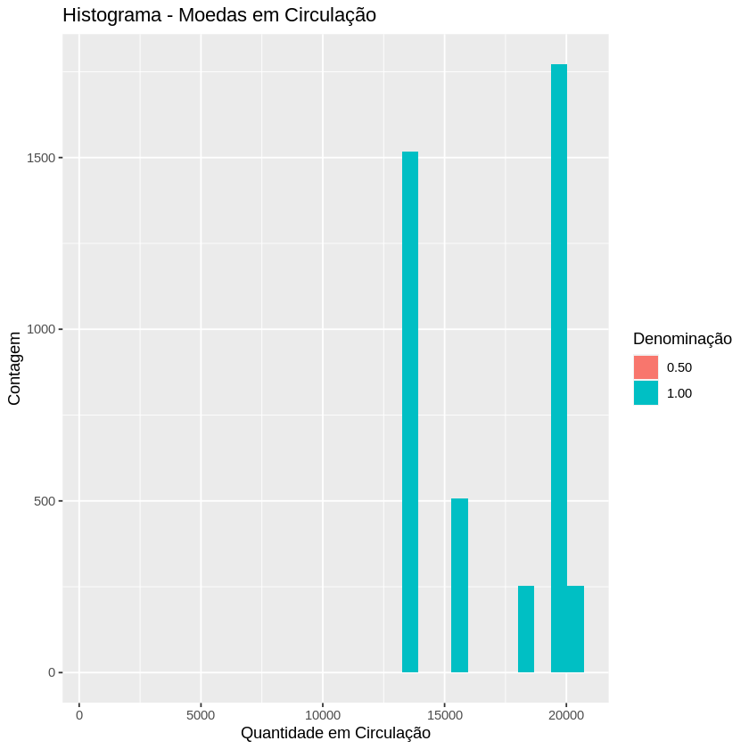
    


De fato, melhorou, certo? conseguimos entender melhor a distruibição de valores da moeda de 1.00. Então a dica é:

cuidado com a escala dos eixos! padrões podem estar escondidos por causa de uma falta de “zoom”

Você pode estar se perguntando: cadê a barra para a denominação 0.50? Ela está ali! porém muito, muito pequena... a base de dados filtrada possui apenas 2 observações cuja Denominação é igual a 0.50. Por isso que o valor para 0.50 mal aparece no histograma!

Para vermos outros exemplos de histograma, vamos utilizar a base artificial gerada para os gráficos de pontos (portanto, se certifiqueque você esteja com ela carregada na memória do RStudio para executar os seguintes comandos):Exemplo de histograma com a variável CONSUMO, mostrando de maneira total a contagem de cada “bin”:


```R
ggplot(data = dados_artificiais) +  
    geom_histogram(aes(x = CONSUMO))
```

    `stat_bin()` using `bins = 30`. Pick better value with `binwidth`.
    


    
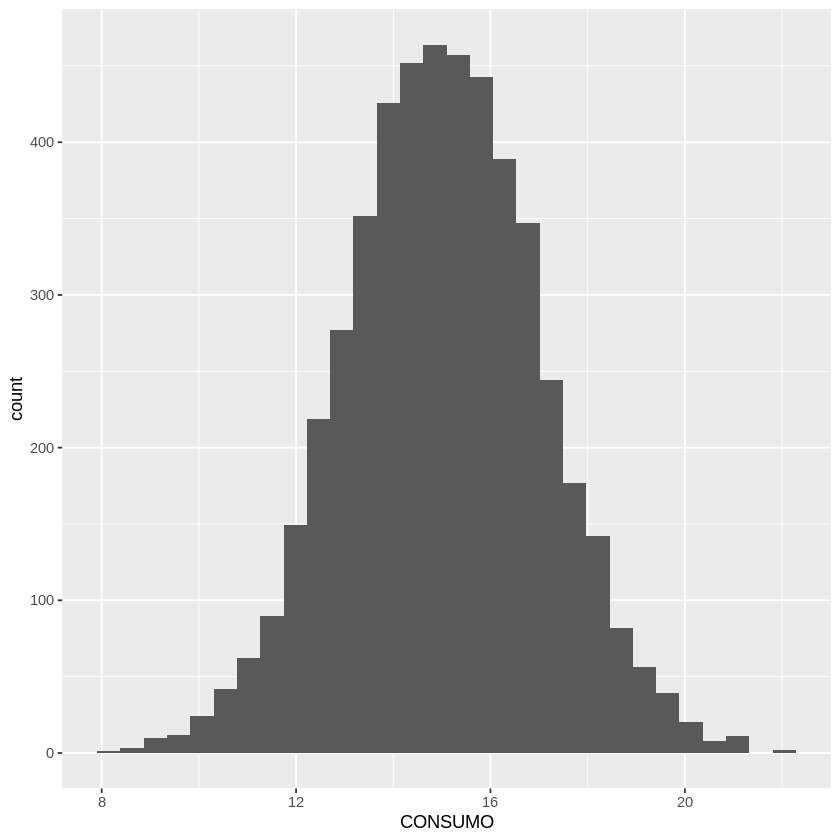
    


Note que podemos observar que a coluna CONSUMO possui uma distribuição “normal”, o que faz todo sentido pois tínhamos usado afunção rnorm() para gerar seus valores.

Repare que o ggplot2 irá emitir um aviso de que ele gerou exatamente 30 “caixinhas” (bins) - ou seja, barras, e que pode-se mudaresse parâmetro usando a opção bins. O parâmetro binwidth irá mudar a largura dos bins e consequentemente o número de binsusados para montar o historgrama.

Um valor muito alto para binwidth irá fazer um histograma muito resumido que raramente iremos conseguir entender a distribuiçãodos dados:


```R
ggplot(data = dados_artificiais) +  
    geom_histogram(aes(x = CONSUMO), binwidth = 10)
```


    

    


Por outro lado, um valor muito baixo de binwidth irá aumentar o número de bins e detalhar ainda mais o tipo de distribuição dos dados:


```R
ggplot(data = dados_artificiais) +  
    geom_histogram(aes(x = CONSUMO), binwidth = 0.1)
```


    
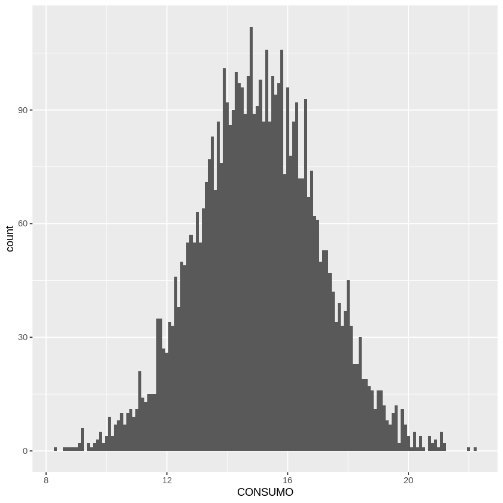
    


Podemos ainda destacar as categorias, da mesma forma que no gráfico de barras:


```R
ggplot(data = dados_artificiais) +  
    geom_histogram(aes(x = CONSUMO, colour = CATEGORIA))
```

    `stat_bin()` using `bins = 30`. Pick better value with `binwidth`.
    


    
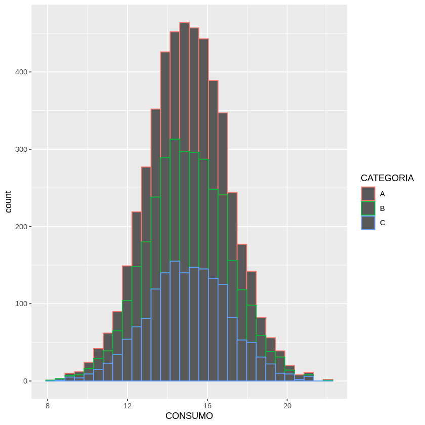
    


Podemos ainda definir o position = position_dodge() para formar barras individuais de histograma para cada categoria (pois o gráfico anterior stava na forma empilhada):


```R
ggplot(data = dados_artificiais) +  
    geom_histogram(aes(x = CONSUMO, colour = CATEGORIA), position = position_dodge())
```

    `stat_bin()` using `bins = 30`. Pick better value with `binwidth`.
    


    
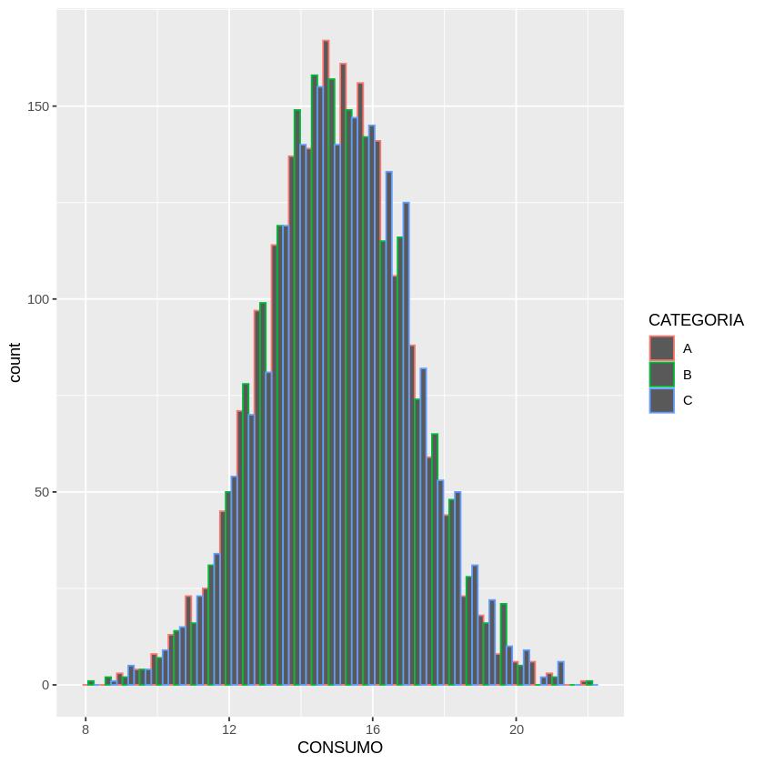
    


# Gráficos múltiplos

Até o momento vimos somente 1 tipo de gráfico em uma mesma figura (“plot”). Agora iremos ver como combinar vários gráficos em umsó “plot”.

# Combinando diferentes tipos de gráficos

A primeira forma de combinação é “adicionar” tipos diferentes de gráficos na mesma área. Ou seja, adicionando novas camadas ao ggplot, onde uma camada é um tipo de gráfico diferentedesenhado por uma função iniciada em geom_. Em outras palavras, cada vez que chamamos uma função do tipo geom_, um novográfico é simplesmente “colocado por cima” do conteúdo atual do ggplot. Isso é bastante importante para impor a ordem dascamadas de gráficos.

Vamos recapitular esses conceitos com alguns exemplos sobre o tibble moedas_2019.

**Combinando um gráfico de linha com um gráfico de ponto**

Podemos colocar pontos em cada linha para “demarcar” seus cruzamentos em cada valor do eixo x e y. Inclusive, especificando um tipo particular de forma de ponto para cada linha da seguinte forma:


```R
ggplot(data = moedas_2019) +  
    geom_line(aes(x = as.factor(Mês), y = Média, #lembre-se, x e y são obrigatórios!                
                  colour = Denominação, group = Denominação)) +  
    geom_point(aes(x = as.factor(Mês), y = Média, #lembre-se, x e y são obrigatórios!                
                   shape = Denominação)) +  
    labs(x = "Mês", y = "Quantidade Média", title = "Moedas em Circulação")
```


    
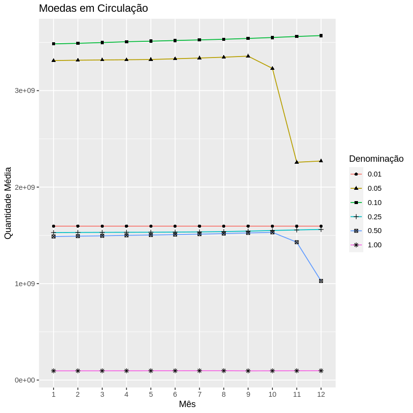
    


Ou ainda, podemos definir uma forma específica de ponto para todas as linhas:


```R
ggplot(data = moedas_2019) +  
    geom_line(aes(x = as.factor(Mês), y = Média, #lembre-se, x e y são obrigatórios!                
                  colour = Denominação, group = Denominação)) +  
    geom_point(aes(x = as.factor(Mês), y = Média, #lembre-se, x e y são obrigatórios!                
                   colour = Denominação), fill = "white", size = 2, stroke = 2, shape = 21) +  
    labs(x = "Mês", y = "Quantidade Média", title = "Moedas em Circulação")
```


    
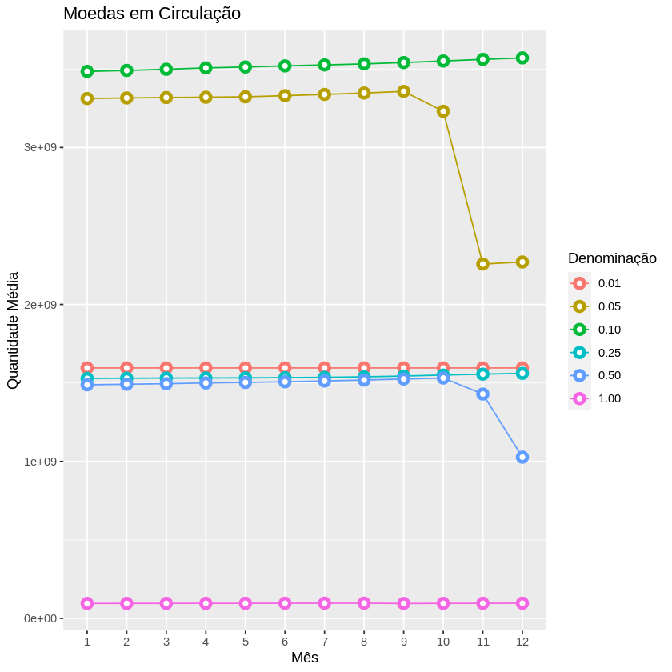
    


Perceba que nos dois exemplos anteriores, de forma literal, os pontos foram colocados por cima das linhas. O que acontece seinvertermos as camadas? Vamos checar no seguinte exemplo (trocamos a ordem do geom_line() e geom_point()):


```R
ggplot(data = moedas_2019) +  
    geom_point(aes(x = as.factor(Mês), y = Média, #lembre-se, x e y são obrigatórios!                
                   colour = Denominação), fill = "white", size = 2, stroke = 2, shape = 21) +  
    geom_line(aes(x = as.factor(Mês), y = Média, #lembre-se, x e y são obrigatórios!                
                  colour = Denominação, group = Denominação)) +  
    labs(x = "Mês", y = "Quantidade Média", title = "Moedas em Circulação")
```


    

    


Resultado diferente, certo? 

Cuidado com as sobreposições!

Uma coisa a ser notada nos exemplos anteriores é que o aes() das funções geom_line() e geom_point() possuem diversosparâmetros iguais, talvez poluindo um pouco o código. Conseguimos melhorar isso ao especificar o aes() de maneira global. Isso éfeito na função ggplot(). Assim, da mesma forma que data = moedas_2019 é acessado por todas as funções geom_, o aes()também será herdado pelas funções geom_. Conseguimos sobrepor algum parâmetro bastando apenas redefinir uma nova funçãoaes() dentro da função geom_ respectiva.

Podemos reescrever um código que gera o mesmo resultado do penúltimo exemplo da seguinte forma:


```R
ggplot(data = moedas_2019, aes(x = as.factor(Mês), y = Média, #lembre-se, x e y são obrigatórios!                
                               colour = Denominação, group = Denominação)) +  
    geom_line() + #as características estéticas serão herdadas do aes() definido no ggplot  
    geom_point(fill = "white", size = 2, stroke = 2, shape = 21) + #aqui são características aplicadas apenas ao geom_point, por isso mantém aqui  
    labs(x = "Mês", y = "Quantidade Média", title = "Moedas em Circulação")
```


    

    


Então observe que diferentes códigos podem gerar o mesmo resultado - **a arte da programação!**

# Fazendo vários “pequenos” gráficos

As funções facet_grid() e facet_wrap() do ggplot2 possuem a característica de fazer subgráficos dentro de um mesmográfico. A primeira função, facet_grid() organiza esses subgráficos de maneira de um tabela, onde conseguimos especificar se osgráficos serão organizados por linhas ou colunas, por meio dos parâmetros rows e cols. Ademais, conseguimos limitar o número delinhas e colunas a serem usados na nossa organização dos subgráficos por meio dos parâmetros nrow e ncol, respectivamente. Porfim, definimos se as escalas dos eixos x e y serão livres ou fixos para todos os subgráficos por meio do parâmetro scales.

No nosso primeiro conjunto de exemplos, vamos utilizar o tibble moedas_2019 para mostrar em cada subgráfico a quantidademédia de circulação de moedas em cada mês. Iremos variar alguns parâmetros das funções facet_grid() e facet_wrap() para explorar seus comportamentos.

Utilizando o facet_grid() para deixar cada mês como subgráficos organizadas nas linhas:


```R
ggplot(data = moedas_2019, aes(x = as.factor(Denominação), y = Média)) +  
    geom_col() + #as características estéticas serão herdadas do aes() definido no ggplot  
    labs(x = "Denominação", y = "Quantidade Média", title = "Moedas em Circulação") +  
    facet_grid(rows = vars(Mês))
```


    
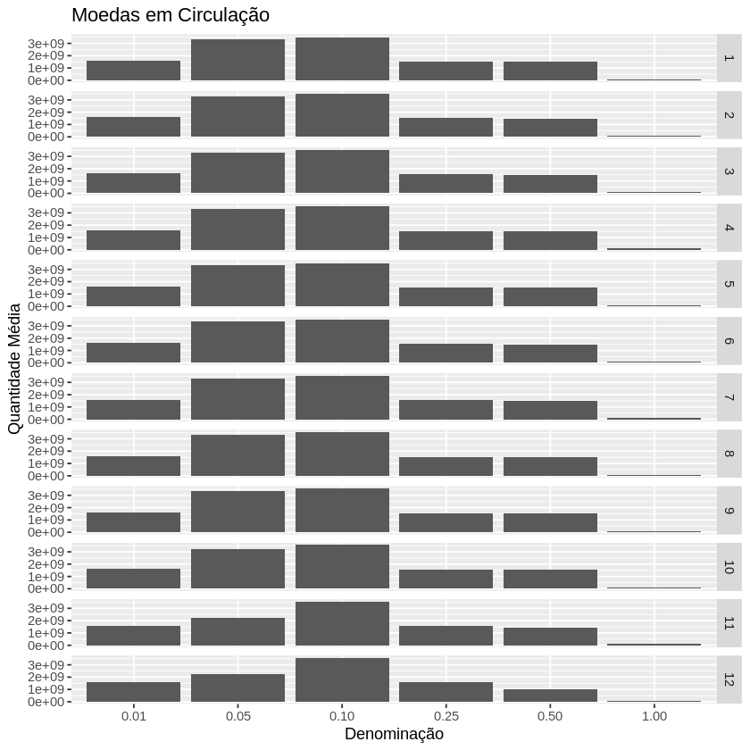
    


Repare que cada linha é de fato um subgráfico de colunas, onde o seu eixo x é a Denominação e o eixo y é a quantidade média. Cada subgráfico é baseado nos valores da variável Mês (ou seja, usando vars(Mês)).

Vamos mudar a orientação, deixando que cada Mês fique em forma de colunas:


```R
ggplot(data = moedas_2019, aes(x = as.factor(Denominação), y = Média)) +  
    geom_col() + #as características estéticas serão herdadas do aes() definido no ggplot  
    labs(x = "Denominação", y = "Quantidade Média", title = "Moedas em Circulação") +  
    facet_grid(cols = vars(Mês))
```


    
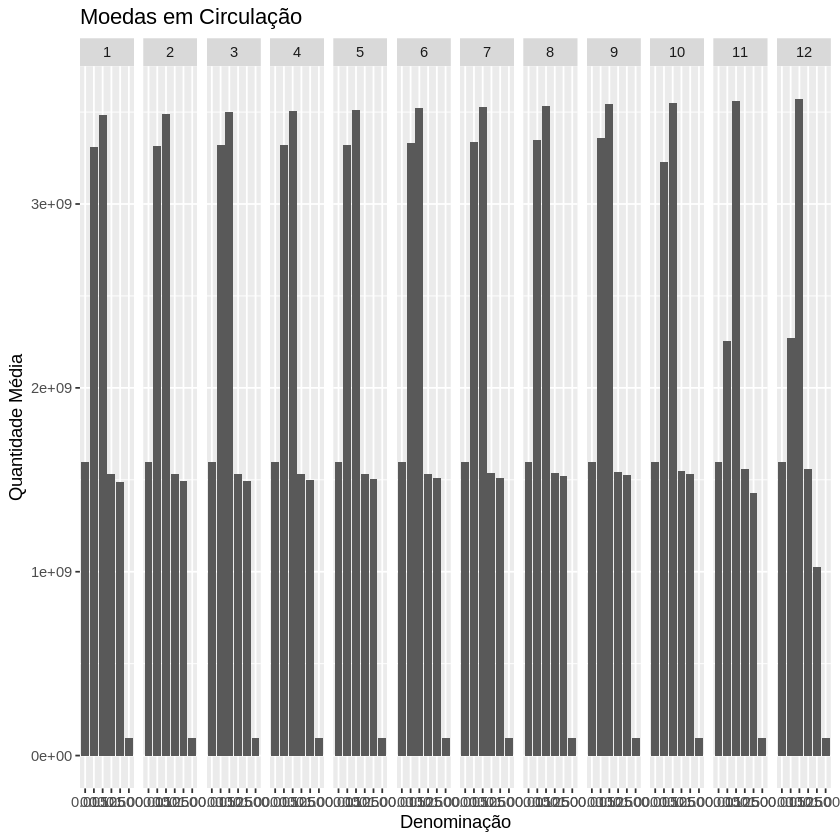
    


As coisas ficam meio “apertadas” certo? Podemos organizar melhor ao usar a função face_wrap():


```R
ggplot(data = moedas_2019, aes(x = as.factor(Denominação), y = Média)) +  
    geom_col() + #as características estéticas serão herdadas do aes() definido no ggplot  
    labs(x = "Denominação", y = "Quantidade Média", title = "Moedas em Circulação") +  
    facet_wrap(vars(Mês))
```


    
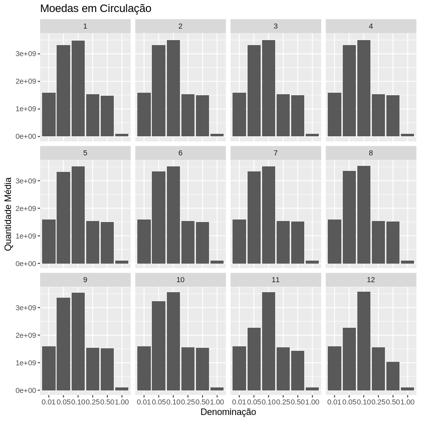
    


A função face_wrap() sempre vai tentar organizar os subgráficos em um layout retangular. Podemos especificar que os subgráficos sejam organizados em 4 linhas:


```R
ggplot(data = moedas_2019, aes(x = as.factor(Denominação), y = Média)) +  
    geom_col() + #as características estéticas serão herdadas do aes() definido no ggplot  
    labs(x = "Denominação", y = "Quantidade Média", title = "Moedas em Circulação") +  
    facet_wrap(vars(Mês), nrow = 4)
```


    
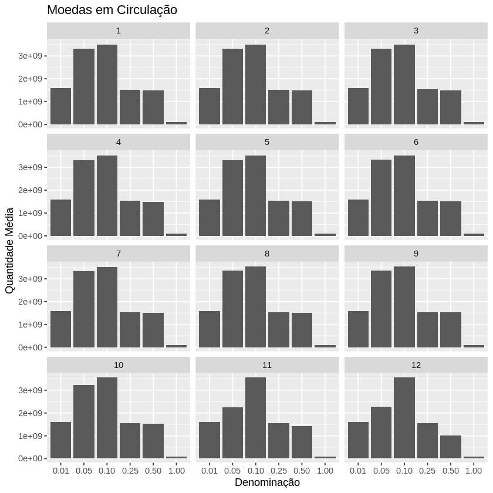
    


Repare que sempre a mesma escala pro eixo y foi usada, mas poderíamos deixá-la livre, conforme a necessidade de cada subgráfico.


```R
ggplot(data = moedas_2019, aes(x = as.factor(Denominação), y = Média)) +  
    geom_col() + #as características estéticas serão herdadas do aes() definido no ggplot  
    labs(x = "Denominação", y = "Quantidade Média", title = "Moedas em Circulação") +  
    facet_wrap(vars(Mês), nrow = 4, scales = "free_y")
```


    
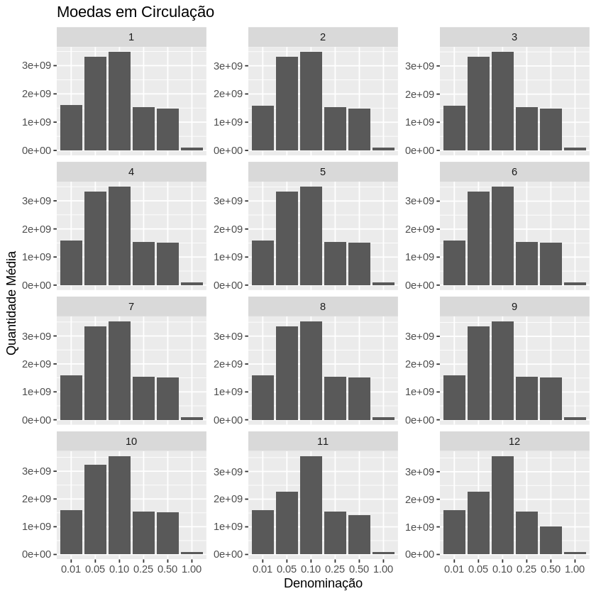
    


Perceba que cada subgráfico agora tem sua escala y específica (mesmo que ela seja a mesma, por causa da característica desses dados).

Isso é interessante quando temos dados que variam bastante, necessitando de escalas diferentes para melhor visualização.

**O que acontece quando queremos combinar 2 ou mais colunas no facet_wrap() e facet_grid()?**

Nesse caso, basta colocar todas as suas colunas que você queira combinar o valor para montar “os títulos” dos subgráficos.

Por exemplo, suponha que queiramos formar subgráficos de quantidade média de circulação de moedas por ano e por mês, considerando apenas o primeiro trimestre de cada ano a partir de 2010. Para isso, primeiro de tudo, precisamos um tibble com essesdados (o tibble atual do moedas_2019 só contém o ano 2019):Criar 3 novas colunas: Dia, Mês e Ano. Então, capturar as observações onde o ano seja maior ou igual a2010, os meses sejam iguais a 1, 2 ou 3 e com denominações iguais a 0.01, 0.05, 0.10, 0.25, 0.50 e 1.00.

Queremos que o conjunto de dados seja ordenado pelas datas mais recentes. Por fim, queremos aquantidade média de moedas em circulação (previamente selecionadas) por mês, ano e denominação.

Vamos considerar o seguinte gráfico (na próxima seção você entenderá melhor como projetar esse gráfico):


```R
moedas_circulacao_media <- mutate(circulacao_dinheiro,                       
                                  Dia = as.numeric(format(Data, "%d")),                      
                                  Mês = as.numeric(format(Data, "%m")),                      
                                  Ano = as.numeric(format(Data, "%Y"))) %>% 
    filter(Ano >= 2010 & Mês %in% c(1,2, 3) & Denominação %in% c("0.01", "0.05", "0.10", "0.25", "0.50", "1.00")) %>%   
    arrange(desc(Ano), desc(Mês), desc(Dia)) %>% 
    group_by(Mês, Ano, Denominação) %>% 
    summarise(Média = mean(Quantidade, na.rm = TRUE))
```

    `summarise()` has grouped output by 'Mês', 'Ano'. You can override using the `.groups` argument.
    


A ordem definida em vars() definirá também a ordem de aparição dos valores das colunas que serão combinados para formar o títulode cada subgráfico. Vamos determinar que cada coluna do grid de subgráficos corresponde a um mês específico. Sendo assim, definimoso ncol = 3:


```R
ggplot(data = moedas_circulacao_media, aes(x = as.factor(Denominação), y = Média)) +  
    geom_col() + #as características estéticas serão herdadas do aes() definido no ggplot  
    labs(x = "Denominação", y = "Quantidade Média", title = "Moedas em Circulação") +  
    facet_wrap(vars(Ano, Mês), ncol = 3)
```


    
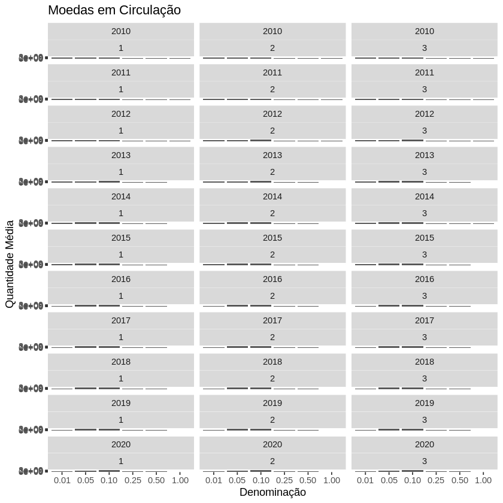
    


Alguns pontos importantes:
1. A formatação definida em cada geom_ é aplicada a todos os subgráficos!
2. Você sempre deve preparar seus dados para refletir o que você quer visualizar (nunca é demais lembrar)
3. Uma dica é entender (e até mesmo desenhar no papel) qual é o tipo de gráfico que você quer fazer e então buscar os comandos necessários para produzir o que você definiu de maneira conceitual

# Material complementar

É sempre recomendável vermos as opções gerais dos pacotes. Nesse link (https://rstudio.com/resources/cheatsheets/), podemos teracesso à uma série de cheatsheet para diversos pacotes.

Mais detalhadamente, sobre o ggplot2, temos esse cheatsheet: https://github.com/rstudio/cheatsheets/raw/master/data-visualization-2.1.pdf (https://github.com/rstudio/cheatsheets/raw/master/data-visualization-2.1.pdf)

Uma função complementar é a ggsave(), a qual salva como .png um gráfico produzido pelo ggplot(). Para isso, vc deve atribuir umggplot() à uma variável e então chamar o ggsave() passando como parâmetro esse variável e o local onde deseja salvar seugráfico. Por exemplo, vamos salvar o último gráfico gerado da seguinte forma:


```R
meu_grafico <- ggplot(data = moedas_circulacao_media, aes(x = as.factor(Denominação), y = Média)) +  
    geom_col() + #as características estéticas serão herdadas do aes() definido no ggplot  
    labs(x = "Denominação", y = "Quantidade Média", title = "Moedas em Circulação") +  
    facet_wrap(vars(Ano, Mês), ncol = 3)#agora a variável meu_grafico está com o gráfico salvo em memória#inclusive, se você executar ela de maneira isolada (como fazemos para ver os dados de um vetor), oRStudio irá mostrar o gráfico para você, normalmente
    
ggsave(".//nome_do_arquivo_do_grafico.png", plot=meu_grafico, height = 20, dpi = "print") #conseguimos especificar também a largura da imagem, se necessário
```

    Saving 6.67 x 20 in image
    


Veja mais sobre a função ggsave() aqui (https://ggplot2.tidyverse.org/reference/ggsave.html).

# Conclusão

Perceba os seguintes pontos:
- A estética do gráfico é bastante importante e você tem absoluto poder em sua definição (deixe sua criatividade fluir!)
- Consultar a documentação do ggplot2 é algo comum e para fazer os gráficos com as aparências que queremos, muitas vezes precisamos recorrer a sua documentação - veja o material complementar
- A forma com que fazemos os gráficos é muito semelhante, bastando mudar basicamente, o nome da função geradora do gráfico(iniciado com geom_) e checando o comportamento de cada parte estética do respectivo gráfico
- Lembre-se, o gráfico é apenas um reflexo dos dados tabulares. Por isso, é importante que você faça as devidas transformações emanipulação antes de visualizar qualquer coisa.

Bons estudos!
